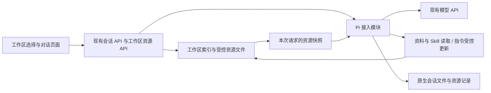

# W01-2 具体设计

日期：2026-09-16。状态：待审阅，未实施。范围以 [PRD](prd.md) 的 N01～N09／A01～A12 为准；[审阅入口](review.md) 汇总用户需要判断的使用行为。本文件是 S2a 的具体方案，优先于父任务中笼统的 S2 草案；S3／S4 契约不因此提前实现。

## 1. 实现基线与边界

延续 `experiments/harness-lab/` 的 TypeScript／Node、React／Vite、Fastify、Pi 0.85.1、DeepSeek Flash。保留原生 JSONL 作为会话历史来源，不引入数据库或通用适配框架。SDK 与原生格式仍只在 `src/pi` 解释。

当前 PiLab 将所有资料放在全局 `info.sources`，缓存会话内核实例并禁用外部资源发现；本期将资源解析绑定到工作区，并在每次请求开始时组装资源。实现依据与接口核验见 [研究记录](research/pi-resource-boundary.md)。



## 2. 工作区、会话与业务任务

| 对象 | 本期语义 | 持久化与约束 |
| --- | --- | --- |
| Workspace | 指令、受控资料和相关会话的组织范围 | UUID、名称、创建时间；名称 1～60 个字符、去除首尾空白；可重名，名称不作为路径 |
| Session | 一个独立的多轮对话 | 固定 workspaceId；原有 sessionId 不变；不支持创建后移动 |
| Agent 指令文件（AGENTS.md） | 工作区持续使用的约定 | 一个通用只读文件、一个工作区 AGENTS.md；内容 hash 用于冲突检测 |
| Skill | 可按需读取的工作方法 | 两个固定只读包；ID、描述、版本和 hash；不是用户／Agent 身份 |
| 业务任务／WorkItem | 后续目标、责任和交付状态 | 本期不建表／接口，不将 workspaceId 当 taskId 或 Run ID |

同工作区会话共享的是获准资料与指令，不共享消息、草稿、活动请求和取消信号。不同工作区的同名资料也必须从各自清单解析。当前用户可访问所有工作区；本期没有多身份授权声明。

用户已明确将跨会话检索／引用后置，是否引入及规则未定，本期不提供该能力。一个会话只加载通用指令与自身工作区的 AGENTS.md，不能读取其他工作区的 AGENTS.md；用户在页面切换工作区不会改变既有会话的绑定范围。ChatGPT 的历史引用机制不作为本项目跨区读取文件的依据。

默认工作区承接旧会话。新工作区由用户输入名称创建，服务端生成 ID 和目录，以空 AGENTS.md、两份通用测试资料副本及两个固定 Skill 初始化。资料仅用于可复现验证，不是消防业务服务；后续上传与真实系统接入另做。

## 3. 页面与用户操作

- 侧栏顶部增加工作区选择及“新建工作区”；下方只列所选区的会话。每区记住最近所选会话；进入无会话工作区时显示空态，新建或发送首条消息时创建会话。
- 聊天顶部显示工作区名称；指令和 Skill 从“工作区资料”入口按需查看，不把技术阶段名称或 Memory 标签作为输入框常驻说明。
- 指令面板区分“通用指令（只读）”与“工作区指令（可编辑）”。编辑工作区文件可保存、清空内容或放弃；显示保存结果及“下次发送时生效”。不实现 Markdown 所见即所得编辑器。
- 每轮消息详情可查看当次实际加载的指令文本、文件显示名、内容 hash，以及已读 Skill 的版本；当前编辑内容和过去实际加载内容分开展示，旧快照只读。主聊天中不常驻 hash、JSON 或内部路径。
- 用户在对话里明确要求“记住／修改／删除这项约定”，Agent 可直接使用指令编辑工具，成功后说明修改内容及下次请求生效。普通问题不自动提取长期记忆；不增加每轮授权开关、候选采纳卡或人工确认状态。
- 用户在页面编辑指令，保存失败或发生版本冲突时，编辑器保留尚未保存的草稿。“查看最新内容”将服务端文件单独显示为只读内容，不替换草稿；用户对照修改后再保存。只有主动选择“放弃草稿，使用最新内容”才用已读取的最新内容替换草稿；不提供强制覆盖服务端文件的按钮。具体流程见下节。
- 工作区／会话切换不取消运行。请求事件仍按 sessionId + requestId 校验；缓存和草稿按会话 ID，工作区资源与未保存指令草稿按 workspaceId。来自旧工作区的异步响应不能覆盖新视图。
- 刷新仅重新 GET；聊天草稿和指令草稿存 sessionStorage，失败时保留内存编辑能力。
- 窄屏沿用侧栏抽屉；资料与指令使用可关闭面板。保留焦点回到触发按钮、键盘保存与关闭、中文输入法、流式跟随和 GFM 表格行为。

业务任务管理、任务树、运行详情和成果面板不在本期页面中出现。

### 3.1 页面编辑指令时发生冲突

入口是“对话页面 → 工作区资料 → 工作区指令”。这里的冲突指：用户打开文件后，服务端文件又被修改了；不要求两份内容在语义上互相矛盾。当前只有一个本地用户，也可能因 Agent 修改或两个浏览器标签同时编辑而发生冲突。

例如，文件原本只有“使用中文回答”。用户在编辑器增加“先给结论”，尚未保存；期间又通过对话要求 Agent 记住“引用资料时注明来源”，Agent 已将这一条写入文件。用户随后保存旧版本上的草稿，服务端就应返回版本冲突，避免覆盖刚保存的来源约定。

页面按以下步骤处理：

1. 收到版本冲突结果后，提示“工作区指令已更新，本次保存未完成，你的修改已保留”。编辑器继续显示用户草稿，不自动刷新、清空或替换内容。
2. 用户点击“查看最新内容”时，页面读取服务端文件，在草稿旁边单独显示只读的“最新内容”；窄屏上下排列，两份内容都可查看。读取失败时保留草稿及已有对照内容，并提示重试。
3. 用户对照最新内容，在原编辑器中自行整理要保留的规则，再点击“合并后保存”。例如保留“使用中文回答”“先给结论”“注明来源”三条。程序不自动决定保留哪条规则，也不自动合并或提交。
4. 用户也可以点击“放弃草稿，使用最新内容”，明确放弃自己的未保存修改。此操作用已经成功读取、展示的最新内容替换编辑器草稿，只更新页面，不向服务端写文件；未成功读取最新内容时不能执行此操作。
5. 合并保存期间文件若再次被修改，仍然返回冲突并保留已整理的草稿，用户可以再次查看最新内容。不会因之前发生过冲突而跳过版本检查。

前端分别保存“编辑草稿及其起始版本”和“已展示的最新正文及版本”，都按 workspaceId 隔离。查看最新内容不能偷偷更新草稿的保存基准并直接重交旧草稿；冲突状态下只有用户主动点击“合并后保存”，才以其已查看的最新版本 hash 作为 expectedHash 提交整理后的正文。放弃草稿时才将草稿及其起始版本一起替换为已展示版本；打开对照、放弃草稿和页面刷新都不触发 PUT。尚未取得最新内容时不提供合并保存操作。

服务端负责检查版本并拒绝过期覆盖，前端负责保留草稿和展示对照，用户负责页面编辑入口的合并或放弃选择。通过对话让 Agent 修改文件走第 6 节的工具接口，不要求用户先进入这个面板。普通保存失败保留草稿；断线导致结果不明时先读取核对，不直接重发。点击“停止回复”也不会清空编辑器或撤销已经成功保存的文件。

## 4. 最小存储与模块

以下路径均位于已被 Git 忽略的 `LAB_DATA_DIR`（默认 `.local`）。客户端和模型只传 ID，服务端生成路径。

这是服务端持久化方案：按实验工程目录启动时，默认根目录为 `experiments/harness-lab/.local/`；未来部署到服务器时由 LAB_DATA_DIR 指向服务器的持久化目录，不存放在浏览器。当前仅完成设计，尚未创建这些工作区文件；浏览器 sessionStorage 仅保留草稿与选择状态，不是工作区或指令的事实来源。

```text
.local/
  workspace-index.json          # schemaVersion、默认区、工作区清单、sessionId → workspaceId
  .workspace-initialized        # 已初始化标记；索引丢失时不得猜测重建
  migrations/workspace-v1.json  # 首次升级的源清单、备份位置和阶段记录
  workspaces/<workspaceId>/
    AGENTS.md                  # 可编辑约定，文件本身是当前内容的事实来源
    sources/                   # 本期两份初始化资料，运行时只读
  sessions/*.jsonl              # 原有原生历史，保留路径和 ID
  agent/                       # 现有受限内核目录
```

通用指令和两个 Skill 作为应用受控资源放在 `fixtures/common/AGENTS.md`、`fixtures/skills/<skillId>/SKILL.md`，随代码管理；这里指实验工程自己的 fixtures，不读取仓库根 AGENTS.md、`.agents/skills` 或开发机全局配置。

索引字段建议：`schemaVersion:1`、`defaultWorkspaceId`、`workspaces:[{id,name,createdAt,sourceIds,skillIds}]`、`sessionBindings:{sessionId:workspaceId}`。工作区根路径按 ID 派生，不保存或接受任意目录。索引不复制聊天和 AGENTS.md 正文；没有两套可写历史。

索引写入在单进程锁中生成完整新文件，以同目录临时文件、fsync 和原子 rename 提交；失效版本或损坏文件明确停止写入，不用空索引覆盖。工作区先准备文件再登记索引，登记成功才返回；失败的未登记目录不自动发布或递归删除。

新会话先创建原生空文件，再提交归属索引，二者完成后才进入列表和响应。没有索引归属的文件保留但不自动加载为默认工作区。两文件不宣称具备数据库事务；启动时发现未登记文件给出诊断，由人工核对。

建议新增 `src/workspaces/store.ts` 负责目录／归属，`src/resources/instructions.ts`、`src/resources/skills.ts` 负责受控资源，现有 `src/tools/sources.ts` 改为接收工作区范围。它们不导入 Pi。PiLab 接收这些服务，在工具闭包内固定 workspaceId 和请求上下文；页面只使用公开契约。

本期仅支持一个服务进程拥有该目录，依靠现有默认监听端口及部署约束，不承诺不同端口／多进程同时写同一目录的安全性。启动文档明确禁止此方式；多进程控制属于后续存储阶段。

## 5. 每次请求的指令与资源装配

一次请求按以下顺序执行：

1. 收到用户消息后，服务端先检查该会话是否已有请求正在处理：若有，返回“会话忙”；若无，立即标记为“正在处理”，并为本次请求生成唯一编号 requestId。同时根据会话已绑定的 workspaceId，确定本次允许读取哪些资源、允许编辑哪个 AGENTS.md；完成这些准备后，才开始异步读取文件或调用模型。
2. 在工作区资源锁内读取完整通用／工作区指令和本轮资源清单，校验文件、大小与 hash；释放锁后才执行模型。等待锁和装配时间也计入请求超时。
3. 创建不可变的 RequestResources：指令原文及 hash、有权资料／Skill 的 ID、版本与正文快照、可写指令文件 ID。资源小且固定，本期在开始时读入内存，避免同一请求按需读取时内容变化。
4. 在原生文件追加 `berserk.request-resources.v1` 的 custom entry，包含 requestId、workspaceId、指令文本／hash、允许的 Skill 版本／hash 及可写文件范围。它是实验加载证据，不是平台 InputSnapshot；不含密钥，也不自动进入聊天历史。
5. 为本次请求新建 AgentSession，使用同一 SessionManager 的原生历史及这次 ResourceLoader。关闭默认发现，使用 `agentsFilesOverride` 提供明确的通用／工作区指令。工具、事件和流封装每次重新装配；结束后取消订阅并 dispose，下一轮仍用同一原生会话历史。
6. 工具消费固定的资料／Skill 快照；编辑工具读取当前磁盘文件用于冲突校验。指令编辑不会改变本轮系统提示；后续调用仍沿用步骤 3 的指令。
7. 等待执行／取消完全收敛，保存结果、释放活动标记。准备阶段失败不发模型请求，不伪造用户消息已进入原生历史；页面保留待发草稿。

步骤 1 沿用现有“同一会话同时只处理一个请求”的机制，其他会话分别维护自己的状态。requestId 用于把流式回复和停止操作对应到本次请求。本文的“宿主”指接入 Pi 的服务端应用；资源读写范围由服务端确定，模型不能自行扩大。用户在页面切换工作区，也不会改变已经开始的请求所属的工作区。

每请求新实例是本期为了固定加载边界的具体实现选择，不意味着成熟平台必须每轮重建。禁止用全局可变当前工作区或临时替换另一会话的 system prompt。避免每轮调用 `AgentSession.reload()`，其在当前版本包含额外运行时重载行为，见研究记录。

指令优先关系：宿主能力／权限始终由程序决定；通用工作方法在前、工作区约定在后，后者可细化工作方法，不能开启工具权限。系统提示明确当前加载文件为当前规则，历史中出现的旧指令／工具结果只代表过去内容；删除旧规则后的效果必须通过真实追问测试验证，不能仅凭替换提示词宣称可靠。

AGENTS.md 不存在时按空指令处理，面板显示“尚未创建”，hash 用 null 表示；用户第一次保存可创建。存在但不可读、不是普通文件、超限或校验失败时明确报错，不静默退回空内容。清空规则通过保存空字符串，不删除文件；hash 空内容与缺失 null 不同。未来新会话加载当前文件，但不会注入其他会话消息。

## 6. 指令编辑与写入结果

用户通过页面编辑当前工作区 AGENTS.md，无需模型。Agent 通过 `instructions.read` 获取最新文件及 hash，再调用 `instructions.update({fileId,content,expectedHash})`；宿主只允许当前本地主体编辑其会话所属工作区的 AGENTS.md，通用指令始终只读；这个范围由服务端固定，不是模型参数。系统提示要求只根据用户明确的记忆／修改意图写入，不自动从资料提取规则。

自然语言意图由模型理解，不能宣称程序能完全识别“这句话是否真想修改约定”；程序保证的是写入范围、冲突与结果可查。资料诱导误写属于必须覆盖的行为测试，不能靠提示词宣称已实现完整防注入。若出现误写，修改指令／工具说明并复验；不静默加入审批流程改变使用方式。

`fileId` 仅允许 `common`（只读）或 `workspace`；工作区由调用上下文固定。Agent 无权创建工作区、修改别的会话、写通用指令或 Skill。`instructions.read` 返回最新文件内容并明确“更新内容下一请求生效”，不会替换当前已加载的系统指令；这使同一请求仍可核对自己刚保存的文件。

文件更新流程在每工作区同一互斥锁内：检查取消／超时与权限 → 检查受控文件类型及原始字节 SHA-256 → 当前内容等于目标时返回 unchanged → 核验 expectedHash → 写同目录临时文件并 fsync → 再检查取消 → 发起原子 rename → 返回当前新 hash。UTF-8 内容按实际保存字节计 hash，不做隐式换行或内容重写。

rename 的成功是效果提交边界。取消在 rename 发起前被观察到则不提交；发起后到返回前的竞争不能宣称必然未写，须等待文件调用返回或重新读取核对。写入已成功则保留效果，即便本轮最终 cancelled／failed。权限检查先于 unchanged 判断，未授权请求不能借相同内容调用写接口。

不同请求带旧 hash 修改为不同内容，返回冲突；保存接口不自动合并／覆盖。页面编辑冲突按第 3.1 节处理，查看最新文件本身不重新提交草稿。相同目标内容返回 unchanged 只表示当前文件已经符合目标，不冒充本次确实执行了写入。工具结果记录 `fileId,status:updated|unchanged,previousHash,hash,effectiveFrom:next_request`；失败区分版本冲突、无权写、不可读及结果未确认。

页面保存请求断线或 Agent 写后结果未持久化时，不自动重发。通过 GET 当前文件及目标 hash 判断当前状态；过程证据未保存则明确无法证明本次写入，但文件当前状态可查。完成的更新作为工具结果／资源变化摘要显示；刷新时也可查当前文件。原生记录与文件不宣称原子提交，不引入 S3 操作账本。

所有资源以 ID 映射路径；检查每级受控目录、拒绝 symlink 和非普通文件，读取目标时使用不跟随链接的打开方式并复核文件信息。这里防止客户端／模型越界，不将能直接修改宿主目录的本地操作员视为已隔离的攻击者。不开放任意相对路径、Shell 或脚本执行。

## 7. Skill、资料与调用预算

本期保留两个 Skill：`synthesis`（资料综合写作）、`review`（结果检查）。每个包包含符合约定的 SKILL.md 名称／描述和正文；版本来自固定清单、hash 来自实际正文。服务端只读取这两个精确文件，不扫描祖先目录或运行脚本。正文不包含待执行命令或依赖外部相对文件的步骤。

系统提示列出当前可用 Skill 的 ID／描述，并指导需要时使用 `skill_read`。按需读取后完整正文进入工具结果，后续对话可使用；记录 ID、版本、hash 与实际正文。Skill 用于提供方法，不增加工具权限，也不强制每次请求重新读取同版本正文。

Pi 0.85.1 内置 Skill 目录提示只在存在 `read`／`bash` 时加入；本期继续禁用这两项，使用宿主明确的目录提示和 `skill.read` 桥接，不声称打开 Pi 默认发现即可完成。仍使用标准文件式 Skill，不建设另一套流程引擎。

| 公开工具 / wire 名 | 参数与结果 | 范围 |
| --- | --- | --- |
| source.list / source_list | 无参数；返回 id、标题、描述、hash | 本工作区清单 |
| source.read / source_read | `{id}`；返回完整文本、sourceId、hash | 本次请求固定资料快照 |
| instructions.read / instructions_read | `{fileId}`；返回当前正文、hash、editable | 当前工作区或只读通用文件 |
| instructions.update / instructions_update | `{fileId,content,expectedHash}`；返回更新／不变结果 | 固定工作区的可写文件 |
| skill.read / skill_read | `{id}`；返回正文、id、version、hash | 本次请求固定 Skill 清单 |

模型不提供 workspaceId、权限字段或路径。所有工具有严格参数 schema、串行执行、实际计数与取消检查；错误也计入工具次数。资料引用沿用 ID，同时携带 hash，用于区分不同工作区与版本；不建立成果数据库。工具调用可以不同，但回答必须区分资料事实、用户要求和模型建议。

建议本期默认：总请求 120 秒、最多 8 次工具尝试／9 次模型调用、单工具 5 秒、单模型输出 2048 tokens；现有环境变量显式配置优先，允许用户继续设置更小上限。工具超时不采用放任写操作后台继续的 Promise.race；写调用必须收敛或读取核对。禁用自动重试、自动压缩及子 Agent。

资源上限：通用指令 4 KiB、工作区指令 16 KiB、每 Skill 16 KiB、每资料 32 KiB，按 UTF-8 字节检查；本期每区固定两资料和两 Skill。达到上限报明确错误，不静默截断。长会话仍可能触及提供方上下文限制，继续提示新建会话，压缩在 S2b。单请求上限不等于真实验收的总请求数限制；沿用用户“不设置 10 条总上限”的决定。

## 8. 公开接口与状态

保持现有直接 JSON 响应、`{error:{code,message}}` 错误格式和 POST SSE，不提前改成 S3 的 Run API。

| 接口 | 契约 |
| --- | --- |
| GET /api/workspaces | `{defaultWorkspaceId,workspaces:[{id,name,createdAt}]}` |
| POST /api/workspaces | `{name}` → 201 Workspace；只创建受控模板，响应前持久保存 |
| GET /api/sessions?workspaceId=… | 只列该区；省略时列默认区以兼容旧入口 |
| POST /api/sessions | `{workspaceId}` → SessionSnapshot；无 body／省略字段时使用默认区 |
| GET /api/sessions/:id | 既有历史／状态，新增 workspaceId 与最近请求资源摘要／指令变化结果；通过归属索引解析 |
| POST /api/sessions/:id/messages | 保留 `{text}`；编辑范围从会话与服务端策略推导，客户端不能提交权限字段 |
| POST /api/sessions/:id/cancel | 保留 `{requestId}` 和收敛语义 |
| GET /api/workspaces/:id/resources | 当前资料、Skill、指令元信息；无物理路径 |
| GET /api/workspaces/:id/instructions/:fileId | `{fileId,content,hash:string\|null,editable}` |
| PUT /api/workspaces/:id/instructions/workspace | `{content,expectedHash:string\|null}` → 更新／不变结果；人工编辑入口 |
| GET /api/workspaces/:id/skills/:skillId | 当前 Skill 正文及版本，只读 |
| GET /api/sessions/:id/requests/:requestId/resources | 该会话实际加载的指令记录、已读取 Skill；未记录／旧会话返回明确的 unavailable，不回填当前内容冒充历史 |

`SessionSummary`／`SessionSnapshot` 增加 workspaceId。`PublicMessage` 增加可选 requestId，由 Pi 模块按 request-resources custom entry 到下一请求边界投影；旧消息不补造编号，详情显示“未记录”。消息无需使用 Pi entry ID 查询资源，详情接口只接受所属会话内已登记的 requestId。`AppInfo.sources` 从全局响应移除，新页面改从 workspace resources 读取；旧页面要求刷新，不能让默认区资料目录冒充所选区。原有数据和消息接口兼容，不保证旧版前端包能继续使用新增 API。

`RequestResult` 可带 `instructionChanges`（fileId、updated／unchanged、hash）和 `instructionOutcomeUncertain`，让取消／失败也能如实显示已保存或需要核对的效果；重启后已持久化工具结果及当前文件可查询，缺失的证据明确标记无法确认。

SSE 保留 sessionId、requestId 和原有事件；增加 `resources.loaded`（指令和 Skill 元信息）、`instructions.updated`（实际写入结果）；完整正文按需 GET。终态 snapshot 校正实时显示，断线仍用 GET 查询而不补发命令。本期不是可靠事件回放。

新增错误：404 WORKSPACE_NOT_FOUND／RESOURCE_NOT_FOUND；409 INSTRUCTION_CONFLICT／RESOURCE_STATE_INVALID；403 RESOURCE_READ_ONLY；413 RESOURCE_TOO_LARGE；503 RESOURCE_LOAD_FAILED。准备阶段发生在 SSE 接受后时发送 response.failed 与安全说明；界面恢复草稿。索引损坏／schema 不支持时服务启动失败并保留原文件。无权写和普通工具参数错误作为工具失败可由模型解释；预算、取消与不安全资源装配错误停止请求。

## 9. 旧数据过渡与回退

新安装且会话目录为空时可直接初始化；存在旧会话而没有索引时，启动提示先执行过渡命令，不静默迁移。首次启用新版本前停止服务并备份整个 LAB_DATA_DIR；实现脚本／步骤须显式列出源目录和备份目录，备份失败禁止继续。不能在服务运行时复制变化中的会话作为一致性备份。

仅当 `workspace-index.json` 从未建立且操作者执行首次升级流程时，创建默认区，将现有可识别会话 header ID 登记进去，原文件不移动、不修改消息、不调用模型。无法解析的文件保留并写迁移报告；原来未完成的会话继续保留 recoveryWarning。迁移报告先固定旧文件清单、默认工作区 ID 与备份位置，再准备目录和原子提交完整索引，最后写已初始化标记。各单文件原子替换，多个文件不宣称原子；重试复用报告 ID 并校验已存在的目录／索引，不能重复创建。存在报告但未完成时启动拒绝写，按报告继续升级；只有索引已提交时可核对报告后补齐标记，不重新扫描绑定。

完成升级后，每次启动只按索引归属加载。索引丢失、损坏、重复归属、指向未知工作区或版本不支持时拒绝写入并提示恢复备份；不把所有原生文件重新归到默认区。保留已初始化标记，区分首次运行和索引丢失。新安装同样建立索引和初始化标记。

旧请求没有资源加载记录，页面明确显示“该历史请求未记录指令”；第一次新请求再保存新格式记录。custom entry 的解析仍集中在 Pi 层，不让页面读 JSONL。

回退应用时停服并从独立备份恢复到另一受控目录，再由旧版读取；保留升级后目录以便人工查看新增指令／会话。**不可直接用旧版打开升级后的活动目录**，旧版不理解工作区范围。回退不承诺自动合并新旧目录；恢复前先记录升级后新增内容，避免覆盖丢失。

## 10. 检查与未验证技术点

- 检查同一个 SessionManager 跨请求新建 AgentSession 时，原生完整历史保持一致，未重复用户消息／工具结果，取消与迟到事件仍隔离。
- 检查 noContextFiles + agentsFilesOverride 装配的指令确实进入最终模型输入；不能只测试 loader 返回值。
- 检查保存后旧规则不再作为当前系统约定出现；历史中的旧正文仍可能影响模型，需真实删除／纠正场景验收。
- 检查原生 custom entry 在空／完成／取消会话中的保存时点和重启可读性。若准备阶段尚未落盘，不宣称有可靠请求日志；不能牺牲历史完整性强行手写原生消息。
- 对所有目录／文件变更做并发、取消、磁盘失败与迁移中断测试；具体见 [实施计划](implement.md)。这些是实现验证点，均未被本方案标记为已通过。

确认本方案后方可进入实现；本轮不改应用代码、不改用户 AGENTS.md、不调用模型或开始数据过渡。
