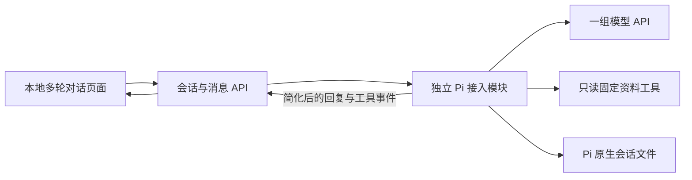

# W01 首增量设计：基于 Pi 的多轮对话与最小工具接入

日期：2026-09-16。基线：MVP v0.7。状态：2026-09-16 用户授权实施 W01-1，任务 in_progress；S0／S1 已实现并完成 C01～C06 真实／本地组合验收；完整 W01 后续阶段尚未开始。结果见 [验证记录](research/validation-results.md)。

## 1. 第一阶段的交付边界

W01-1 首先交付一个可实际使用的本地 Web 多轮对话入口：用户发送消息、看到流式回复、连续追问，Pi 使用本会话历史回答；必要时读取固定资料，并将工具结果用于回答和后续对话。多个会话的上下文独立，支持停止、错误提示及已完成历史的保存读取。

第一步不要求生成正式成果版本，不把“草稿 v1 → v2”作为唯一入口或退出标准。输出可以是普通回答、概括、比较或对话中的草稿，处理步骤由模型按目标选择。

| W01 阶段 | 交付重点 | 与第一步的关系 |
| --- | --- | --- |
| S0 最小工程与模型接入准备 | 锁定依赖、配置入口、独立 Pi 模块、只读工具范围 | 仅保留启动多轮对话必需的准备 |
| S1 多轮对话与最小工具 | Web、流式回复、会话隔离、停止、原生历史、一个只读资料工具 | S0 + S1 构成首增量 W01-1，以 C01～C06 独立验收 |
| S2 Harness 能力扩展 | 更多工具、AGENTS.md、Skill、压缩、单层只读子 Agent | 第一增量之后逐项接入，先复用 Pi 原生机制 |
| S3 运行管理与成果 | 持久化 Run、确认暂停／恢复、操作账本、成果版本、可靠事件 | 完整状态机在此实现，不反向阻塞 S1 |
| S4 可替换边界验证 | 平台工作记录、版本化快照、受控导出、契约与兼容检查 | 保留未来自研路径；完整迁移仍另行立项 |
| S5 技术收敛 | 完整 T01～T13 证据及 M1 选型依据 | 首增量通过不代表整个 W01 已完成 |

完整 Run 状态机和数据契约移至 [后续设计](design-later.md)。本文仅规定 S0／S1；后续方案不作为首增量的隐藏前置条件。消防样板、业务模拟服务、外部调度、正式席位协作和 Ubuntu 部署按原路线后移。

## 2. 技术路线与最小结构

第一步按 Pi 嵌入路线设计，采用 TypeScript／Node.js；Pi 的长期采用与模型兼容结论仍需实测。使用 React + Vite、Fastify 和 HTTP 流式响应。实际依赖已精确锁定在实验工程的 package.json／package-lock.json；兼容结论按测试证据记录。

Pi SDK 提供会话、历史、流式事件和取消入口；首步复用这些能力，具体调用以安装版本公开接口为准。[官方 SDK 文档](https://github.com/earendil-works/pi/blob/v0.85.1/packages/coding-agent/docs/sdk.md)。开发模型为 DeepSeek 默认端点上的 `deepseek-flash`，显式关闭 thinking。用户不设首轮验收总请求数上限；单次请求仍限制时间、工具次数和输出。

实现位于 `experiments/harness-lab/`：`src/server` 提供会话／消息入口，`src/pi` 封装 SDK，`src/web` 提供页面，`src/contracts` 仅定义实际用到的请求、页面消息和流式事件，`fixtures` 保存固定资料，`tests` 保存对应检查。

首步不引入 SQLite、平台 NativeCheckpoint／ProviderRecord、操作账本或通用 HarnessAdapter 框架。Pi 原生会话文件是此阶段历史的保存来源；待进入 S3／S4 再明确平台数据库和转换方式。

### 保留未来替换的最小约束

Pi 包、类型与原生会话文件的读取集中在 `src/pi` 及对应集成测试；API 和页面使用项目自己的少量字段。工具的资料读取函数不依赖 Pi，由 Pi 模块包装成 SDK 工具。避免直接修改 Pi 源码或让页面解析原生 entries。

这只保留代码边界，不宣称数据已经内核无关。完整平台记录、快照版本、导出和契约替身检查在 S4／T13 落地；首步不实现第二套内核或迁移工具。

## 3. 会话、历史与请求

- 使用单一固定的本地测试主体，只监听回环地址；首步不建设身份选择、任务空间或角色权限矩阵。至少创建两个会话验证上下文独立，不把它等同于多身份授权验收。
- 每个会话使用独立的 Pi 会话实例和历史。可以在进程内保留实例并跨轮调用，无需每轮销毁后重建；等待用户输入期间不发模型请求、不持有模型请求执行额度。
- 服务端管理会话 ID 到受控会话文件的映射，仅打开指定实验目录内的文件；客户端不能提供任意路径。会话文件包含当前会话历史，不加载其他会话消息。
- 同会话通过进程内活动请求标记串行执行，忙时第二条消息返回冲突，不自动排队。请求结束或取消收敛后清理标记，新的输入才可执行。
- 每次消息分配 requestId，用于事件关联、日志和精确取消。首步没有持久化 Run 表、queued 状态、segmentNo 或 continuedFromRunId。
- 历史使用 Pi 原生保存／加载方式；页面只读取公开消息与工具摘要。正常完成后重启服务，可以加载原会话继续追问；实现时验证保存时点及所选模型要求的原生字段没有丢失。

刷新或断线只重新查询历史和当前活动状态，不自动再次发送用户消息。服务进程仍在时，已接受请求继续到结束或超时；重连页面可短暂轮询会话快照直至空闲，首步不建设持久化事件序号、游标补发或完整 SSE 回放。切换会话不将旧请求事件写到新会话。

执行中服务崩溃后不自动续跑、不自动重发工具；最后未完成回合可能不完整，不能标记为成功。首步只承诺已完成会话的重启续聊；若 Pi 无法安全恢复完整协议历史，明确提示新建会话并保留原记录。完整中断识别和接续在 S3 验证。

## 4. 最小交互状态与接口

第一步只管理当前请求的交互状态，不实现后续 Run 状态机。

| 交互状态 | 行为 |
| --- | --- |
| 可输入 | 可以发送一条消息 |
| 回复中 | 展示流式文本及实际工具结果；禁止再次提交，保留输入草稿 |
| 正在停止 | 取消信号传给 Pi 和工具；等待本次执行收敛，再允许下一条消息 |

成功、失败、已停止作为本次请求的结果显示。失败要区分模型未配置、请求超时和提供方错误；保留输入草稿与已显示内容，用户可以重新发起消息。取消后新输入不能收到旧请求的迟到事件。每个请求有总超时、工具次数和输出上限；数值与真实测试总预算在调用前确定，首步不建设父子／压缩的持久化预算账本。

| 最小接口 | 作用 |
| --- | --- |
| `POST /api/sessions` | 创建会话并返回平台会话 ID |
| `GET /api/sessions` | 列出受控实验目录中的会话摘要 |
| `GET /api/sessions/:id` | 返回公开历史、工具摘要和进程内活动请求状态 |
| `POST /api/sessions/:id/messages` | 提交文本，接收关联 sessionId／requestId 的流式回复、工具和结束／错误事件 |
| `POST /api/sessions/:id/cancel` | 带目标 requestId 停止当前请求，旧请求取消不得影响下一条 |

流式响应可采用 fetch 读取 SSE；页面事件只保留实际需要的 text.delta、tool.started／completed、response.completed／failed／cancelled 等语义。服务端以最终历史快照校正流式内容；网络断开不解释为模型失败，也不隐式重试发送命令。

## 5. 最小工具与资源范围

只注册一个逻辑 `source.read` 工具（DeepSeek 函数名不允许点号，因此 Pi／协议侧使用 `source_read`，公开输出映射回 `source.read`），按受控资料 ID 读取 fixture 文本并返回正文和来源标识。资料清单可由页面静态呈现或显式放入当前输入；模型按目标决定是否调用。工具无写入效果，无需等待人工确认、业务操作账本或成果版本库。

禁用默认任意 Shell／文件工具；资源加载只允许本实验明确配置的内容，不自动发现开发机全局／祖先目录的 AGENTS.md、Skill 或扩展。API Key 只从服务端本地配置读取，不进入页面、普通历史或日志。

AGENTS.md 编辑、Skill、压缩和 Subagent 的能力验证在 S2，首步只接通最小工具循环。固定资料不规定唯一问法或工具顺序，不用预设回答冒充真实模型输出。

## 6. 页面与第一步验收

页面采用会话列表和对话区；工具记录可折叠，资料正文可展开查看。首步不要求任务树、成果版本面板、人工确认卡、指令编辑面板或运行审计页。

支持新建／切换会话、连续追问、流式回复、停止和错误提示。中文输入法组合时不误发送，Enter 发送、Shift+Enter 换行；流式内容不抢焦点，切换／异常时保留未发送草稿。详细交互分期见 [交互依据](research/interaction-notes.md)。

W01-1 仅按 [C01～C06](prd.md#首增量验收c01c06) 验收：真实连续对话、一次资料工具调用与追问、双会话隔离／忙时拒绝、取消与错误、原生历史读取和基本边界。当前首增量已通过，证据见验证记录。成果 v1／v2、完整 Run、待确认、崩溃恢复和 T13 不是首增量退出条件。

## 7. 后续进入条件

S2a 的具体方案已单列为 [W01-2](../09-16-w01-2-workspace-memory/review.md)，供审阅，未实施。它先建立工作区与会话归属，再接入指令和 Skill；压缩、Subagent 另作 S2b／S2c。

首增量通过后按 S2 → S3 → S4 → S5 推进；每步仅补齐当步需要的数据和控制。S2 不要求先实现平台 Run，S3 引入写工具和成果版本时才建设持久化操作／确认语义，S4 再完成完整可替换边界检查。

[后续设计](design-later.md) 保留既有运行与迁移要求，进入对应阶段前依据首步实测更新，不能直接把尚未验证的 SDK 接法视为已定事实。首步可持续扩展，MVP 的 Tool、Memory、Skill、Subagent、压缩、协作和方案目标不因分期而删除。

## 8. 首增量实施说明

原生历史使用实验工程下被 Git 忽略的 `.local/sessions/`；空会话先保存 Pi 原生 header 并通过 SessionManager 重新打开，使空会话也能跨重启保留。已完成记录的原生格式继续由 Pi 管理，页面不解析 JSONL。资料固定于 fixtures，服务端配置和凭证不进入页面。

默认单请求 90 秒、最多 4 次实际工具调用／5 次模型调用、每次模型输出 2048 tokens；不使用自动重试或自动压缩。未完成协议历史保留并拒绝自动续跑。运行说明见 [实验工程 README](../../../experiments/harness-lab/README.md)。
