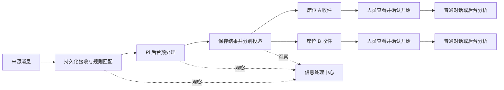

# 设计：信息处理与席位投递

更新：2026-09-22。状态：**已实现并部署，待用户验收**。范围以 [PRD](prd.md) 为准。

## 1. 整体流程



TypeScript／Node 服务、SQLite、React 和 Pi 0.85.1 保持不变。一个服务进程独占数据目录，进程内领取持久队列；Worker 是执行代码，不是共享上下文的常驻 Agent。Gateway 表达来源鉴权和接收能力，本期集成在现有服务，不单独部署消息中间件。

预处理完成后先交席位，正式分析由人员发起。后台收到消息与前台用户发起分析使用同一 Pi 能力，但身份、资料范围和启动入口不同。

## 2. 来源、处理方案与规则

三者分开，避免把“从哪里来”“怎样处理”“交给谁”混为同一对象。

| 对象 | 内容与维护方式 |
| --- | --- |
| 来源 Source | sourceId、名称、凭证引用、允许使用的处理方案及允许接收资料的席位范围；由部署配置登记，网页脱敏查看、停止／恢复接收 |
| 处理方案 Profile | goal、允许的工具／Skills／Agents、服务指令与只读资源；由维护人员登记，复用 Pi 执行，本期网页不编辑工具权限或可执行代码 |
| 处理与投递规则 Rule | 名称、来源、预处理方案、recipientSeatIds、可选公共任务展示归属、启停、revision；有管理权限者在网页新建／编辑／启停 |

`goal` 是该处理方案要完成的目标，不是 Axon 业务任务对象。`recipientSeatIds` 是本次应收到输入和预处理结果的席位列表，不是自动启动的 Agent 列表。人员后续分析的目标由人员填写，与预处理目标分开。

### 示例

以下为对象关系示意。实际部署读取 `LAB_BACKGROUND_CONFIG` 指向的 JSON，完整格式见 [配置示例](../../../experiments/harness-lab/config/background.example.json)；席位与方案必须实际登记，凭证通过环境变量提供。

```yaml
# 部署登记
source:
  sourceId: special-info
  name: 特情信息接入
  credentialRef: SPECIAL_INFO_TOKEN
  allowedProfileIds: [material-preprocess]
  allowedRecipientSeatIds: [test-seat, seat-b]
profile:
  id: material-preprocess
  goal: 读取原文及附件，整理事实要点、重复内容和待核实问题，生成供席位分析使用的材料。
  tools: [read, write, bash, file_output]

# 网页维护的规则
rule:
  name: 特情资料接收
  sourceId: special-info
  profileId: material-preprocess
  recipientSeatIds: [test-seat, seat-b]
  enabled: true
# 到达后等待席位人员发起分析，不自动启动下一段 Agent
```

工具使用步骤由 Agent 决定，例如读取 Excel、编写 Python、执行计算、输出文件。规则本期只按来源匹配，每来源最多一条启用规则；支持多个固定接收席位，不加入 LLM 分类、复杂条件或规则优先级。

规则保存校验管理来源范围、方案清单及接收方权限，不能通过编辑规则扩大来源授权。修改和启停采用 revision 校验并记录操作者；新增带 clientActionId。规则只影响后续新消息，历史保留规则版本及完整快照。停用规则后新信息仍可接收，显示“未匹配处理规则”，不启动模型；启用不自动补办这些历史信息，管理人员可明确选择按当前规则处理。

## 3. 接入、消息标识与快照

消息格式为 `{sourceMessageId, title, text, uploadIds?, subjectId?, occurredAt?}`，文本或文件至少一项。不要求任务编号；来信中的目标席位或任务名称是待处理数据，不授予权限。

- `sourceId` 是 Axon 登记并与凭证绑定的来源，例如 `special-info`、`situation-info`。
- `sourceMessageId` 是来源内部稳定消息标识；发送方或其适配器生成并保存，重试沿用原值，不在每次重送时换 UUID。
- `(special-info, 1001)` 与 `(situation-info, 1001)` 是不同消息。同键同内容返回原回执；同键异内容返回 409。
- 同事项的新内容使用新消息标识，可沿用同一 subjectId；独立保留，不按接收顺序覆盖旧结果。

文件经绑定来源的受控上传入口完整保存后再提交。消息摘要覆盖正文、其他语义字段和有序附件名称／大小／实际 hash，不含临时上传 ID、接收时间或当前规则版本。上传附件进入工作目录后是普通文件，不自动加载为指令、Skill 或自动解压。

接收顺序：验证来源与去重 → 校验新消息接收开关、大小与积压容量 → 固定原文、文件和已匹配规则／资源快照 → 同一 SQLite 事务登记事件及初始 queued 作业 → 返回回执。无启用规则时仅登记待匹配事件。写文件或事务失败不能确认接收；无主暂存内容可清理，不成为可执行作业。

初始作业与事件关联唯一，并发重送不重复创建。原回执可以在停止接收或容量满时查询。服务关闭时无法接收，调用方重送未确认消息。停止来源接收返回 503，不确认新消息；它与停用处理规则是两个不同开关。

已匹配输入固定规则和资源版本；领取时核验权限仍有效，不因编辑规则静默换目标或接收席位。无规则事件由人员补处理时才固定选定快照。来源的可选公共任务归属仅用于展示，不开放该任务的席位目录；归档不取消独立预处理。

规则生效版本以接收／补处理事务为界。异步准备文件期间规则发生变化时，提交前重新核验并准备一致快照，不能把新规则编号与旧接收席位混存。无规则补办和重复消息同时到达也只登记一项初始作业。

## 4. 执行身份、文件和 Pi

| 执行 | 身份与资料 | 工作目录／历史 |
| --- | --- | --- |
| 自动预处理 `preprocess` | 固定服务身份；仅本次输入和配置资源，不继承席位私有文件、聊天或 AGENTS.md | 每作业独立目录及 Pi 会话 |
| 人员对话分析 | 当前登录用户所属席位，绑定选定任务 | 既有任务 × 席位目录及普通会话 |
| 人员提交后台分析 `seat_analysis` | 服务端记录发起 userId／seatId、选定任务和输入；按该席位范围执行，不使用预处理的全局服务权限 | 同样使用选定任务的席位目录，新建一条普通会话关联作业 |

规则、处理方案及资源快照保存在 SQLite；文件与原生历史目录如下：

```text
LAB_DATA_DIR/
  background/events/<eventId>/             # 固定输入文本
  background/files/<fileId>/content        # 原始附件与预处理交付的固定副本
  background/uploads/<uploadId>.json       # 上传回执
  background/jobs/<preprocessJobId>/
    files/                                # 输入、脚本、中间文件、输出
    sessions/                             # Pi 原生历史与委派记录
    logs/                                 # 命令日志
  workspaces/<workspaceId>/files/          # 人员对话／后台分析的持久工作文件
  sessions/                               # 既有席位原生历史
  file-storage/<workspaceId>/              # 既有席位下载副本及日志
```

例如预处理 Agent 写入 `files/analyze.py`，容器看到 `/workspace/analyze.py`，可执行 Python 并将结果写回同一目录。一次执行中的多次模型／工具调用沿用目录，不每调用一次就重新建立空目录。容器按需创建并挂载目录，关闭容器不删除持久文件；目录名称不强制规定脚本或成果格式。

同一席位任务的后续会话继续使用其工作文件；不同席位分别复制选定输入后分析。不同普通会话仍可并行操作同一席位目录，沿用现有共享文件边界，不增加工作区级串行锁。重启中断保留现有内容；明确重新预处理使用新目录，人员重新分析沿用其任务目录并提示核对上次效果。

复用公开 AgentSession／SessionManager、原生 JSONL、默认压缩、重试、Skills、single 只读 Agents 及 Docker。新增宿主服务范围与后台启动适配，抽取确实共用的会话／文件依赖，不伪造席位条目、复制 Agent 循环或引入第二内核。

后台两类作业均不长期等待人工：不注册 AskUser、正式协作写工具或指令修改工具；缺资料可返回问题并结束。Bash 允许项执行、禁止项拦截；需要确认时停止并记 `HUMAN_ACTION_REQUIRED`，保留产物。用户在普通对话继续时使用既有 HITL，批准只绑定当次具体操作；“提交后台分析”不授予所有危险操作权限。

## 5. 结果与多席位投递

结果使用原生最终答复引用和零到多个 `file_output` 固定文件。模型文字声称生成文件不代表交付成功；声明的交付记录必须能核验读取。普通脚本、原文件和阶段消息保留供核对，不能冒充最终成果。生成结果不创建 WorkItem／Submission。

预处理正常结束后，核验结果，在同一事务中提交作业 succeeded，并为每个接收席位建立 pending 投递记录。输入及结果可以共同引用固定副本，不为了多个席位重复调用模型。

投递代码逐项校验接收席位和来源资料授权，将对应收件登记为 delivered；失败保存原因。站内 delivered 与收件可查询性在同一 SQLite 事务生效，不依赖浏览器在线。唯一键为 `(预处理作业ID, 接收席位ID)`；响应丢失或重启后重复处理不重复送达。

| 状态 | 含义 |
| --- | --- |
| pending | 已保存投递要求，尚未完成站内投递 |
| delivered | 收件记录已持久化，该席位可查询获准输入和结果 |
| failed | 未完成投递，记录原因，可明确重试 |

列表分别显示处理状态与每个席位的投递状态。某席位失败不撤销其他席位已送达的结果；重试投递只处理未送达项，不重跑 Pi。没有自动重试风暴或站外消息投递。人员重新预处理会产生新的处理及投递版本，旧版保留且清楚标识，不覆盖旧结果。

执行失败／取消／中断时，不自动把部分结果当作完成成果投递；信息中心显示异常，获授权管理人员核对或重新处理。人员后台分析的结果保留在原席位会话／文件中，不自动再次分发给所有原接收席位。

普通规则编辑不改变历史收件归属，也不追授新接收人旧结果。明确收回来源资料权限或停用账号时，相应查询／下载立即拒绝；权限撤销与修改未来规则分开处理。

## 6. 席位确认后的两种分析入口

工作台增加“收到的信息”，只查询已投递给本席位且当前仍有权查看的记录。详情显示原文、附件、预处理结果和本席位后续处理入口，不自动触发分析。

| 入口 | 用户动作与系统行为 |
| --- | --- |
| 进入对话分析 | 选择未归档任务、勾选资料并填写／修改目标；准备文件和空会话，填入可编辑草稿；发送后才调用模型 |
| 提交后台分析 | 同样选择任务、资料和目标；确认后持久化后台作业，后台领取并处理，用户可关闭页面，稍后从原会话／收件详情查看 |

默认选中预处理答复与交付文件，原始附件可勾选；用户可选用已获准的 Skill／Agents，沿用现有能力，不新增常驻席位 Agent。导入不包含服务指令或完整工具过程，同名不同内容不覆盖既有文件。

每次发起使用 clientActionId，记录发起用户、席位、投递 ID、目标任务、选定资料、目标和分析方式。准备过程预分配会话与文件去向，持久记录进度；固定副本及会话绑定完成并核验后才能返回可发送草稿或提交 queued 作业。文件／Pi 与 SQLite 不天然原子，失败可查回原准备记录继续完成，不生成重复会话或盲目清理用户文件。相同操作换参数返回冲突。

后台分析队列保存预分配 sessionId／requestId，并预留该会话；准备、排队和执行期间普通发送返回 busy。占用按持久作业记录校验，不能只依靠 Pi 进程内 active 标记。任务归档同时检查排队作业、执行和准备中的导入；防止归档后仍开始写文件。不同会话不因此强制串行。

领取前重新校验发起账号有效、席位绑定、任务访问和输入授权；无效则明确结束，不降级成服务身份。领取时按现有机制加载本席位工作区指令／资源快照并记录依据。已接受执行不依赖网页登录会话继续存活；注销不取消作业，终态后的查看仍受当前权限约束。

后台分析结束或中断后释放会话预留，用户可在同一普通会话发送新消息继续；不是恢复原执行断点。普通对话准备但未发送时只显示“已创建对话”，不能显示“分析已开始”。各席位可独立发起分析，重复点击同一操作不重复执行；人员明确发起另一项分析则创建新记录。

选择重新后台分析时新建作业和会话，保留旧会话及其关联，文件仍在同一任务的席位目录；选择普通续聊则直接沿用已有会话。人员分析的取消／重新发起由原有权席位办理，信息管理权限不能代其执行。

## 7. 信息处理中心与权限

信息处理中心作为同一应用的独立页面，路径为 `/information`；工作台左下仅对获授权账号显示入口，中心提供“返回工作台”。不增加右上角设置入口，不另建账号体系或服务实例。

| 权限／身份 | 页面与范围 |
| --- | --- |
| 普通席位 | 工作台“收到的信息”及自己的后续会话／作业；不能浏览全局记录或规则 |
| 信息查看 | 在获准来源范围查看输入、预处理过程／结果、投递情况和规则，只读 |
| 信息管理 | 包含相同范围查看，可维护规则、启停接收、取消／重新预处理、重试投递；不能据此操作他人私有会话 |

通过现有离线维护入口登记对账号或席位的来源范围和查看／管理能力，默认无授权；账号及所属席位的有效授予共同生效。不建设通用角色层级。`information_grants` 只表达主体、来源和能力；全局队列暂停／恢复只允许管理全部已登记来源的主体，单来源管理者只能控制自己的来源。

中心权限不是读取其他席位全部文件的权限。后续席位分析在中心仅展示办理席位、执行方式、状态及时间；私有任务名称、分析目标、正文、文件、工具日志和可访问会话链接仍只对原有权席位开放。用户不能通过“信息中心管理员”绕过这些边界。

### 页面布局

```text
信息处理中心                         返回工作台
[信息记录]  [后台作业]  [处理与投递规则]
来源筛选 / 状态筛选 / 搜索
标题       来源       接收时间       处理状态       投递情况
某条信息   特情系统   10:30          预处理完成     A 已送达 / B 待投递
```

- **信息记录**为默认页。详情按“原文 → 使用规则 → 预处理 → 分席位投递 → 人员后续分析”展开，可跳转关联作业；无规则、处理中及部分投递失败均有清楚说明。
- **后台作业**展示排队、运行和终态，区分自动预处理／人员提交分析；复用现有过程、Markdown、文件与日志组件，受上述内容权限约束。
- **处理与投递规则**支持基础表单的新建、编辑、启停，字段为名称、来源、已登记方案、多个接收席位和可选公共任务归属。到达后行为固定显示“等待席位人员发起分析”。来源详情提供接入开关及脱敏配置，不展示凭证。

详情使用可恢复 URL，列表分页并保留筛选／滚动位置。状态刷新不启动工作，不虚构百分比，不移动用户焦点或覆盖编辑草稿；保存冲突保留草稿并提示读取最新内容。切换中心与工作台保留本账号对话状态；退出清空身份状态并丢弃迟到响应。复用 Axon 现有视觉样式与键盘操作，桌面为验收范围，不建设特情专用组件。

## 8. 生命周期、容量与重启

这里的作业指一次自动预处理或人员提交的后台分析；不表示业务任务、整段会话或席位待办的状态。作业状态：`queued → running → succeeded / failed / cancelled / interrupted`；queued 也可取消或因执行前校验失败而结束。准备、等待模型、生成、工具、压缩和委派属于执行阶段。等待席位人员不是 running 作业，没有持续占用容器或模型。

领取事务先保存启动标识、时间和原生会话／请求引用，再调用 Pi。取消先保存请求再传播 AbortSignal，收尾后才提交终态；取消与成功按 revision 串行校验，已有文件不回滚。重新处理必须明确发起，使用新作业与 retryOfJobId；预处理固定原输入和原方案／规则快照，能力仍须获当前授权，旧部分产物不默认成为新输入。

默认后台并发 1、进程实际模型调用并发 2，可配置调整。两类后台作业共用执行容量；前台、后台、摘要、重试及子调用共用先进先出模型许可池。父 Agent 等待工具／子 Agent、退避或人工交互时不占模型名额；并发为 1 也不能父子互等。投递代码不占模型许可或后台 Agent 执行槽位。

等待模型不增加调用次数、不启动流空闲超时；取消移出等待队列。沿用现有用量、超时及容器限额，不新增固定工具次数、模型次数或整轮时限；父子用量避免重复累计，中断缺失值标未知。默认积压上限 100，统计未匹配信息与 queued 作业，避免无规则入口绕过容量；达到上限时新接收／后台提交返回 429，原回执仍可查回。

若部署显式设置整轮执行时限，从领取开始计时，排队耗时单独展示。文件准备和后台容量检查完成后才确认作业已入队；拒绝入队时可查询准备回执重试，不重复复制文件或创建会话。

暂停领取只影响新开始的后台作业，已执行和既有投递继续；开关持久保存。模型设置变更同时检查后台活动：运行中拒绝，queued 领取时采用当时有效模型设置并记录标识，密钥仍留宿主。

| 退出时状态 | 重启处理 |
| --- | --- |
| 已接收、未匹配规则 | 保留待处理，等待人员明确补办 |
| queued | 保留队列及席位会话预留，重新核验权限／资源后领取 |
| running | 无已提交取消请求则记中断；有取消请求则清理后记取消，提示核对已有效果，不重放工具 |
| succeeded，投递 pending | 只继续站内投递，不再调用模型 |
| 已投递或其他终态 | 展示原记录，不重复送达或重新执行 |

Pi JSONL、文件和 SQLite 不天然原子提交。历史已有回复但成功事务未提交时，保留内容并显示中断，不在启动时猜测并补写成功。原生后台分析终态与队列状态不一致时保守展示未确认完成，释放结束后的会话预留，不自动重跑。投递提交和席位收件同库事务，无须重新执行模型来修复回执。

正常停服先停止接收／领取，通知在途停止并清理，未完成者记中断；只有人员取消才显示取消。启动先校验数据库、清理本实例遗留容器再领取；清理失败则暂停执行。文件损坏或磁盘失败不得返回假成功。

## 9. 存储与接口

在现有 SQLite 连接增加必要元数据：

| 记录 | 负责的事实 |
| --- | --- |
| background_events | 来源消息键、固定输入、规则快照、初始处理引用或未匹配原因 |
| background_jobs | 作业类型、发起主体、范围、执行／会话引用、状态、结果引用、用量与重新处理关系 |
| background_deliveries | 每份预处理结果到每个席位的投递状态和原因；同时作为站内收件依据 |
| information_rules／information_grants | 当前基础规则及变更校验；账号／席位的来源权限 |
| background_actions／background_controls | 发起、导入、重试等操作回执与开关 |

聊天、工具、压缩内容仍在 Pi JSONL；文件副本保存输入与交付内容；正式业务效果仍以原协作回执为准。席位分析明细不复制到全局事件正文。规则快照、投递记录是本期追溯所需信息，不扩展为完整前台 Run 账本。

| 接口入口 | 职责 |
| --- | --- |
| `/api/integrations/:sourceId/uploads` 及文件内容子路径 | 来源认证上传，绑定来源和实际文件内容 |
| `/api/integrations/:sourceId/events` | 提交消息／按 sourceMessageId 查回接收回执，回执不泄露内部内容 |
| `/api/inbox`、`/:deliveryId`、受控文件子路径 | 当前席位收件、输入／结果查询下载 |
| `/api/inbox/:deliveryId/analyses` | 选择任务、资料、目标及 conversation／background 方式；准备或提交并查询 clientActionId 回执 |
| `/api/background/jobs/:id`、`/:id/cancel` | 本席位分析进度及停止；预处理管理操作需信息管理权限 |
| `/api/information/events`、`/jobs`、`/deliveries` | 授权来源内观察详情；投递重试只补投递，重新处理明确创建作业 |
| `/api/information/rules`、`/sources`、`/queue` | 基础规则维护、来源脱敏查看及控制 |

集成路由使用专属来源 Bearer 凭证，精确注册免于网页 Cookie／CSRF 的范围，不放开其他 `/api`。浏览器入口继续使用登录、CSRF、viewId；服务端逐次校验范围，不能只隐藏菜单。越权对象返回 404，无管理能力的写入拒绝。规则编辑、取消和开关校验 revision；新增／重试／发起以 clientActionId 去重，相同键改参数返回冲突。

来源凭证只能提交本来源并查询回执，不能读取席位会话或修改规则。上传限制大小／数量／并发并清理未提交暂存文件；资料 ID 不得替换为宿主路径。沿用 loopback／SSH 部署，本期不开放公网或站外推送。

## 10. 兼容与发布

配置该功能时增量迁移现有 SQLite 至 schema v3，增加表和独立权限，不重置当前账号、任务、会话或交接记录。后台默认关闭，配置来源及权限后显式启用。发布前停服备份整个数据根，在副本验证迁移与故障；回退使用对应旧版本及备份，另行保留和核对备份后新增输入、投递及分析记录。

已有未完成后台作业或资料准备时，移除后台配置会拒绝启动，避免遗失会话预留。开发与发布方式见 [实施记录](implement.md)，验证证据见 [验证记录](validation.md)。线上部署与备份记录见 [验证记录](validation.md#上线与验收)。
