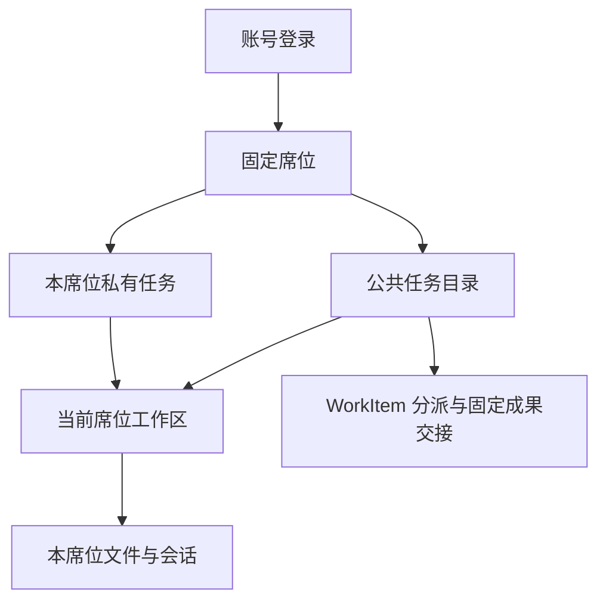

# 设计：业务任务、可见范围与席位入口

日期：2026-09-21。状态：**首增量待审，未实现**。按 [D01～D03](prd.md#3-待审产品选择) 的推荐方案设计；私有归属、登录和公共目录范围尚需用户确认。

## 1. 对象关系

| 对象 | 本期定位 |
| --- | --- |
| 账号 Account | 登录身份；本期一个启用账号绑定一个席位，一个席位绑定一个启用账号 |
| 席位 Seat | 业务责任及工作区归属；保留已有 seatId，配置必要能力 |
| 业务任务 TaskSpace | 页面中的项目，统一名称、目标、公私类型、负责席位及状态；沿用 taskSpaceId |
| 工作区 Workspace | taskSpaceId × seatId 的独立目录，保存文件、AGENTS.md 和会话绑定 |
| WorkItem | 公共任务下明确分派给另一个席位的一项工作，保留原提交／验收机制 |
| Session／请求 | Pi 对话及一次执行；其完成不改变 TaskSpace 或 WorkItem 的业务状态 |

建议页面统一使用“任务”，公共／席位私有是任务类型；不再同时让“项目”和“业务任务”表示两个层级。内部 taskSpaceId、workspaceId 和既有路径不因改名而变化。



私有任务按席位归属是待审选择，不等同于自然人的永久个人空间。本期不提供更换账号席位或换岗继承界面；若决定私有任务跟人，需要在实施前调整所有权和迁移规则。

## 2. 最小身份入口

建议加入账号／密码登录，使用 Fastify 官方 cookie／session 插件与 SQLite 会话存储，版本在实施时按现有 Fastify 5 兼容范围锁定。账号开通、重置、停用由停服维护命令完成；输入密码不回显，不写命令参数或仓库，不提供公开注册。

账号记录稳定 userId、用户名、显示名、seatId、密码摘要及启用状态。账号密码只保存加盐的 scrypt 摘要，使用 Node 公开 crypto API；签名密钥由服务端本地配置提供。登录限流覆盖账号和来源，失败返回统一提示，不暴露账号是否存在。具体参考见 [依据](research/basis.md)。

Cookie 保存不透明会话标识，启用 HttpOnly、SameSite 和明确到期时间；登录成功重新生成会话标识，退出在服务端销毁。建议会话绝对有效期默认 8 小时，可配置；这是登录有效期，不限制 Agent 工作时长。写请求校验 CSRF 与 Origin，认证请求也在保护范围内。

延续目前 loopback／SSH 访问；本地 HTTP Cookie 例外仅适用于明确的本地模式。未来通过远程浏览器直连时，须先配置 HTTPS 与 Secure Cookie，不把本期等同于公网部署项目。

### 路由与身份

- 未登录只开放登录所需接口、静态资源和不含业务数据的健康信息；旧 `/api/info` 不再匿名泄露业务／模型配置。
- 正式业务接口统一由登录会话解析不可变的 `userId、seatId`，再加载席位能力；浏览器提交的席位或权限字段不能作为身份依据。
- `/api/test-seats/:seatId/...` 仅在显式开发测试模式中注册，使用独立测试数据。正式模式不得同时开放无认证旧路径，账号未配置应明确拒绝启动业务服务，不自动降级成测试身份。
- 正式工作台只挂载当前身份的一份状态树。不同身份验收使用独立浏览器配置或隔离浏览器会话；同一浏览器的多个标签共享登录 Cookie，不承诺能同时登录不同账号。

## 3. 任务目录与权限

TaskSpace 最小字段：`id、title、goal、visibility(public/private)、ownerSeatId、state(active/archived)、revision、createdByUserId、createdAt、updatedAt`。公共任务目标必填；私有任务目标可选。ownerSeatId 表示任务负责席位，对私有任务也表示唯一可见席位。

| 行为 | 公共任务 | 私有任务 |
| --- | --- | --- |
| 查看任务说明 | 所有启用席位 | 仅归属席位 |
| 创建 | 席位具有 createPublicTask 能力 | 任一启用席位，为自己创建 |
| 修改说明、归档／重新开启 | 任务负责席位 | 归属席位 |
| 在任务内开始自己的会话／文件工作 | 任一启用席位，使用自己的工作区 | 仅归属席位 |
| 读取其他席位文件／会话／指令 | 不因任务公共而开放 | 不允许 |
| 跨席位分派 WorkItem | 沿用现有分派与确认 | 本期不允许，提示在公共任务中开展协作 |
| 查看 WorkItem／交接文件 | 原有参与方权限 | 不新增跨席位交接 |

创建公共任务的权限只决定是否可建立任务，不自动授予其他任务的管理权或私人内容读取权。模型设置是全服务配置，另以 `manageModelSettings` 能力控制写入，避免所有登录席位都能替换共享模型和密钥；保留当前左下设置入口。

创建页明确显示类型及可见范围；公共任务由有权限者点击“确认建立公共任务”后写入目录。创建者所在席位成为负责人，不另设多人审批。创建使用 clientActionId 去重，响应不明先查询，不重复建任务。

公私类型和负责席位本期创建后固定，不提供一键公开、转私有或转交。这避免在尚未明确文件／会话分享规则时扩大已有内容范围。

### 任务状态

仅 `active（进行中）` 与 `archived（已归档）`。归档保留目录、会话和文件，禁止新会话、消息、文件／指令写入和新业务交接；可查看历史、下载既有获准文件。归档不自动验收 WorkItem，也不表示业务结论已被认可。

归档前检查无活动父请求、在途写操作、待确认操作及未完成 WorkItem；否则返回原因，由人员先完成或取消相应工作。负责人可重新开启。归档、启动新请求及新写操作的接纳使用短临界区校验，不能出现双方同时通过旧状态；不把同任务的整个处理过程串行化。

## 4. 工作区、会话与 Pi 复用

任务目录是统一元数据；工作区仍保存该席位的实际文件和会话。查看公共任务只读说明；点击新建会话／开始文件工作时，宿主按 `(taskSpaceId, seatId)` 幂等准备工作区。首次进入不需邀请，不复制别人的文件、AGENTS.md 或历史。

保留 `LAB_DATA_DIR/workspaces/<workspaceId>/`、原会话绑定和 Pi JSONL。现有 Workspace 的 name 作为兼容字段保留，新的页面及上下文统一从任务目录读取名称，不能让工作区索引和任务表各自维护不同任务名称。

当前任务名称、目标和范围通过既有宿主资源装配提供给 Agent，并沿用当前请求资源记录；不导入其他任务目标，不重写旧消息或修改 Pi 压缩。任务说明不能增加工具权限。

身份／任务检查在服务端统一入口及宿主资源访问层执行：先验证任务可见及可操作，再检查具体工作区属于当前席位；已归档任务只开放读取。文件下载、上传、@ 引用、指令编辑、日志、Agents 详情、会话历史和 WorkItem 接口均适用，不能只过滤侧栏。

模型工具沿用宿主捕获的执行身份和工作区，不能自行填写另一身份。确认后的业务提交仍核验参与方、版本和当前任务状态。Pi 保持一个运行实例与原生机制，不为各席位复制服务进程。

## 5. 页面交互

### 登录与席位

`/login` 展示 Axon 标志、账号、密码和登录按钮，支持密码管理器、粘贴、显示密码及键盘提交。错误就在表单内说明，提交时有反馈；成功后进入当前席位工作台。服务出错与凭证错误分别提示恢复方式，不回显密码。

左下显示账号／席位及退出入口；设置仍只在左下。普通聊天页面不显示测试席位下拉框，不为不同席位建设两套页面或独立部署。

### 任务与对话

```text
Axon                       当前任务与会话
新建对话                    任务名称 · 公共／席位私有
公共任务           [+]     任务说明／文件／会话
  任务 A           [+]     ……
    本席位会话 1
席位私有           [+]
  私有任务 B       [+]
    本席位会话 2
全部动态 · 工作待办
账号／席位 · 设置 · 退出
```

公共任务的加号创建公共任务，仅对有权限席位显示；私有组加号默认创建席位私有任务。任务行加号仍表示在该任务中新建会话。任务数量较多时提供搜索／分页，已归档任务通过筛选查看。

全局新建对话可选择进行中的公共或本席位私有任务；未准备工作区时由宿主创建。默认仍保持快捷新建对话的交互，不强迫用户先完成成员加入流程。

任务说明用现有布局内的详情区域／抽屉呈现；负责人可修改目标、归档或重新开启。保存冲突保留草稿，提供查看最新内容后重试，不强制覆盖。归档确认说明将停止新工作，不暗示删除文件。

任务切换保留各会话的未发送文字、附件引用、滚动位置、未读和进行中状态。公共目录可见不让侧栏展示别人的会话标题或进度。WorkInbox 继续只显示当前席位有权查看的业务工作。

### 退出、过期与跨标签页

退出后关闭该登录会话的受保护事件流、清除当前页面数据和客户端敏感缓存；服务端已接受的 Agent 请求按原身份继续，不自动重放或撤销。未完成的 HITL 仍按原确认规则处理，必须重新认证为有权身份后才能回答。

浏览器业务请求携带当前视图的预期身份标识，服务端与登录身份比较；它仅用于识别旧页面，不授予权限。另一标签页切换账号后，旧页面不能把草稿或确认提交到新身份下。收到身份变化／401／上下文不符时停止渲染旧响应并重新验证，延迟返回不能写入新页面。

未发送草稿仅在当前登录上下文中保留，退出前有草稿时说明将清除；不向新账号恢复旧草稿或附件。同一账号重新登录可以读取服务端已保存历史。浏览器之间同时验证两个席位时使用独立存储上下文。

## 6. 存储与接口

在现有 SQLite 中增加 `task_spaces、accounts、seats、auth_sessions` 及最小任务操作记录；复用一个连接／迁移入口，避免各模块竞争升级数据库。任务操作记录仅保存创建去重、修改／归档的操作者及结果，不扩建通用审计或 Run 账本。

任务表保存任务事实；workspace-index 继续保存目录和会话绑定；Pi 保存对话，现有协作表保存 WorkItem／Submission／Receipt。账号密码和登录 Cookie 不进入 Pi、文件沙盒或请求资源记录。

任务创建先在 SQLite 登记；工作区按需生成。目录准备失败时保留已建任务并提供重试，不能宣称数据库与文件系统天然原子提交，也不能再次创建一个任务掩盖失败。

| 接口 | 职责 |
| --- | --- |
| `/api/auth/session`、`/api/auth/login`、`/api/auth/logout` | 登录初始化／当前身份、登录、退出；返回必要 CSRF 信息，不返回服务端秘密 |
| `/api/tasks` | 按当前身份查询可见目录；创建公共／私有任务，带 clientActionId |
| `/api/tasks/:id` | 查询说明、按 revision 修改允许字段 |
| `/api/tasks/:id/archive`、`/reopen` | 归档和重新开启，校验身份、revision 及运行条件 |
| `/api/tasks/:id/workspace` | 幂等准备当前席位工作区，不能指定另一个席位 |
| 原会话／文件／协作接口 | 改用登录身份和统一任务校验，业务功能继续复用 |

任务创建的未知响应通过同一 clientActionId 查询，状态修改携带 revision，重发不能产生第二次效果。正式模式旧的直接新建 workspace 入口只能作为“创建本席位私有任务”的兼容适配，不能绕过任务登记和可见范围。

## 7. 旧数据与升级

升级前停服并备份完整数据根。先生成迁移清单，按已有 taskSpaceId 聚合工作区、席位和 WorkItem；保留任务、工作区、会话、文件和操作 ID。

- 仅单席位且无跨席位交接的项目：建议映射为该席位私有。
- 已有多席位工作区或交接的项目：列出原参与范围，必须明确公共任务映射及负责人；不能因存在两个目录而直接扩大对所有席位的可见范围。
- 同一 taskSpaceId 的旧名称不同、缺目标或关系不完整：列出待确认项，不猜负责人、伪造业务目标或丢弃记录。历史任务可暂标说明待补，修改或新建公共任务时要求填写目标。

未完成映射或升级标记不完整时，正式服务拒绝开放业务接口并提示恢复／继续迁移。账号按原 seatId 绑定，不能把所有旧数据挂到第一个登录账号。Pi JSONL 和文件字节保持不变，旧协作记录继续可读。

迁移命令可重入，校验报告与数据库阶段，不重复创建账号或任务。回退使用对应程序与完整备份，并单独核对升级后新增数据；旧程序不能直接打开升级后的数据。

## 8. 范围边界

本期不增加后台事件总线、Job、智能分流、特情系统、后台管理台、个人换岗、成员邀请、公私互转或通用权限设计器。最小账号仅为本期访问限制服务。后续自动作业使用公共任务目录时，还需单独审阅服务身份、查询资料范围与结果交付，不因为“公共任务存在”就默认获准读取所有工作区。
