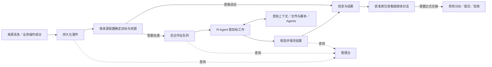

# W09-A 设计：事件驱动的后台作业与管理台

日期：2026-09-21。状态：**设计待审，未实现**。任务目录、后台资料范围和席位结果入口按 [PRD 待审建议](prd.md#5-待审选择) 展开，尚未获得实施批准。

## 1. 总体结构

事件记录已经发生的事实，后台作业记录系统要执行的工作，结果记录实际产出及去向。WorkItem／Submission 继续表达正式分派、提交和验收，不要求每次自动执行都创建它们。



TypeScript／Node 服务运行接入和队列领取，React 提供页面，SQLite 保存元数据；一个进程独占数据目录。无需引入 Redis、Kafka 或第二套 Agent 循环。Worker 指领取并执行作业的代码，不是常驻同一上下文的 Agent。

## 2. 输入与外部系统职责

`Event` 保存 `id、sourceId、sourceMessageId、type、receivedAt、occurredAt、text、fileIds、payloadHash`；可选来源事项 `subjectId`、来源版本 `sourceVersion`、原消息引用、任务引用及 `operationId`。来源身份与数据范围由宿主核验，正文不能授予权限。

- 来源消息、来源事项和 Axon 任务使用不同标识。来源任务引用可以为空或多项；项目引用与具体 WorkItem 引用带类型，不能混用。
- 特情等来源系统维护自身事实、修正及历史。Axon 分析其与业务任务的关系；允许来源提供已知关系，不要求其预先判断所有影响。
- 来源引用要区分“已知相关”与“仅允许在这些任务内使用”。前者是分析线索，后者是访问限制；未知语义不能推断为授权。
- Axon 保存收到的原文、文件及实际读取的重要依据。完整领域历史留在来源系统，不以全量同步为前提。

| 本期事件 | 默认行为 |
| --- | --- |
| `information.received` | 受控测试接口／管理入口提交文本和文件，按来源配置送达或创建作业 |
| `work.assigned` | 在原业务事务中记录成功事件并关联已有 WorkItem；不重复分派，不默认调用模型 |
| `work.submitted` | 关联既有 Submission；可启用辅助检查，保存检查意见，不替人员验收 |

接收顺序：校验来源及大小 → 保存固定文件 → 事务写事件及待处理记录 → 返回事件 ID。内部事件与原业务状态、回执同 SQLite 事务提交。文件暂存失败或登记失败不能返回已接收。

`(sourceId, sourceMessageId)` 唯一：同键同内容返回原记录，同键异内容返回冲突。附件比较实际内容摘要，不因重新上传获得不同临时 ID 而改变消息语义。新消息即使指向同一 `subjectId` 也独立保留。

“无人在线”指服务运行但浏览器关闭。服务停止时，来源应重送未确认接收的消息；本期不承诺服务停机期间仍能直接接收。

## 3. 目标、分流与 Agent 执行

来源配置给出触发条件、工作目标、可用工具／Skill／Agents、资料范围、交付范围及兜底处理人。配置由受控部署文件提供，保存版本；网页可查看、启停和测试，不编辑可执行代码。

有明确目标时直接创建对应作业；纯送达无需模型。需要理解内容时，配置一个分析目标，例如“结合获准任务和来源历史，判断影响并形成处理结果”，由 Pi Agent 查询、判断并工作。LLM 不限于从固定 `optionId` 中选一项，也不要求每条消息先增加一次分类调用。

Agent 按需决定：涉及哪些任务、需要做什么、是否委派获准 Agents、哪些结果交给谁。这些决定可以在同一工具循环中完成。角色职责沿用已有 Agents 配置；复用 single 只读委派，写文件和执行脚本仍由当前作业的 Agent 完成。本期不新增任意 DAG、递归或后台子作业编排。

一条事件按一个已匹配的处理配置创建一个作业，初次派生按事件 ID 与处理配置版本去重；匹配冲突先交人工选择。首次分派固定配置版本，重送消息或更新配置不重新处理已分派的事件。一个作业可处理多个相关任务并生成多份结果，关联任务不会自动再为每个任务启动一份作业。人员另行指定目标时创建关联新作业，按人员操作标识去重并保留原执行。

最终判断保存简短理由、所依据的资料引用和处理范围，不保存隐藏推理。无相关任务可以正常完成；缺少资料应说明限制。未知标识、越界交付或无法确定的目标不能靠默认改派掩盖，保留结果及问题，交给配置的兜底处理人；后者也只能看到获准资料和可公开的错误说明。

## 4. 上下文查询与信息关联

建议本期以 Axon 既有项目／WorkItem 为候选任务目录，不另外建设任务生命周期。项目目前主要有名称，WorkItem 才有目标和状态；项目级判断需补充明确开放的任务说明，不能声称现有项目名称已经足够。首轮可用受控任务说明文件补充，并由只读目录适配器统一呈现；管理表单后置。

| 查询能力 | 提供给 Agent 的内容 | 范围 |
| --- | --- | --- |
| 来源查询 | 指定对象详情、历史更新、按条件检索的片段与引用 | 配置允许的来源和条件 |
| 任务查询 | 候选任务标识、类型、目标描述、必要状态、可读资料索引 | 获准任务目录 |
| 资料读取 | 已授权的任务材料、来源原文及固定文件 | 有权限的具体资源，不开放任意宿主路径 |

来源查询先使用可重放测试适配器，任务查询复用当前数据和明确提供的说明；两者均通过 Pi 工具接入。凭证留在宿主，查询通过宿主适配器完成，不为 Docker 开放执行网络。来源不可用、查询截断或覆盖范围不足均明确返回，不把缺数据解释为无影响。

实际用于判断的查询结果保留来源、对象 ID、读取时间、可用版本及正文／文件依据；工具原文在 Pi 历史中，另有下载需要时保存固定文件。结果引用这些已保存内容，不要求以后重新查询到完全相同的远端内容。无需复制完整远端数据库或全量索引。

任务关联支持零到多项，记录关联对象、理由、依据及产生方式（来源提供／Agent 判断／人员修正）。来源原始关系和旧判断不被人员修正抹除。关系是分析结果，不自动成为领域事实、任务成员关系、文件访问授权或新作业触发器。

权限分为“允许读取”与“允许交付”。配置明确任务描述、资料和接收席位范围；资料不足时允许待核实，不遍历全体席位目录。本期采取保守交付校验：结果接收方必须获准接收本次尝试实际读取的受限资料，包括输入、指令资源及委派读取；不能仅凭模型说已脱敏而放行。需要向互不相容的范围交付时，使用不同读取范围的新作业，不混用上下文。

## 5. 结果、送达与人员继续

| 产出 | 处理方式 |
| --- | --- |
| 正文、图表、分析文件 | 保存结果；可不关联业务任务，也可关联多项 |
| 任务影响判断 | 保存关联、理由及依据；向获准席位显示，不自动分派工作 |
| 对既有提交的检查意见 | 关联该次 Submission，不另建提交、不改变原工作状态 |
| 缺资料或需要人员判断 | 结果标明问题，在“信息与结果”中提示跟进；不冒充正式业务待办 |
| 需要正式办理或上报 | 人员进入对话／既有工作页面，按原分派、提交及确认流程操作 |

复用文件输出工具固定交付文件。为模型选择任务关联和接收方补充一个结构化结果登记工具：登记文字／文件引用、相关任务、接收席位及可选待核实问题；宿主校验真实标识、权限和文件存在。正文不要求固定 JSON 摘要格式，工具只把交付关系与自然语言结果区分开。

登记只准备本次结果，不立即送达，也不创建 WorkItem／Submission。作业正常结束后由宿主事务发布。无需动态关联的配置可以直接使用最终回复和配置中的固定接收方；不能因模型漏填结果而猜测交付对象。配置要求文件时，只有文字声称完成不能通过；需要动态交付却未形成有效登记时，保留部分结果并标明失败原因。

一项作业可有多份结果。结果各自有正文／文件引用、任务关联、接收范围和必要的问题提示；只保存时不必通知席位。收到结果不意味着获准访问后台完整会话，关联同一项目也不自动向该项目所有席位公开。结果、接收范围及站内未读记录同事务提交，按尝试和条目去重。

人员进入对话时选择已有空闲会话或新建会话，选定资料和结果导入自己的工作区，填入可编辑草稿，发送后才调用模型。无项目结果无需虚构项目；开始文件工作时再由人员选择或创建项目。同名不同内容的文件不覆盖。

补充要求后重新处理使用新尝试和目录，保留前次结果；改变目标或读取／交付范围则创建关联新作业。已读只影响未读提示；“需跟进”不是 Submission 的通过／退回状态，不新增通用复核引擎。获准席位可修正自己的任务关联或补充理由，服务端记录操作者及修正内容并校验 revision；不借此改写原文或扩大结果可见范围。

后台不注册 AskUser、正式业务写操作及指令文件修改工具。资料不足可正常返回问题并结束；需确认的 Bash 未获授权不能执行，应停止该次尝试，保留产物和原因，提示人员接手。前者可记成功且有待核实问题，后者记失败 `HUMAN_ACTION_REQUIRED`；均释放执行资源，不长期等待人员。人员对话中的 HITL 保持原行为。

失败、取消或中断时，终态事务保存执行状态和可公开的问题提示，不把未核验产物作为完整成果发布。获准人员从详情中明确选择可导入的已有产物；技术日志及无法授权的内容仍只在管理入口查看。

## 6. 身份、目录与存储

后台使用固定服务身份和宿主内部执行范围，不借用 `seat-a`，不把服务作业写入席位 workspace-index。仅为 Pi 接入和后台记录增加服务执行上下文；本期不把所有既有 WorkItem 主体迁移成服务承办方。

```text
LAB_DATA_DIR/
  sessions/                             # 既有席位 Pi JSONL
  workspaces/<workspaceId>/              # 既有任务 × 席位目录
  collaboration/collaboration.sqlite     # 既有业务及新增后台元数据
  collaboration/files/<fileId>/content   # 固定交接／事件／结果文件
  background/<jobId>/<attemptNo>/
    sessions/                           # Pi 原生历史及委派记录
    files/                              # 输入副本、中间文件和输出
    logs/                               # 命令日志
```

宿主解析身份、目录、工具及资源范围后，复用现有 PiLab 的公开 AgentSession、工具循环、压缩、停止和历史读取。通用及服务指令按配置加载，不默认继承某席位的 AGENTS.md。Docker 沿用请求级容器、无执行网络、密钥留宿主；后台不共写人员目录。

| 记录 | 权威内容 |
| --- | --- |
| events | 原始消息、来源事项／任务引用、文件、接入与触发状态 |
| jobs／job_attempts | 目标与配置版本、执行范围、队列状态、执行尝试、用量、错误及接续关联 |
| result_items | 发布的结果引用、关联与依据、接收范围、待核实问题；不复制完整聊天历史 |
| inbox_items | 席位收到的信息／结果引用及已读时间，不作为验收依据 |
| 既有 WorkItem／Submission／Receipt | 正式业务状态、提交版本和操作效果 |
| Pi JSONL | 原始模型对话、工具输入与结果、压缩、委派及已保存的完成证据 |

结果正文引用原生消息或固定文件，SQLite 不另存一套可修改的完整聊天历史。关联与发布记录是新增能力所需的元数据，后台技术执行记录只向管理入口开放。

复用同一 SQLite 连接及事务入口。固定文件的归属从仅业务操作扩展到事件和后台结果，按归属核验下载权限；不伪造 WorkAction 来保存普通自动结果。旧工作、主体及业务回执保持兼容。

## 7. 执行状态、并发与重启

事件触发状态：`pending` 待处理、`held` 触发停用、`dispatched` 已创建作业或完成直接送达、`needs_human` 需人工确定目标、`ignored` 明确无需触发。分派状态不表示自动作业完成。

作业状态：`queued → running → succeeded／failed／cancelled／interrupted`。准备、等待模型名额、模型生成、工具、压缩和委派是执行阶段，不另造业务状态。需要跟进的问题由结果承接，后台不保持 `running` 等人。

1. 领取事务预登记 attemptNo、sessionId、requestId、执行者启动 ID，成功后才创建目录和 Pi 会话。
2. Pi 执行；完成后核验原生终态、结果登记及固定文件，在事务中发布结果、接收记录和作业终态。
3. Pi JSONL 与 SQLite 不天然原子提交。成功以结果发布事务为准；每个结果引用都须能读回，不能补造工具成功消息。
4. 取消先保存请求，再传播信号，收尾后才进入终态。取消与发布按 revision 串行校验；已发布结果不被取消改成未执行，部分文件不回滚。

后台并发与共享模型并发分别配置，首个验证环境建议为 1 与 2。模型名额只占一次实际请求到流结束的时间；等待工具、Agents、重试退避不占名额。普通回复、摘要、重试及子调用通过同一入口，排队可取消，流空闲超时从实际调用开始算。并发为 1 也不能让父子执行互等。

保留 Pi 原生重试、压缩和用量；父子用量避免重复累计，缺失标未知。默认不加固定工具次数、模型次数和整轮时长上限；可按部署明确配置总时限。容器 CPU／内存／PID 限额继续使用。本期不自动重跑整项作业。

| 重启前情况 | 重启后 |
| --- | --- |
| 事件已接收或作业已排队 | 继续扫描；唯一键避免重复创建 |
| 尝试已登记，无完整原生结束证据 | 标为中断，保留资料、日志和执行阶段，不重放工具 |
| 原生正常结束，结果尚未发布 | 核验范围、登记、文件和取消状态；证据齐全只补发布一次，否则中断 |
| 发布事务已提交 | 展示原结果，不再次调用模型或重新送达 |

脚本是否已经生效无法确认时显示需要核对。遗留容器清理失败则阻止相关目录继续使用。人员明确重新处理才产生新尝试；旧确认不继承，部分产物需明确选入新输入。

## 8. 更新、去重与启停

同来源事项的多条消息按各自消息标识保存，来源声明的版本和引用原样记录。没有可靠版本时不把接收时间当作业务顺序。每份结果固定本次输入与读取依据，新消息不删除或静默替换旧结果。

本期不按 `subjectId` 强制串行、不合并更新队列、不指定唯一“当前结论”。需要比较变化时由作业查询关联历史；界面展示依据和时间。领域中的撤回、更正、正式结论替代规则在实际来源接入时明确。

只让明确配置的来源事件触发作业；自动结果不默认重新作为输入事件触发自身。纯送达按事件与接收方去重；重新处理是明确操作，不受消息重送去重阻止。

- 停用触发：新事件仍保存为 held，既有作业不取消。
- 恢复触发：只自动处理恢复后新事件；历史 held 由管理人员明确补处理。
- 暂停领取：保留队列，正在执行的作业继续；恢复后领取。
- 取消：针对某个 queued／running 作业，不等于停用来源。

站内送达通过数据库记录和查询完成，浏览器断线后重新查询不重跑模型。本期不实现邮件、外部推送及投递 Worker；将来外部投递失败只重试投递，不重做已完成作业。

## 9. 页面与接口

### 席位工作台（待审建议）

保留对话、项目、全部动态和工作待办；增加“信息与结果”入口，可按来源、关联项目、未读／需跟进筛选。列表展示标题、来源、时间和简要结果；详情展示获准原文、结果文件、关联任务及理由、待核实问题和“进入对话”。无任务关联的信息也可查看。

“全部动态”提供本席位获准查看的后台进度摘要；“工作待办”继续只表达正式业务工作。结果详情可跳转已有 WorkItem／Submission，不能把查看结果当作签收或验收。不自动把所有后台会话加入普通聊天列表。

### 管理台

采用 `/admin` 独立页面外壳，与 `/` 工作台共用 React、API 和部署。左下入口及返回链接；保留切换前的草稿、会话和进度，不新增右上角设置入口。

导航为“后台作业、事件记录、触发配置”。列表按来源、状态、配置及关联任务筛选；详情展示输入、目标与范围、执行尝试、结果去向、问题及日志。提供启停、暂停领取、取消、明确补充要求后重新处理；待确定目标的事件可由管理人员从获准配置中选择。先用列表与详情，不建设拖拽看板或通用编排器。

查询定时刷新，隐藏页面暂停、返回重新查询；不覆盖未提交的人员修改。进度展示真实阶段，不虚构百分比。写操作校验 revision 和 clientActionId；响应不明先查询，不盲目重发。

| 入口 | 职责 |
| --- | --- |
| `/api/events/:sourceId` | 受控文本／文件接入及按来源消息键查询接收结果 |
| `/api/admin/events` | 事件查询、held 补处理、人工明确处理目标 |
| `/api/admin/jobs` | 尝试及结果查询、取消、补充要求、重新处理 |
| `/api/admin/triggers`、`/api/admin/queue` | 配置查看及启停、暂停／恢复领取 |
| 席位 API 下的 `/inbox`、`/results` | 获准信息／结果、已读、跟进提示、关联修正、资料导入与对话关联 |
| 既有 WorkItem API | 原有分派／提交／验收；不增加绕过确认的后台提交入口 |

来源凭证绑定事件类型和读写范围；不接受任意宿主路径或下载 URL。固定文件先经受控上传校验。管理 API 使用独立 `LAB_ADMIN_TOKEN`，浏览器输入后仅内存持有；席位选择器不授予管理权限。沿用本地／SSH 和 Host／Origin 限制，不把测试身份称为公网多用户鉴权。

## 10. 兼容与实施边界

新增元数据表及固定文件来源校验；旧会话、目录、WorkItem／Submission／Receipt 不整体迁移，Pi 历史格式不改变。新增服务执行范围不得让普通浏览器伪造后台身份。

先在隔离副本验证迁移和故障，发布前停服备份完整数据根。旧程序不直接打开新版数据库；回退恢复对应程序和数据，并单独核对备份后新增记录。

不前置完整前台 Run 账本、会话存储迁移、第二内核、服务承办业务状态机、多进程写入、领域全量副本或任意断点恢复。具体复用点与验证缺口见 [实现依据](research/basis.md)。
