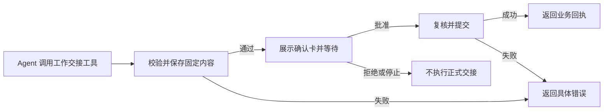

# 工作交接确认修复方案

状态：已批准实施（2026-09-22）。产品范围与验收见 [需求](prd.md)。

## 1. 对用户的行为

用户说“把这项工作和两份文件分派给 B”后，Agent 提供完整内容。系统检查后展示已有确认卡；用户批准才正式分派，拒绝则返回未执行结果。卡片继续显示实际附件。



本次不新增“分派成功”卡片状态。用户批准与实际执行结果继续分开展示，成功以业务回执为准。

## 2. 面向模型的工具

拟用 `work_item_action`（工作交接）替代新请求中的 `work_item_prepare`、`work_item_commit`。保持现有四种动作，不另拆四个新工具，也不把查询和文件导入合并进去。

| 动作 | 模型填写 | 宿主提供 |
| --- | --- | --- |
| assign | 接收席位、标题、目标、可选 inputPaths | 当前项目、当前工作区、登录席位和请求身份 |
| claim | workItemId、expectedRevision | 当前席位和请求身份；核验工作属于当前项目 |
| submit | workItemId、expectedRevision、文件 path | 当前工作区和请求身份；核验项目与提交权限 |
| review | workItemId、expectedRevision、submissionId、决定和意见 | 当前席位和请求身份；核验项目与验收权限 |

调用示例：

```json
{
  "action": {
    "kind": "assign",
    "payload": {
      "assigneeSeatId": "seat-b",
      "title": "修订说明",
      "goal": "按修订要求形成新稿，保留初稿。",
      "inputPaths": ["初稿.md", "修订要求.md"]
    }
  }
}
```

从 Agent 参数定义中删除已知的 taskSpaceId／workspaceId，由宿主补齐现有服务输入；不接受模型传入多余 ID 后静默丢弃。页面 API 和已存操作继续使用原结构，业务服务继续检查归属。inputPaths 仍可选，不从目标正文猜路径，不把整个目录默认附上。

工具说明拟为：

> 发起分派、签收、提交文件或验收／退回。系统核对内容并展示确认卡，等待用户批准后执行；成功返回交接回执。文件来自当前工作区，交接使用固定副本。工作编号与 expectedRevision 从工作详情取得；需要澄清的业务信息先询问。

当前系统上下文同步改为新调用方式，删除要求模型串联 prepare／commit 的说明。按用户决定，补充业务流程说明后置；只有本次改动经验证仍不足时再讨论。不另建流程 Skill，不向 AGENTS.md 或用户消息叠加补丁提示。`work_item_list`、`work_item_read`、`handoff_import_file` 保留。

## 3. 宿主如何衔接

复用 Pi 的公开工具和执行前回调，不修改内核循环。

1. **执行前校验与准备。** 校验最终工具参数，注入当前范围，调用现有 `CollaborationService.prepare`，保存固定附件。准备属于当前 sessionId／requestId／toolCallId；不创建 B 的正式工作。
2. **进入确认前核对。** 复用 prepare 在文件保存前后的权限、版本校验，补查准备状态与当前请求有效性，不新建重复预检框架。生成卡片用服务返回的实际内容与 files。已知不满足提交条件的操作直接返回错误，不创建确认请求。
3. **等待批准。** 复用 `waitForInteraction`、原生交互记录、SSE 和 `InteractionCard`；同一工具调用保持待完成。等待不反复调用模型，现有会话／容器和请求时限规则不变。
4. **批准后执行。** 复核取消、授权与参数一致性；复用 `authorizeAgent`、`commitAgent` 及服务端的权限／版本／文件校验。业务事务保存工作、附件关联和回执后，返回真实工具结果。

准备结果与批准凭据在宿主按本次 toolCallId 关联，执行函数取这一关联完成提交。operationId 仍保留在确认内容和回执中，可查询；模型不再负责传递它来触发下一步。

不把宿主补齐后的内部参数写回原生模型调用。交互中的 parameters 与真实工具参数保持一致，固定交接内容放在已有 handoff 字段；不伪造一次 prepare 调用或结果。复用现有记录类型和执行证据，解析分别校验新工具的 `{action}` 与旧 commit 的 `{operationId}`，保留原调用、审批和回执之间的一致性检查。

## 4. 错误、拒绝和停止

| 情况 | 处理 |
| --- | --- |
| 输入、归属、文件、版本或操作失效 | 不展示已知无效的卡片；作为明确工具错误返回，允许模型纠正。已有 operationId 时一并保留供查结果。 |
| 用户拒绝 | 返回未执行结果，不自动重试或重复要求批准；准备内容按既有请求生命周期失效。 |
| 等待中停止／请求结束／服务重启 | 沿用已有取消或失效展示，不恢复旧等待、不自动提交。 |
| 批准后业务校验失败 | 返回具体错误，不宣称分派成功；如需修改后再发起，重新准备并重新确认。 |
| 持久化、历史一致性、授权机制等内部故障 | 仍终止请求，不把所有异常降级为可继续的普通错误。 |
| 提交已成功但响应或历史记录中断 | 保留已有业务效果，查询原回执；不补造原生工具成功记录，不自动创建第二项工作。 |

仅把明确可恢复的业务校验错误从当前统一 catch 中区分出来。按错误来源和 code 分类；`RequestError` 或 HTTP 4xx 本身不代表可恢复，例如 `RESOURCE_STATE_INVALID` 仍须停止。不能笼统捕获所有错误然后允许执行。

同一操作已提交时复用原回执；重复点击确认不再次执行。新的工具调用仍代表一次新的业务提议，不能承诺仅凭内容相同就自动去重。准备阶段保存的私有副本沿用现有管理方式，不新增复制或清理系统。

## 5. 历史与已有入口

- 新工具只提供给具备现有业务权限的普通会话，后台预处理和只读 Agents 不获得交接能力。
- 页面分派等入口保留原 prepare／commit API；已有授权检查与一次确认继续适用。
- 旧工具名称仍可由历史解析和前端展示识别；不重新向模型注册旧工具，也不把旧 operationId 映射为新授权。
- Pi JSONL、SQLite、文件副本不迁移；现有旧准备单按原规则失效。旧会话后续请求可以使用新工具。
- 历史兼容同时覆盖真实模型上下文中的旧调用／旧结果和前端卡片。若模型尝试已下线工具，应得到明确不可用结果，不能偷偷代理执行旧提交。

更新历史读取兼容与工具展示名称即可，不增加独立审批页面或状态机。上线仍需结束活动请求后更换服务，避免半途中更换审批处理代码。

## 6. 参考与取舍

Claude Agent SDK 支持在执行前等待宿主的批准决定；Codex App Server 由服务端发起审批、客户端返回决定、服务端继续原操作。Axon 已有这类等待机制，本次复用它们体现的职责分工。[Claude 文档](https://code.claude.com/docs/en/agent-sdk/user-input)、[Codex 文档](https://learn.chatgpt.com/docs/app-server#approvals)。

OpenAI 的工具指南建议围绕用户目标组织工具，不机械映射内部 API。[工具指南](https://developers.openai.com/plugins/plan/tools)。本方案是对 Axon 现有需求的选择，并非这些产品要求所有业务都只有一个工具。

准备后如果需要重新比较候选、修改草稿或单独保存，可以有独立业务工具；当前没有这项需求。本次收敛的是一个已确定操作内部的机械衔接，不移除权限、人工批准或确定结果的过程。

## 7. 发布和回退

以提交 `047ab63` 为代码基线。先完成同时识别新旧历史的兼容修改，再切换模型工具；回退目标必须保留新历史读取能力，不能让只识别旧工具的版本直接读取新确认记录。正常回退不删除数据、不回滚已完成交接。具体发布记录见 [实施与验证](verification.md)；2026-09-23 已根据用户后续明确授权更新线上。
