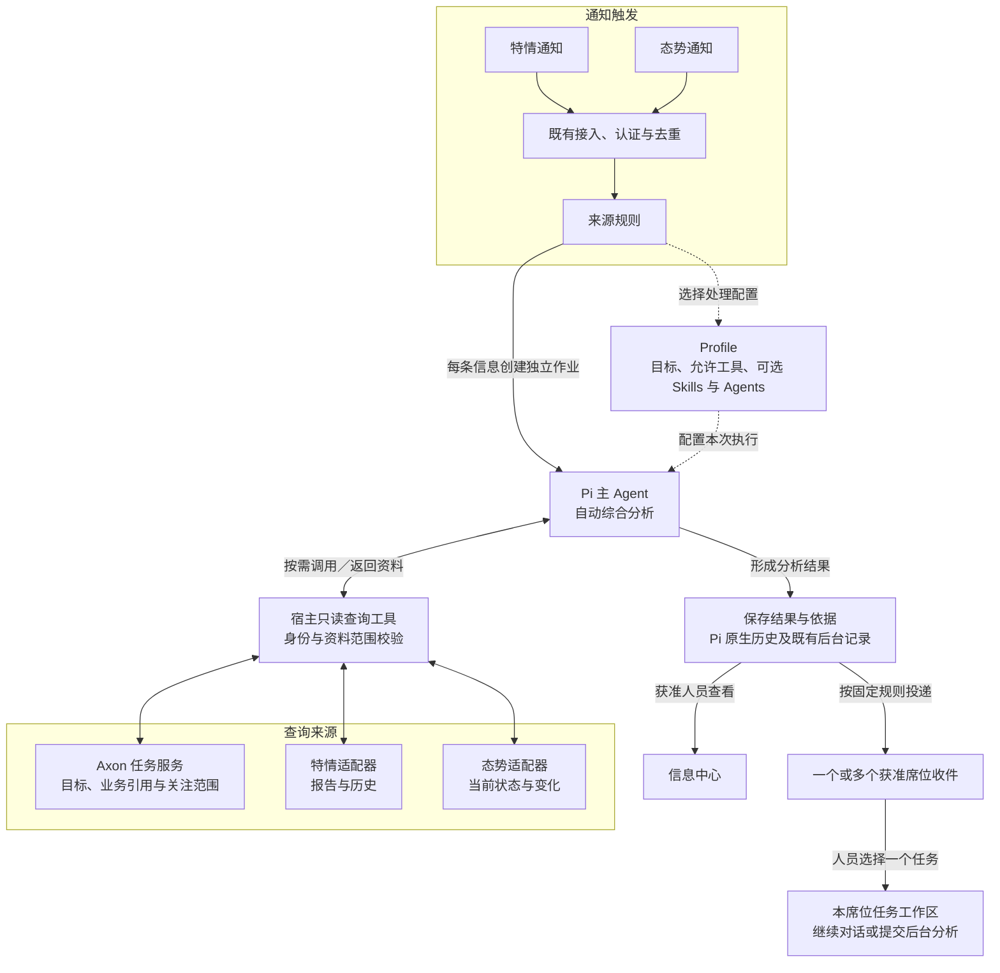

# 具体设计：多源上下文接入与自动综合研判

日期：2026-09-23。状态：**实现完成，待用户验收**。需求见 [PRD](prd.md)。

## 1. 组成与复用边界



虚线表示配置关系，双向线表示查询与资料返回。特情、态势任一通知均可独立触发工作，可以使用同一 Profile；查询来源按需选择，不规定调用顺序。信息中心用于查看处理情况，席位收件后由人员决定是否继续分析。

Axon 服务端、查询适配层和模拟服务使用 TypeScript / Node.js，页面沿用 React。Pi 继续管理模型循环、工具调用、上下文压缩和原生会话。宿主补查询、身份和 Web 适配，不修改 Pi 内核。

自动分析是现有后台作业的一种 Profile 配置。它包含目标、允许工具、可选 Skills 与可委派 Agents；不等于创建一个常驻进程，也不强制绑定一个席位。现有 Agents 仍是只读委派角色，主 Agent 可以向其提供已经查询到的必要资料。

## 2. 数据归属与任务上下文

### 2.1 职责及标识

| 信息 | 保存位置与权威来源 |
| --- | --- |
| 业务任务、目标、关注范围、可选业务引用 | Axon 现有 `task_spaces.data` JSON |
| 报告原文、报告修订、道路与资源对象、态势历史 | 各外部系统；本期由独立模拟服务提供 |
| 一次分析实际读到的内容 | 当前 Pi JSONL 的工具结果；保留原记录，不同步整个外部数据库 |
| 结果、执行与投递关系 | 现有后台作业、结果及逐席位投递记录 |
| 人员接续后的文件和对话 | 所选任务 × 当前席位的现有工作区与 Pi 会话 |

`systemId` 是业务系统身份，例如 `intel`、`situation`。`sourceId` 是 Axon 入站来源，例如 `mock-intel-source`。部署配置把来源映射到系统；消息去重仍使用 `(sourceId, sourceMessageId)`，不拿报告或对象 ID 当消息 ID。

业务对象引用用 `{systemId, objectType, objectId}`。特情报告可以引用态势系统的道路对象；Axon 任务可以引用同一对象。相同名称或不同系统中相同编号不能自动视为同一对象。真实系统编号不一致时由对应适配器提供显式映射，本期只验证固定模拟映射，不建设自动实体消歧。

### 2.2 TaskSpace 字段与本期可选上下文

TaskSpace 是系统预先定义字段结构的任务记录，不是所有字段都可选，也不是用户运行时任意新增字段的表单。字段结构固定，具体任务内容由用户填写或系统生成。

| 部分 | 字段与填写规则 |
| --- | --- |
| 现有任务基本信息 | title 为必填名称；visibility 表示公共／私有；goal 为目标说明，公共任务必填，私有任务可以为空字符串 |
| 系统维护信息 | id、ownerSeatId、state、revision、创建／更新人员和时间必须存在，由系统生成或维护 |
| 本期拟新增信息 | context 整体可选，其中 businessRefs、focus 及区域／时间／主题均可按需填写 |

下方只展示本期新增的 context，不是完整 TaskSpace。`?` 表示可以省略；一旦填写一条 businessRefs，其 systemId、objectType、objectId 必须齐全，label 可省略。

```ts
context?: {
  businessRefs?: Array<{
    systemId: string;
    objectType: string;
    objectId: string;
    label?: string; // 仅显示名称，不作为匹配依据
  }>;
  focus?: {
    areaIds?: string[];
    time?: { from?: string; to?: string }; // 带时区的 ISO 时间
    topics?: string[];
  };
};
```

示例：补给任务引用 `situation / road / road-west-01` 和 `situation / resource / vehicles-west-01`；关注 `zone-west`、2026-10-01 09:00～11:00，以及“物资运输”。任务目标中说明计划 09:40 经该道路、方案要求至少 3 辆车。

- 时间使用半开区间 `[from,to)`，允许单端开放；都有值时必须 `from < to`。区域使用模拟域的稳定编码；主题为短文本，不新增 GIS 或主题分类体系。
- 普通任务可以不填。格式有效的引用可保存，远端是否存在由查询确认；不能把保存成功显示成远端关联已验证。
- 公共任务的这些字段随任务说明对有效席位可见；私有任务仍只对所属席位可见。不在其中保存密钥、私密原文或其他席位文件路径。
- 创建沿用 `clientActionId`，参数摘要包含规范化 context；编辑沿用任务同一个 revision、既有管理权限及冲突流程（公共任务由获准管理席位维护，私有任务仅所有席位维护）。更新语义为未提交 context 则不变、`null` 则清空、对象则整体替换。
- 去重依据引用三元组；校验数组、字符串长度与日期。本期上限为 20 个引用、各 10 个区域／主题；标识最长 128 字符、显示名称／主题 200 字符。这些是表单和传输约束，不限制 Agent 工具调用次数。
- 查询任务不创建工作区、不读文件或聊天、不自动写入任务关联。Agent 本期不获得修改 context 的工具，由任务负责席位在现有面板维护。
- 不改当前任务的原生资源快照格式；Agent 按需用 `task_read` 读取最新 context，结果带任务 revision。

## 3. 外部接入及访问范围

### 3.1 部署配置

新增可选 `LAB_CONTEXT_CONFIG` 指向本地配置文件，由宿主在服务启动时加载，前台和后台共用。本期使用固定部署配置，不建设配置热更新、动态撤权或权限管理页面／API。示例为提案，敏感值从环境读取：

```json
{
  "systems": [
    {
      "id": "intel", "name": "模拟特情系统",
      "adapter": "mock-information-http",
      "baseUrl": "http://127.0.0.1:4401/intel",
      "tokenEnv": "MOCK_CONTEXT_API_TOKEN"
    },
    {
      "id": "situation", "name": "模拟态势系统",
      "adapter": "mock-situation-http",
      "baseUrl": "http://127.0.0.1:4401/situation",
      "tokenEnv": "MOCK_CONTEXT_API_TOKEN"
    }
  ],
  "scopes": [
    {
      "id": "demo-context",
      "name": "演示业务资料",
      "systemIds": ["intel", "situation"],
      "seatIds": ["seat-a", "seat-b"]
    }
  ]
}
```

本期只配置一个共享资料范围，范围内的两类模拟数据具有同一可见边界。不实现逐条报告授权或多域结果裁剪。未配置时旧功能保持可用；格式错误或缺少凭证时相关新能力不可用，不回退为无限制查询。

宿主适配器调用配置中的固定服务地址，凭证留在宿主；模型不能传任意 URL、SQL、身份或授权范围。Bash 容器网络继续关闭。来源认证令牌与查询 API 凭证分开；浏览器只得到名称、支持的能力和可见范围说明。

### 3.2 执行主体与权限

| 主体 | 任务查询 | 外部查询 |
| --- | --- | --- |
| 自动来源作业 | 明确的服务身份，仅读活动公共任务及 context | 已校验 Profile 的资料范围与工具白名单 |
| 席位普通对话／人员发起的后台分析 | 当前有效身份可见的公共及本席位私有任务；检索限活动任务 | 按启动时生效的部署配置检查当前席位及查询范围 |
| 只读子 Agent | 维持现有工具集合，使用主 Agent 显式传入的资料 | 本期不额外扩展其查询工具集合 |

新增查询服务接收宿主构造的 `ContextPrincipal`，区分 service 与 seat；不将内部 `service` 字符串冒充席位或借用某个登录用户。前台 `task_read` 可查看自身获准的历史任务说明；后台不可借猜 ID 读取私有或归档任务。

Profile 配置增加可选 `contextScopeId`。入队时将 `{scopeId, systemIds}` 固定到已有 Profile 作业快照中，保存当次范围，用于查询授权、结果访问检查和来源追溯。模型不能指定或清除范围；执行领取、查询、投递及结果读取按主体、作业范围和启动时生效的部署配置校验，不另建权限版本或撤权生命周期。

**为何需要这一项：**原来只按触发来源检查收件权限；现在结果可能含另一个系统的数据，仅有触发来源权限不足以阅读全部分析。

因此，来源权限及既有收件权限之外，还须检查资料范围：
- 规则保存和实际投递均验证接收席位；每个席位仍使用现有独立投递状态。
- 信息中心 events/jobs、inbox 列表及详情都先做权限投影；原始 Profile 快照、结果文件和错误也不能随列表旁漏。全文、结果、工具过程、预览／下载和导入入口共用范围检查，不能只隐藏前端按钮。
- 只有来源查看权限而无资料范围权限时，信息中心只返回时间、状态等最小处理元数据，不返回综合内容、工具结果或包含资料的错误详情。
- 已使用范围的历史作业保留标记；已经导入席位工作区和普通对话历史的内容沿用现有文件／会话权限。
- 本期投递整份分析，所有接收者须有相同资料范围；不尝试用 LLM 删除敏感段落后投递。

动态权限变更、运行中撤权及历史结果、文件副本和衍生内容的处理后置，另行设计与验收；不作为本期多源查询和综合研判的前置条件。

## 4. 查询工具与资料依据

### 4.1 Agent 工具

工具名为本期契约；均为只读，结果与错误作为普通 Pi 工具结果返回。

| 工具 | 主要参数 | 返回内容 |
| --- | --- | --- |
| `information_search` | systemId；可选 reportId、subjectId、objectRefs、areaIds、from/to、query、limit、cursor | 报告与修订的索引、摘要、业务时间、分页信息 |
| `information_read` | systemId、reportId；可选 revision | 指定报告完整正文、版本、对象引用与时间；不指定版本取当前最新 |
| `situation_query` | systemId、mode=current/changes；可选 objectRefs、areaIds、query、limit、cursor；changes 支持 from/to 或 after，二者互斥 | 对象当前状态，或版本变化及业务时间；返回分页与变化位置 |
| `task_search` | 可选 businessRefs、areaIds、query、limit、cursor | 获准的活动任务候选：ID、目标、context、revision、匹配理由 |
| `task_read` | taskId | 当前获准任务的完整元数据和 context，不含工作区正文 |

外部检索条件由适配器做明确过滤：多项对象／区域各自可匹配任一项，不同条件组取交集；from/to 对报告观测时间或态势变化生效时间过滤，端点口径随结果返回。缺少业务时间的记录须标记未知，不能伪装成符合时间条件。不支持的过滤条件明确报错，不能静默忽略。

任务检索以“引用命中、区域命中、名称／目标／主题文本命中”的并集取候选，标明命中依据；无条件则分页返回可见活动任务。任务时间原样返回供分析判断，不在第一步检索时隐式排除时间未知的任务。主题只做明确文本匹配，本期不建设向量索引。Agent 可调整条件继续查询；一次无匹配不代表所有任务均无影响。

检索工具用 cursor/nextCursor 表达同一查询的分页；态势 after 表示变化流位置，只有末页的 nextAfter 才用于下一批变化查询，不用消息去重键代替。当前对象查询返回 changeCursor，便于取得初始变化位置。查询参数、排序、时间、空结果和游标失效规则见 [接口契约](integration-contract.md)。各工具支持 AbortSignal。查询页默认 20 条、最多 100 条，单次 HTTP 超时 15 秒、响应上限 256 KiB；超限明确报错，不能自动截短后声称完整。这些是单次外部请求边界，不新增整个作业时限、模型次数或工具总次数限制。

取消传播到 HTTP；用户取消不转换为可继续的普通查询错误。权限拒绝、服务不可用、未找到对象、无匹配和响应不完整分开表达；Pi 可根据普通查询错误继续使用其他获准资料，最终说明缺口。

### 4.2 适配器与页面接口

新增 `context/` 服务和两个具体 HTTP 适配器；共用记录元信息，业务正文与属性按来源保留，不设计覆盖所有领域的统一实体表。

模拟服务提供只读接口：`/intel/reports`、`/intel/reports/:id`、`/situation/objects`、`/situation/changes`。报告列表支持同一 reportId/subjectId 的版本历史，详情可取指定修订；changes 可返回变化前后值及其版本。测试控制由独立脚本提供，不暴露给 Agent。

通知沿用现有入站字段和接收回执，不增加跨系统统一消息模型。完整请求／响应、认证、错误、过滤及数据范围以 [integration-contract.md](integration-contract.md) 为准；模拟服务也走真实 HTTP，不能以宿主直接读取 fixture 代替集成验证。

Axon 新增登录后的 `GET /api/context/catalog`，只返回当前席位可用系统、对象类型、区域名称及查询能力，不返回地址或凭证。任务创建／更新接口复用现有路由增加 context；业务查询由工具直调宿主服务，无须为每个工具再建设浏览器 API。

后续接入真实系统时增加适配器及部署配置，将其查询参数、对象引用、时间和错误映射到以上契约。若真实系统不支持所需查询，明确暴露能力缺口；不默认用 Axon 建全量副本补齐。

### 4.3 依据与存储

每个成功查询返回：来源系统、记录／对象引用、可用版本、业务时间、查询时间、实际内容，以及分页／完整性标记。来源未提供版本或业务时间就明确缺失，不以接收时间或当前时间代填。不同系统没有共同事务快照，跨源查询不宣称“同一时刻全局一致”。

工具结果的 `content` 保存这些字段和实际返回内容；`details` 可携带同一结构供展示，但不能只保存 details。任务查询同样保存实际目标、context 和 revision。引用以原生 `toolCallId + 记录引用` 定位，正文可直接写来源、对象和版本，不要求模型生成固定 JSON 或逐句引用。

页面“查询依据”从当前作业原生工具结果派生，显示来源、标识、版本／业务时间及查询时间，展开查看实际返回内容；不新建证据数据库或第二份对话历史。不从最终 Markdown 反向推导真实查询，也不把所有查询候选称为受影响任务。

沿用 Pi 默认上下文压缩，旧工具原文仍保留在 JSONL；没有特殊保留字段或新摘要提示。本期不增加历史原文检索工具，人员可以在详情回看；Agent 需要最新情况时重新查询。

## 5. 自动分析、触发与投递

示例 Profile 的业务目标为：“结合本次更新、相关历史、当前态势与获准任务，说明新增变化、可能影响的任务及依据；区分事实与推断，资料不足时说明缺口。无需改变任务状态或执行业务交接。”这是一份可更换的处理配置，不是全局系统提示补丁，也不是上下文压缩要求。

示例 Profile 允许上述五项查询及现有只读文件工具；按需要可启用现有文件处理、脚本、Skill 与只读委派能力。没有查询必要时不强制走固定五步流程。后台受限操作继续按已实现规则返回“本次未执行”，允许 Agent 选择其他步骤，不因本期查询接入改造 HITL。

两条入站来源分别映射 intel、situation，可使用同一综合分析 Profile。来源配置增加可选 systemId 映射，入队时固定其值；旧来源可以不填。既有来源规则固定接收席位 A/B；公开任务展示归属仍只用于分类，不限制唯一影响任务。宿主把 sourceId、systemId、subjectId、业务发生时间及消息正文明确写入本轮 Pi 输入，并由原生历史保存；仅保存在接收表中不算已提供给模型。缺失项标明未提供，不必含 Axon 任务 ID。

| 入站来源 | 业务系统 | 分析方案 | 资料范围 | 固定投递 |
| --- | --- | --- | --- | --- |
| mock-intel-source | intel | 综合变化与任务影响分析 | demo-context | 席位 A、B |
| mock-situation-source | situation | 综合变化与任务影响分析 | demo-context | 席位 A、B |

执行顺序：
1. 既有接收流程认证、去重、保存输入，固定规则／Profile／资料范围并入队。
2. 服务身份启动 Pi；Agent 根据输入自行检索报告、态势与候选任务，必要时取详情并比较。
3. Agent 输出正常文本／Markdown 分析，说明变化、任务影响及证据缺口；宿主保存原生历史与既有执行结果。
4. 沿用现有终态及逐席位投递。工具局部失败后正常答复可为 succeeded，正文必须说明局限；进程或模型失败仍按原状态处理，不能伪装成完成。
5. 席位查看结果、选择目标任务；进入对话仅准备草稿，发送后才运行，或沿用现有确认提交后台分析。

没有相关任务时，分析仍可说明信息变化与待核实项，不强制建立任务。与多个任务有关时逐项解释，不生成多个共享目录。正式分派、上报、验收继续由已有业务工具与人工确认处理。

重新处理产生新作业，使用保留的输入和配置快照，但查询当时最新可用数据；新旧结果分别保存。它不保证重现上次外部快照，不覆盖旧依据，也不自动重放业务写操作。旧事件晚到时依据业务时间与版本判断，不把“后接收”当成“事实更新”。

## 6. 模拟服务与验证数据

一个独立进程提供 intel 与 situation 两个业务 API，原始数据不存入 Axon。控制脚本支持重置、推进固定版本、发送通知及制造查询失败；仅用于隔离测试环境。通知和查询响应不含 Axon 任务／席位 ID、受影响任务清单或推荐投递。测试预期不进入 Profile、Skill、指令文件、附件或沙盒。

三个公共任务：A 补给、B 设备转移均引用西区道路与车辆池，分别要求至少 3 辆／1 辆；C 使用相邻东区独立道路。特情 E1 是西区道路限制，影响 A/B；态势 E2 是可用车辆 4→2，独立触发，并按两个任务不同条件判断。另设未知对象、查询不可用和 C 改为前一日任务的独立变体；以互换 A/B 车辆需求的对照验证判断随任务条件改变。

任务通过现有 API 创建，脚本记录生成的真实 UUID；不把场景代号写成产品 taskId。私有任务、未授权席位作为权限测试数据。完整数据与时间见 [simulation-scenario.md](research/simulation-scenario.md)，验证顺序见 [acceptance.md](acceptance.md)。

## 7. 页面交互

只扩展现有桌面页面，保留左侧栏、对话草稿、信息中心看板和详情抽屉。

| 位置 | 本期变化 |
| --- | --- |
| 任务说明面板 | 增加默认可折叠的“业务关联与关注范围（可选）”；系统／类型下拉、对象编号、区域编码、时间和主题。来源编号可以手动填写，不建设复杂对象选择器 |
| 规则页 | 显示所选分析方案的目标和允许查询的系统；接收席位仍为现有选择器；明确展示归属不是查询授权 |
| 信息中心详情／收件 | 结果名称用通用“处理结果”，展示 Profile 名称；保留分析正文，新增可折叠查询依据；无权时只显示获准状态 |
| 收件接续 | 入口为“提问与处理”；所选任务是会话保存位置，不限制讨论范围，可见查询能力放在现有能力区；查看不启动模型，准备不自动发送 |
| 普通对话 | 沿用既有工具过程呈现；主 Agent 可按当前席位权限查询外部资料，无须从收件进入才有能力 |

正文可含“可能影响的任务”段落，但本期不新增结构化影响数组、影响数量徽标或依据正文自动排序任务选择器。不会解析自然语言自动改任务归属。人员继续时只有所选任务 × 当前席位接收文件及对话。

新增字段与标题／目标一起使用原有版本保存。冲突保留完整草稿，最新内容比较包含所有字段。旧请求成功或失败按当前身份、任务／信息选择及请求版本隔离；加载失败不清空已填写字段。日期输入显示时区，空范围不能显示成“全域授权”。

“查询依据”属于本次分析详情，不在每条聊天回复下增加技术核对按钮。正文维持现有安全 Markdown 展示；不为来源引用开放任意外链或 HTML。详见 [交互研究](research/interaction.md)。

## 8. 兼容与实施边界

TaskSpace、Profile 快照及后台记录只增加可选 JSON 字段，不新增表／索引，不因此迁移全部 SQLite 或 Pi 文件。旧任务无 context、旧作业无资料范围标记仍可读取；新增字段存在时严格校验，更新旧字段不丢 context。旧 Profile 无查询配置仍走既有流程，不自动赋予外部数据权限。

资料范围授权不取代既有登录、来源、席位和文件权限。前台主 Agent 查询按当前席位配置重建，刷新／重启后仍可使用，无须新建会话能力状态机。新增只读工具不扩大后台业务写工具或子 Agent 权限。

实施前备份，先在独立数据根验证旧数据兼容及现有对话／文件／交接回归；获批后再按现有单实例发布方式更新。本设计不包含自动部署或改变在线测试数据。
