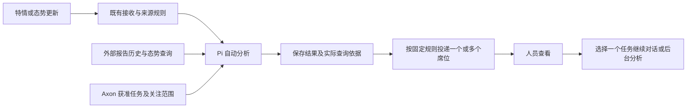

# 多源上下文接入与自动综合研判

日期：2026-09-23。状态：**实现完成，待用户验收**。这是任务与后台作业的第三增量；审阅入口见 [review.md](review.md)。

本阶段只验证接入、查询、研判与接续能力。模拟场景、字段和固定投递用于验收，不代表后续场景或能力设计；真实系统的数据模型待业务需求明确后设计。

## 1. 建设目标

当特情信息或态势数据发生变化时，Axon 能查询相关历史、当前状态和获准的任务信息，综合判断变化及可能影响的任务，保存依据并投递分析结果。席位人员收到后，可以在自己的任务工作区继续追问、处理文件或发起现有业务交接。

首个验证同时覆盖特情、态势两类来源。通用部分是查询工具、接入适配、权限及分析接续；具体业务判断由处理方案与 Pi 驱动的 Agent 完成，不把道路、车辆等模拟字段写进 Harness。

## 2. 系统职责

| 对象 | 职责 |
| --- | --- |
| Axon 任务 | 维护任务目标、公共／私有范围，以及可选的业务引用、关注区域、时间和主题 |
| 外部系统 | 维护自身的报告、业务对象、历史与态势数据，提供更新通知和查询接口；无需同步 Axon 任务表 |
| 自动分析 Agent | 按服务端 Profile 的目标和获准能力查询、比较与分析；一次结果可涉及零个、一个或多个任务 |
| 席位 | 接收获准结果，由人员追问、判断或开展业务；不要求每个席位新增常驻 Agent |
| 投递规则 | 指定本次来源使用的 Profile 及接收席位；任务影响判断不自动修改投递规则 |

业务引用提供关联线索，不是资料访问凭证。工作区继续按任务 × 席位隔离；查询任务元数据不读取其他席位的文件或聊天。

## 3. 本期需求

| 编号 | 要求 |
| --- | --- |
| MC01 | 任务可选填写业务对象引用、区域、时间与主题；普通任务可以全部留空，沿用现有任务管理权限和版本冲突处理 |
| MC02 | 提供特情检索／详情、态势现状／变化、Axon 任务检索／详情的只读工具；前后台主 Agent 复用 |
| MC03 | 特情和态势通知各自能够触发分析；消息无需携带 Axon 任务 ID，重复接收沿用现有去重 |
| MC04 | Agent 结合多个来源判断变化和任务影响，区分事实、推断、无匹配与无法判断；候选匹配不等于已经证实受影响 |
| MC05 | 后台以服务身份查询活动公共任务；席位以自身身份查询可见任务及获准外部资料；接收者也须获准阅读综合结果 |
| MC06 | 保存本次实际查询内容、来源版本及时间，沿用 Pi 原生历史；后来的来源变化不改写旧分析依据 |
| MC07 | 复用现有信息中心、投递与收件页面，展示处理结果和查询依据；人员选择一个任务后可在前台或后台继续分析 |
| MC08 | 提供独立的最小模拟服务及完整 HTTP 交互契约，包含两类来源、固定数据和可重复触发脚本；覆盖多任务影响及无关、缺失、失败和任务条件改变；不向模型预置分析答案 |

## 4. 使用过程

道路限制信息到达后，自动分析查询既往通报、资源现状和相关任务：同一道路可能同时影响补给方案与设备转移方案；相邻区域的无关任务不应被机械关联。之后只有车辆数量变化，也能独立触发新分析，并按照两个任务各自的条件判断。数据细节见 [模拟场景](research/simulation-scenario.md)。

## 5. 范围边界

- 本期保留固定多席位投递。LLM 自动选择接收席位、按席位生成不同内容、连续 Agent 自动转派后置。
- 任务影响保存在分析正文，不新增正式关联状态机，不自动修改任务、创建 WorkItem 或更新外部业务事实。
- 不建设外部数据全量镜像、常驻综合态势库、地图、跨系统任务同步或统一业务主数据平台。
- 本期只接入一个明确共享范围内的模拟资料集，使用服务启动时加载的固定部署配置并校验访问；动态撤权、存量资料治理、逐记录授权、复杂角色体系和跨来源身份映射后续按真实系统需求设计。
- 继续使用 Pi、现有队列、原生压缩、工具记录、文件沙盒和交接确认，不新增内核、总线产品或通用工作流引擎。

通过标准见 [acceptance.md](acceptance.md)。实现与验证情况见 [验证记录](research/validation-results.md)；已于 2026-10-08 部署，待用户验收。
