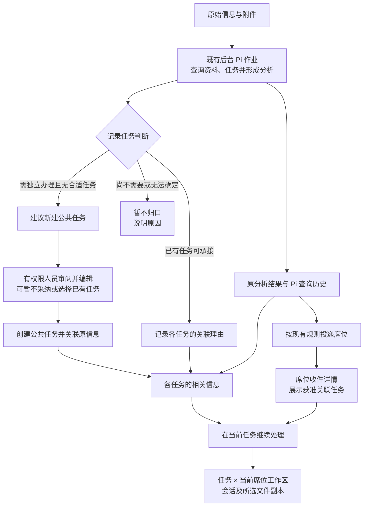

# 设计：信息自动归口与任务内接续处理

日期：2026-10-09。状态：**已实现并部署，待用户验收**。需求见 [prd.md](prd.md)。

## 1. 总体关系



信息、分析、任务是多对多使用关系，工作会话仍有一个确定的工作区。任务关联不创建 WorkItem，不派发给其他席位，不自动触发新的分析。

关联已有任务、建议新建、暂不归口是 Agent 的不同判断，不是必须依次通过的步骤。建议新建不等于任务已经成立；后台仍按原规则完成分析和投递，不等待人员决定。

## 2. 保存哪些记录

继续使用同一个应用 SQLite 数据库及 Pi JSONL。SQLite 保存任务、消息、作业和投递等元数据，以及本期的任务判断和人员决定；Pi JSONL 保存对话、分析正文与实际工具结果，附件本体沿用现有文件存储。不另复制聊天正文或查询证据。

| 内容 | 保存方式与用途 |
| --- | --- |
| 原始信息、附件 | 沿用 BackgroundEvent 和已有固定文件，唯一消息键不变 |
| 分析正文、工具查询 | 沿用 BackgroundJob.result 指向的 Pi 原生历史 |
| 本次任务判断 | BackgroundJob 的可选 `taskAssessment` 字段，保存已有任务关联、新建建议或暂不归口说明 |
| 从建议创建的任务 | 原 TaskSpace 和 task_actions；对应 job 仅保存创建回执 `taskSuggestionCreation`，用于展示已建任务及防止重复创建 |
| 人员纠正 | 新增 `information_task_overrides` 表，每个 `(eventId, taskSpaceId)` 一条当前决定 |
| 任务相关信息列表 | 从成功作业及人员决定计算，不复制正文，不再保存第三份可修改的关联列表 |

实际分析正文可能出现在记录任务判断工具之前。展示和接续时，从同一请求的 Pi 公开助手消息读取至已核验的最终答复；多段内容分为“处理过程中的说明”和“最终答复”，保留先后与更正，不将前文自动视为最终结论。不混入工具原始输出、思考内容或其他请求，也不新增一份聊天历史存储。

本次判断示意：

```ts
taskAssessment?: {
  recordedAt: string;
  toolCallId: string;
  items: Array<{
    taskSpaceId: string;
    taskRevision: number; // 宿主从本次实际查询结果取得
    reason: string;
  }>;
  newTaskSuggestion?: {
    title: string;
    goal: string;
    reason: string;
  };
  emptyReason?: string;
};
```

eventId、jobId、requestId 已在宿主作业中，不让模型重复填写。每次判断三选一：非空 items 表示关联已有任务；空 items 加 newTaskSuggestion 表示建议新建；空 items 加 emptyReason 表示暂不归口，并说明是无匹配、依据不足还是仅供参考。字段不存在表示未记录判断。暂定最多 100 个关联、理由每项 1,500 字符；建议名称最多 60 字符、目标最多 8,000 字符，沿用任务创建约束。超限返回错误，不截断保存。

人员决定保存：eventId、taskSpaceId、mode（include / exclude / auto）、选定 jobId 与 taskRevision、reason、revision、updatedByUserId、updatedAt。include 表示人工保留／补充，exclude 表示移除，auto 表示恢复自动判断。这是可修改的关联决定，不是“待审→批准”的审批流程。未有决定时按 auto 处理。恢复自动后即使没有实际关联，管理者仍可取得该决定的 revision，供下次编辑校验；不把它显示成一条关联。

## 3. 后台 Agent 如何记录任务判断

新增公开工具 `information_record_task_assessment`，只对明确启用它的 preprocess Profile 开放；普通席位对话、seat_analysis 和子 Agent 不得到这一写能力。它记录本次分析的任务判断，不另行分析，也不创建任务。

```json
{
  "relations": [
    {"taskId":"<补给任务 UUID>","reason":"同一道路，任务关注时间与限制时段部分重叠"},
    {"taskId":"<设备转移任务 UUID>","reason":"设备运输引用该道路，需要核实限制对通行的影响"}
  ]
}
```

建议新建示例：

```json
{
  "relations": [],
  "newTaskSuggestion": {
    "title": "编制应急物资盘点说明",
    "goal": "根据来文要求形成物资盘点说明及待核实事项。",
    "reason": "来文提出独立编制需求，已查询的活动公共任务中未找到适合承接的任务。"
  }
}
```

暂不归口示例：`{"relations":[],"emptyReason":"已查询任务未发现相关项，信息仅供参考，尚无独立办理目标"}`。没有匹配项不直接触发新建建议；任务查询失败只能说明无法判断，不能据此声称应当新建。

工具说明保持简短：“记录当前信息的任务判断：关联已查询的公共任务，或建议新建公共任务，或说明暂不归口的原因。每次提交完整判断，三者选一；新建建议须有独立工作目标及理由；任务可为一次性交付。本工具不创建任务，不改变投递。”不拆为 prepare / commit 两个模型工具。

宿主处理顺序：

1. 绑定当前 preprocess 作业和已冻结 Profile；检查工具授权、取消信号及作业仍在运行。
2. 关联已有任务时，检查任务在本次成功的 task_search / task_read 返回中，且当前仍为可查询活动公共任务。由请求内已观察任务记录取得版本；若查询后版本变化，返回“任务已变化，请重新查询”。建议新建时要求本次至少成功查询过活动公共任务，检查建议字段及三种判断互斥；查询过不代表已穷尽全库，也不证明新建必要性，语义质量另行验收。
3. 全量校验、去重；任意一项无效则不替换已有集合。保存到当前作业，重复相同内容返回 unchanged；同一次作业后续有效调用可整体替换。
4. 返回实际保存的判断及理由；新建建议明确返回“建议已记录，尚未创建任务”。说明本次分析成功结束后展示，工具结果照常进入 Pi 历史，不另增消息记录。
5. 正常最终答复和既有历史核验成立后，由现有 finishJob 保存成功状态及投递记录；只有成功作业的任务判断可以对人员展示、产生自动关联或用于创建任务。取消、失败、中断不发布新判断，已经投递的旧成功结果不受影响。

对应 Profile 只增加工具及一句通用目标：“结合已查询的任务记录关联；若需独立开展工作且无合适任务承接，提出新建公共任务建议；否则说明暂不归口原因”。不增加另一次 LLM 分类，不要求六字段摘要或逐句引用，不注入特定样例答案。

未调用工具时可以正常结束分析，但显示“未记录任务判断”，不声称“无相关任务”。保存失败作为普通工具错误返回 Pi，由模型决定是否更正；宿主不强制补调用或重发整次任务。

## 4. 人员如何处理新建建议

收件详情和信息处理中心在分析下展示“建议新建公共任务”，列出名称、目标、理由及分析时间。复用现有投递对象与查看权限，不新增建议收件箱或待审批状态。没有任务管理权限的人可查看获准建议，但不能创建；有权限人员也可从原来源管理入口查看并处理。

- “创建公共任务并关联”打开现有任务表单，预填建议名称和目标，允许编辑；明确公共任务说明的可见范围。原分析正文、查询证据和附件不自动填入公共说明，建议理由仍受原信息权限保护。
- 人员确认后，以当前身份创建公共 TaskSpace，并将原信息和该次成功分析作为人工 include 关联；理由可编辑，默认采用建议理由。创建不发起模型、不复制附件，也不建立工作区或 WorkItem。
- 人员可改选已有任务并使用同一人工关联入口；不采纳则不操作。不增加“拒绝／待审批”等状态或要求填写拒绝原因。

宿主通过同一数据库连接，用一个 SQLite 事务保存任务、既有创建幂等回执、人工关联与该建议的创建回执。复用 AccessStore 创建校验和 task_actions，将事务内写入抽为内部共用方法；不能直接调用当前自行 BEGIN/COMMIT 的 create 再假设关联也已原子保存。此次操作的幂等内容还包括来源 eventId/jobId，普通任务创建接口保持兼容。

`taskSuggestionCreation` 仅保存 taskSpaceId、createdByUserId、clientActionId、createdAt；不是一套建议审批状态机。事务中重验权限及对应成功建议，并检查该 job 的创建回执；双击、断线重试或两人操作同一建议不会创建第二项任务。已创建时展示实际任务；更改请求参数不能悄悄覆盖原任务。事务失败不留下只建任务未关联的半成品，响应丢失可从判断详情查询创建结果。

重新分析产生新判断，既有任务、创建回执及人工关联不撤销；页面同时展示该信息已有关联，供人员避免重复建任务。不按相近标题自动合并任务，也不保证两份独立建议语义上的重复识别。人员后来移除关联或归档任务，创建回执仍指向原任务；恢复关联／重新开启走现有操作，不再次创建。

## 5. 多次分析、人工纠正与并发

- 每次 preprocess 独立保存自己的任务判断及分析正文。一次分析可以关联多个任务，无需按关联数量重复分析。原消息重送沿用现有去重，不新增集合。
- 任务列表按 eventId 聚合。同一人员有权读取的成功作业中，采用**最新创建且提交了有效任务判断**的那次完整集合，不能按任务分别拼接不同批次；先筛权限再选版本。使用数据库既有作业插入顺序判先后，不以完成时间决定，避免早发晚完成的作业覆盖较新判断。
- 新的成功判断若为暂不归口或建议新建，其空关联集合可清除旧自动关联，但不影响人工保留。新作业失败／中断／未记录判断时不替换旧完整集合，旧条目标明实际分析时间及版本。收件详情始终展示该条投递对应作业的历史建议，不偷换为最新正文；从历史建议创建时明确所用版本，不声称建议仍代表最新判断。
- include 固定人员所选可读成功 jobId 和理由，后续自动集合不覆盖。exclude 隐藏该 event/task 在任务列表中的关联，重新处理同一 event 不恢复它。auto 恢复到当前可读自动集合。一个任务的纠正不影响其他任务。
- 新 sourceMessageId 是另一条信息；本期不按报告 subjectId 合并信息，也不把旧消息的人员决定自动传播到新消息。
- 人工编辑使用该 event/task 决定的 revision CAS；不存在时 revision=0。原样重复提交返回已有结果；冲突保留用户输入并展示最新决定，无强制覆盖按钮。修改关联不复用 TaskSpace.revision，不改变任务说明。
- 自动快照和人员决定分开保存，使重新分析与人员纠正互不覆盖；不串行整个任务的会话或目录。
- 任务内容后来变化时，列表显示“任务说明已更新，关联依据为旧版本”，不自动调用模型。任务归档后保留历史，不能新增关联或启动新的处理；复用任务活动校验和写入准入，避免归档竞争。

## 6. 访问与纠正权限

| 操作 | 校验 |
| --- | --- |
| 查看任务相关信息及计数 | 可见任务 + 有权读取该次信息／结果 + 对应 contextScope |
| 人员读取信息／结果 | 已送达本席位的对应 job，或现有来源 view/manage 权限；两者都须满足资料范围及来源可用条件 |
| 纠正公共任务关联 | 当前具有工作任务管理权限（现有 createPublicTask）且可读所选信息／结果 |
| 从建议创建公共任务 | 当前具有 createPublicTask，且可读对应成功 preprocess 信息／结果；用人员身份创建，不借用后台服务或最高权限账号 |
| 纠正个人空间关联 | 当前席位为所有者且可读所选信息／结果；自动服务不查询或写入个人空间 |
| 后台自动记录 | 当前 Profile 明确允许、服务身份及资料范围有效，仅活动公共任务 |

列表、总数、搜索、关联理由、任务标签、正文、附件、导入和模型工具共用上述检查。无权者不能从关联名称、理由或计数得知信息存在。关联不授予源信息权限，也不把原有席位私有分析公开化。

**实现注意：**当前 canReadJob 只检查资料范围，不能独立作为新入口授权。新服务需组合任务权限、原来源读取／本席位实际投递，以及范围检查。也不能伪造 delivery 记录来让来源管理员通过旧的收件接口。

本期只有 preprocess 成功结果可进入共享任务关联；seat_analysis 与普通对话内容仍属原席位，不向相关信息列表发布。权限动态撤销及副本治理维持此前后置边界。

## 7. 任务内查询与 Agent 上下文

对席位主 Agent（含其 seat_analysis）新增两个只读工具，不扩展子 Agent 或自动服务的历史检索能力：

| 工具 | 参数 | 结果 |
| --- | --- | --- |
| `task_information_list` | 可选 taskId（默认当前任务）、query、offset、limit | 获准的关联条目：eventId、jobId、标题、来源、时间、reason、自动／人工标记、当前任务版本提示 |
| `task_information_read` | eventId、jobId；可选 taskId（默认当前任务）、section=original/analysis | 精确版本的原文或分析正文、来源引用、查询依据标识、附件元数据 |

每次读取验证当前 task/event/job 是获准有效关联；任务列表以外的读权限继续走现有信息接口。旧页面版本失效时明确提示刷新，不能静默换成另一份正文。分页默认 20、最多 100，按权限过滤后计算总数；单次正文响应上限 256 KiB，超限明确报错并指向网页查看，不暗中截断。

查询不创建目录、不导入文件；二进制附件在人员选定后沿现有导入路径供文件工具处理。本期不新增模型任意下载或导入路径参数。

这两项工具通过任务信息服务注册，不依赖外部 context 配置是否存在；无外部配置的旧消息仍按原信息权限使用。只向系统上下文说明这两项工具用途，不自动加载全部相关信息或旧分析。模型按问题读取必要内容；旧分析带生成时间及其来源版本，外部当前状态仍由已有查询工具按需获取。读取工具结果继续保存在 Pi 原生历史中。

## 8. 接续处理及文件

从相关信息发起处理时携带固定 `(taskSpaceId,eventId,jobId)`；服务重新校验关联和读取权限。目标任务从当前页面确定，用户仍需填写问题或工作要求；不自动发送模型请求。

- 进入对话：复用 BackgroundAction 的幂等准备、固定文件导入计划、sessionId 和未发送草稿；发送后才执行。
- 提交后台分析：沿用确认后排队的 seat_analysis，以人员身份在同一任务 × 席位工作区执行，不借用服务身份。
- 附件从原始消息或所选 job 的固定成果副本选择；导入当前工作区后是普通文件。重复同一个 clientActionId 沿用同一导入计划，不追加第二份；新一次明确发起的处理仍沿用当前的独立工作副本行为。
- 同一信息从两个任务或两个席位处理会产生不同工作副本，不互相同步；原消息、原成果和既有交接副本不修改。

当前 analyse 强依赖 deliveryId。需要把“解析与授权来源”抽为内部共用步骤，支持 inbox 与 task_information 两种入口，再复用后续准备逻辑。BackgroundAction / seat_analysis 保存可选 origin；旧记录未写 origin 时继续按 deliveryId 解释。执行领取时也复核原入口权限，不能只在网页准备时校验。

查看列表、详情、关联、只读查询与加载能力选项不创建工作区。现有 analysisOptions 在读取选项时调用 ensureWorkspace，本期一起调整为目录已存在则读目录配置、未存在则读受控默认目录；到明确发起处理时再确保工作区并核验选择内容。

## 9. 页面与接口

保持现有侧边栏和聊天会话存活，不增加一级后台管理入口；桌面优先，不新增手机专项交互。

- 工作任务／个人空间的操作菜单与任务说明提供“相关信息”，进入同一应用内容区，例如 `/tasks/:taskId/information`；首次查看不创建工作区。
- 列表按接收时间倒序，显示标题、来源、业务时间与接收时间、关联理由、分析时间、自动关联／人工保留。支持关键词和来源筛选，分页；不新增独立未读计数体系。
- 选中后展示原文／分析及已有查询依据组件；“继续提问”为主要动作，后台分析复用现有表单与确认。Skill / Agents 收在可选能力区。
- 收件详情增加关联任务区域：单个获准活动任务默认预选；多个只给候选、不默认第一个；用户已经手动选定或编辑草稿后，刷新不覆盖。仍允许选择其他可见任务办理，这个选择本身不改变关联。
- 管理人员可在关联区域保留、移除、补充或恢复自动判断。公共任务纠正会影响其他有权人员看到的关联，个人空间只影响自己；页面直接说明，无额外审批卡。
- 新建建议展示于同一区域；创建前提供可编辑表单，完成后展示“已创建”及任务入口。首次点开任务仍不建工作区；不以“建议已生成”冒充“任务已创建”。
- 操作成功／失败有就地反馈；错误保留输入；冲突展示最新内容供核对。返回、深链接、键盘焦点、正在回复的对话及输入草稿沿用既有隔离处理。后台返回的迟到响应不能覆盖已切换任务或身份。

API（均复用现有登录、CSRF、x-axon-view）：

| 接口 | 用途 |
| --- | --- |
| `GET /api/tasks/:taskId/information` | 分页列出获准关联信息，同时给出有权查看的完整来源选项，避免来源只来自当前页 |
| `GET /api/tasks/:taskId/information/:eventId?jobId=...` | 指定版本详情，支持前端和工具共用服务 |
| `GET /api/tasks/:taskId/information/:eventId/files/:fileId?jobId=...` | 校验后预览／下载原附件或该次成果 |
| `GET /api/information/events/:eventId/task-links?jobId=...` | 查看任务判断、可见关联、新建建议及创建回执；既有 inbox DTO 也携带此投影 |
| `PUT /api/information/events/:eventId/task-links/:taskId` | `{revision,mode,jobId,reason?}`，以指定可读成功 job 授权；include 还须给出理由 |
| `POST /api/information/events/:eventId/tasks` | `{jobId,clientActionId,title,goal,reason,context?}`，人员确认创建公共任务并关联；强制 public，仅限对应成功作业的新建建议，复用任务字段校验 |
| `POST /api/tasks/:taskId/information/:eventId/analysis-options` | `{jobId}`，读取能力选项，无建目录副作用 |
| `POST /api/tasks/:taskId/information/:eventId/analyses` | `{jobId,clientActionId,goal,mode,includeResult,fileIds,skillIds?,agentIds?}`，目标任务由路由固定 |
| `GET /api/tasks/:taskId/information/:eventId/analyses?jobId=...&clientActionId=...` | 沿用幂等操作查询，处理不确定响应 |

移除后，普通列表隐藏；有纠正权且可读原信息的人员可在收件／信息中心关联区查看已移除决定并恢复；来源管理员不需要先收到投递。按原关联版本打开详情时若已经移除，拒绝接续并提供返回列表；已合法创建的对话和导入副本不回滚。

## 10. 兼容与发布

新增人员决定表需将当前应用 SQLite schema 从 3 升至 4；任务判断和建议创建回执保存在原 job JSON 可选字段。同步更新 AccessDatabase、AccessStore、BackgroundStore 的版本检查及完整性校验。迁移为新增表和索引，不删除原任务、消息、投递或 Pi 会话。

旧作业无判断字段，显示未记录任务判断；旧 Profile 不启用工具则行为不变。规则原有 publicTaskId 仍仅承担历史展示用途，不推导新的任务关联。已有消息可由获准人员手动关联或明确重新处理，不自动消耗模型额度重算历史。

任务判断在 job 成功时才有效，重启导致 running→interrupted 时不会误发布；SQLite 元数据与 Pi JSONL 不宣称跨介质原子提交，成功核验继续用已有代码。没有自动重放模型、工具或失败作业。

部署前停服务并备份同一数据根和配置；迁移失败应事务回滚。回退旧代码须配套恢复升级前数据库／数据备份，不能让旧版直接读取 schema 4，也不能无声丢弃发布后的新增用户数据；出现新增数据时先保全再选择修复或回退。
