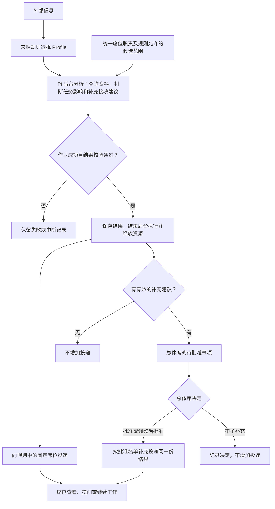

# 业务席位与补充投递审批：审阅入口

状态：**已按批准方案完成本地实现，已部署，待用户验收**。2026-10-09。

实施前设计提交：`4fd9565`。验证及使用步骤见 [实施验证记录](research/validation.md)，真实模型的实际表现见 [模型验证记录](research/validation-live.md)。

本期建设方向：**规则确定固定接收席位；Agent 分析后建议补充接收席位；总体席批准后再补充投递。**

例如：道路信息按规则送情报席。Agent 认为道路封闭还影响方案安排和态势更新，建议补充给筹划席、态势席。情报席的投递不等批准；总体席审阅后决定补充给两席、其中一席，或不补充。待批准期间后台作业已经结束。

实现与验收重点：

1. **四类席位的初步分工**：总体席兼管理员，另设情报席、筹划席、态势席；职责统一维护，不等同于常驻 Agent 或完整组织体系。
2. **总体席审批范围**：批准接收名单，不替分析结论背书；接收方无需先批准自己接收。
3. **页面入口**：沿用侧边栏和信息中心，增加总体席可操作的“待批准投递”；不另建后台管理门户。
4. **最小配置方式**：通过管理脚本维护席位职责；规则页面选固定席位和补充候选，不编辑重复职责。旧 A／B 账号及历史不自动改名、搬迁或删除。

| 文档 | 阅读目的 |
| --- | --- |
| [需求与边界](prd.md) | 四席位分工、本期目标与限制 |
| [实现设计](design.md) | 配置示例、Agent 工具、审批记录、权限和页面 |
| [实施步骤](implement.md) | 开发顺序与发布前准备 |
| [验收清单](acceptance.md) | 固定投递、总体席批准、重启与隔离如何验证 |

继续复用 TypeScript、Pi SDK、SQLite、原生 JSONL 和既有投递。新增持久审批是为了总体席可在后台分析结束后处理，不引入新的 Agent 运行状态机。先验证这条流程，不开展两种分析架构的基线对比。
