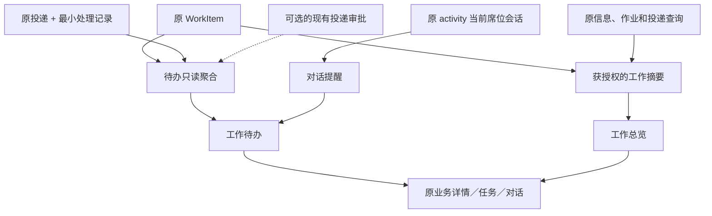

# 统一席位待办与工作总览：详细设计

状态：待审。本文所有“新增／调整”均为拟实施内容。需求见 [PRD](prd.md)，代码依据见 [现状记录](research/current-state.md)。

## 1. 架构原则与能力边界

Pi 继续拥有对话执行、工具循环、等待用户交互和原生历史。SQLite 中已有的 WorkItem、BackgroundDelivery、BackgroundJob 及可选 DeliveryReview 分别拥有各自的业务状态。新增待办只是一层查询与展示，不新增通用 work/event/run 表，也不复制会话或分析正文。

实际缺口限定为两项：持久的“本席位处理状态”，以及获授权的“跨席位工作摘要”。职责沿用中央席位目录；没有职责字段的旧数据仍显示已有席位名称，不阻塞基础改造。



## 2. 页面与导航

### 2.1 一级入口

保留新建对话、工作任务、个人空间和设置。新增结构如下；首次无明确目标进入时默认工作待办，显式对话或旧信息链接优先。

```text
新建对话
工作待办
工作总览                 [至少具备一类总览或来源查看能力]
工作任务
  任务 → 对话、相关信息、文件和成果
个人空间
设置
```

删除“收到的信息”“全部动态”的独立导航。工作总览是信息中心的新外壳，不额外保留同级旧入口。

### 2.2 工作待办

页面采用列表／详情布局。列表行显示类型、标题、来源或分派双方、关联任务、业务状态、最近业务时间，以及清楚的下一步动作。详情沿用信息原文与分析、TaskAssociations、InformationContinuation、交接资料和提交记录。

```text
工作待办
待我处理 | 跟进中 | 已办 | 全部
类型：全部 / 工作交接 / 外部信息 / 投递审批（可选）    搜索
对话提醒：待回应 2 个 · 异常 1 个                 [独立的会话数量]
办理事项列表：5 项                               [独立的事项数量]
  外部信息 · 道路变化 · 待处理        → 信息详情
  工作交接 · 修订方案 · 待我验收      → 交接详情
```

“对话提醒”只复用已有 activity 中本席位的等待回答、等待确认、失败、中断或恢复提示。待回应和异常分组，明确标注关联工作；同一会话只出现一次，工作项与关联对话分别计数，不把两个数字相加成“总工作量”。它不受事项类型筛选隐藏，以免审批／信息筛选掩盖另一对话的待确认；任务筛选则同时限制两者。已办筛选不生成会话历史，仍可从任务列表读原对话。

对话列表的状态标记固定在每条对话右侧：处理中显示转圈，新回复显示蓝点，待确认显示醒目的橙黄色点；红色用于失败或异常。列表不再附“处理中／新回复／待确认”文字，悬停说明与无障碍标签保留。同一对话同时有新回复和待确认时，优先显示待确认，不堆叠标记。工作待办中的对话提醒和具体操作仍保留文字，说明需要用户做什么。

列表分页只针对办理事项。对话提醒为按会话状态生成的独立小节，可折叠但保留数量。新回复只有未读提示，不进入必须操作的待办；普通运行状态仍在侧栏对话及折叠任务计数展示。

### 2.3 工作总览

| 栏目 | 内容与权限 |
| --- | --- |
| 席位工作 | 获准的公共任务交接摘要；按任务、发起／承办席位、业务状态筛选；默认列表 |
| 信息流转 | 原信息记录、各次分析版本、接收席位和投递情况；有权读取结果时附各接收席位的处理状态 |
| 处理运行 | 现有后台作业看板／列表及已有获准异常操作，不新增跨席位私有聊天监控 |
| 处理与投递规则 | 沿用来源管理权限的配置；不因总览可见而开放管理 |
| 投递审批（可选） | 复用已有审批列表和详情，按其权限展示 |

有工作摘要权限时默认“席位工作”；仅有来源权限时默认“信息流转”。同一公共任务下的工作可以按任务过滤查看；不凭任务关联自动认定工作责任人，也不计算含义不明的“整体完成百分比”。

分清“系统处理成功／已投递”“本席位已处理”“工作验收完成”。一条信息关联多个任务仍是一条来源记录，每次分析保留独立版本；显示投递成功和处理进度时说明分母是本次作业的获准接收者，不混入历史重试。

### 2.4 可访问性与状态保留

保留当前组件、Lucide 图标和样式体系；状态同时有文字和图形提示。筛选、列表、详情动作均支持键盘；打开详情后聚焦标题，返回后恢复原行和滚动位置。错误保留草稿，动态数量更新不抢焦点。桌面优先，窄屏列表／详情切换须可返回且无横向溢出。

## 3. 业务状态与计数

### 3.1 工作交接：只改变视角映射

| 原状态 | 承办席位 | 发起席位 |
| --- | --- | --- |
| assigned | 待我处理：待签收 | 跟进中：待对方签收 |
| working | 待我处理：办理中 | 跟进中：对方办理中 |
| returned | 待我处理：待修改 | 跟进中：等待重新提交 |
| submitted | 跟进中：等待验收 | 待我处理：待验收 |
| completed | 已办：已完成 | 已办：已完成 |

每个 WorkItem 每席位只出现一次，按其实际身份映射。待处理包含持续办理事项；不表示系统必须停止。验收仍只有发起席位可操作，总体只读授权不改变这一规则。

### 3.2 外部信息：最小处理闭环

| 状态 | 进入方式 | 列表与动作 |
| --- | --- | --- |
| pending（待处理） | 新投递成功，或人员重新列入 | 待我处理；可进入任务处理或标记已处理 |
| completed（已处理） | 本席位人员明确操作 | 已办；可重新列入待处理 |
| legacy（历史未登记） | 一次性迁移已有 delivered 记录 | 仅全部／历史筛选；可列入待处理或直接标记已处理 |

“标记已处理”表示本席位人员已确认知悉该信息，或完成当前必要的分析、跟进。仅打开、阅读信息，或系统分析成功、投递成功，均不自动标记已处理。不自动结束相关对话、作业、任务或 WorkItem；无需补写结论或强制关联任务。不自动发现结论变化后重新打开旧记录。

键为原 `deliveryId`（已有唯一 job × seat），因而：重试同一投递不新增待办；对同一信息重新分析成功并形成新投递时形成新的待处理，行中显示分析时间／版本；一个事件关联多个任务不重复其收件。固定投递和补充投递对同一次作业同一席位仍复用现有唯一约束。

同一席位在多个账号／浏览器间共享处理状态。其他席位的状态互不影响；总体不能代为结清。旧记录首次阅读也不自动产生处理事实。

### 3.3 对话与审批

对话等待只投影已有原生运行状态，点击后进入最新原对话交互卡；新列表不承接答案提交、授权或恢复执行。等待被解决、取消或重启失效后不再显示等待，按照现有活动信息展示异常或终态。当前选中的对话由本地流拥有状态，沿用现有修订保护，迟到的轮询不能重现已解决等待。

补充投递审批存在时，pending 对配置审批席位为待我处理，approved／declined 为已办；非审批者不出现在自己的待办中。点击复用既有详情及决定 API。批准不标记接收方处理、不创建交接工作，也不替分析内容背书。

## 4. 权限设计

### 4.1 最小新增能力

在既有席位身份能力中增加 `viewWorkOverview`，数据库席位布尔字段默认 false，由现有离线管理工具显式维护（拟 `--view-work-overview`）。初始化四席位时可给总体席开通，旧 A/B 账号不自动升级。不绑定名称，不复用 `createPublicTask` 或 `deliveryReviewSeatId`。

原因：原 WorkItem 详情只允许参与双方，来源管理权限只覆盖信息来源；两者均不能证明“可读其他席位工作摘要”。本次只补一项显式能力，不引入角色继承或任意权限规则编辑器。若 main 在实施前已有等价能力，则复用等价能力并更新本设计，不重复添加。

### 4.2 阅读与操作矩阵

| 对象 | 当前席位待办 | 获授权总览 | 可执行操作 |
| --- | --- | --- | --- |
| 交接工作 | 当前席位为发起人或承办人 | `viewWorkOverview` 且属于可见公共任务 | 沿用原双方权限，不能代办／代验收 |
| 原始交接文件与会话 | 沿用原详情权限 | 不因总览权限新增内容访问 | 固定副本下载／导入仍经原路由 |
| 外部信息 | 已实际投递给本席位，且当前来源配置、资料权限有效 | 沿用来源授权与内容可读检查 | 处理仅本席位；来源管理仍按 manage |
| 他席处理摘要 | 无他席列表 | 当前有来源查看权且能读对应完整结果，才返回接收席位和处理状态 | 只读 |
| 对话提醒 | 本席位所有获准对话，包括个人空间 | 不扩大到其他席位私有对话 | 进入原对话处理 |
| 投递审批（可选） | 仅既有服务确认 canDecide 的当前审批席位 | 沿用既有审批阅读范围 | 复用原审批资格和决定路由 |

总体跨席位摘要允许的字段：工作 ID、公共任务 ID／标题、工作标题、发起与承办席位 ID／名称、原工作状态、创建／更新时间、最近提交时间及次数。**不返回**工作目标正文、输入文件 ID／路径、提交文件 ID／路径、退回意见正文、会话 ID 或私有会话标题。参与者仍可通过现有 WorkDetail 读取已有允许内容；非参与者只能打开摘要。

所有过滤、计数、分页、标题搜索都在权限过滤后进行。撤销能力后立即按现有身份机制重新核验；旧选中行不得继续显示残留内容。没有总览能力但具备来源权限的人只能看到对应信息栏目，不获得跨席位工作。

## 5. 数据与接口（拟定契约）

### 5.1 处理记录

新增 `inbox_handling`，字段限 `delivery_id` 主键／外键、`state`、`revision`、`updated_at`、可空 `updated_by_user_id`。席位、事件、作业均由原投递取得，不额外存副本。legacy 初始操作者为空，迁移不伪造操作人；第一次人工变更之后记录真实操作者。

原投递首次成功变为 delivered 时，在同一事务创建 pending、revision=1 的记录；同一投递重试或查询不得重置其状态。对历史 delivered 的一次迁移创建 legacy。历史 pending／failed 仍按原流程；今后首次 delivered 才创建 pending。只有已送达且当前可读收件可更改处理。

沿用 `background_actions` 幂等机制，扩展一个 `inbox_handle` 操作类型；同一身份的 clientActionId 与请求摘要绑定，处理 revision 校验、状态更新和操作回执在同一事务保存。新增记录仅服务明确的处理需求；不另外建立通用待办事件账本。

### 5.2 待办聚合

拟新增 `GET /api/workbench/items`，限正式登录模式；从现有交接服务、信息服务和可选审批服务取得授权数据，返回只读投影。查询包含 `bucket=actionable|following|done|all`、`kind=work|information|delivery_review`（省略为全部）、`taskId`、`search`、`offset`、`limit`。

返回 `items / total / counts / generatedAt / sections`。单项包含带类型的稳定键、原对象 ID、类型、标题、原业务状态、当前席位视角文案、来源、可见任务摘要、实际业务时间、能力标记和详情目标；不夹带正文、附件或会话历史。信息的多个可见关联任务保留为一项；任务筛选通过有效关联过滤。

业务模块提供未分页的授权摘要或可组合的查询；聚合后统一排序再分页，不能拼接各源第一页假装完整结果。基于现有小规模 SQLite 方式先实现有界返回的服务查询；不新增搜索索引平台。默认按实际业务更新时间倒序，稳定键打破同时间并列。counts 先应用权限、类型、任务、关键词筛选，再按 bucket 统计；total 是当前 bucket 的条数。

sections 区分 `available / unavailable / error`。没有 background 配置或没有审批能力是 unavailable，不是请求错误；模块读取失败时返回已成功板块且标明其计数不完整，失败板块数量为未知而非零。客户端保留上次列表并提示过期，不依据部分结果移除失败板块的已展示事项，不继续翻页声称得到完整列表。聚合 GET 不创建记录、工作区、文件或模型调用。

对话提醒继续使用已存在的 `GET /api/activity` 和 useChat 内状态，不引入第二套实时会话聚合。持久事项查询在活动浏览器标签页每 10 秒最多一次，窗口回焦及成功操作后刷新；离屏标签页暂停。activity 的现有轮询不变。所有读取按身份和导航世代丢弃过期响应。

### 5.3 拟新增读写契约

上述正式聚合不强加给旧匿名或测试身份。测试双席位继续通过原 scoped work-items 与 activity 读取，复用相同状态映射和界面内容；未配置交接的旧单席位保持原聊天入口，不调用不存在的正式收件 API。基础改造不要求启用背景来源。

| 接口 | 责任 |
| --- | --- |
| `GET /api/inbox/:id/handling` | 返回本席位当前处理状态／revision；身份及资料权限与收件详情一致 |
| `PUT /api/inbox/:id/handling` | `{state:pending|completed, revision, clientActionId}`；服务不接受客户端 seatId，重复 action 返回原回执 |
| `GET /api/work-overview/items` | 获准的公共工作摘要，按任务／席位／原状态／关键词筛选及分页 |
| `GET /api/work-overview/items/:id` | 同一范围内的单项摘要，用于刷新和直达；参与者完整详情仍走原接口 |

收件详情及列表投影补充 handling。现有信息流转详情可在原权限成立时补充处理摘要。对未知或越权对象沿用 404；已登录但缺少整体总览能力的入口返回 403。处理 stale revision 返回 409 并携带可重读提示；同 action 不同请求体冲突。响应丢失后先按原 clientActionId 查询 `inbox_handle` 回执及当前 handling，再决定是否重试同一操作，不盲目提交新 action。回执查询复用现有 background_actions 查询模式，拟 `GET /api/inbox/:id/handling?clientActionId=...`。

不新增概括所有业务的 mutation API。WorkItem 准备／确认／提交／验收、投递重试、审批和原生对话响应继续走各自服务，并在执行时重新鉴权。

## 6. 路由、组件与旧入口

新页面拟使用 `/work?bucket=...&kind=...&id=...`、`/overview?tab=work|events|jobs|rules|reviews&...`。选中 id 必须带 kind，避免不同对象混淆。任务信息保留 `/tasks/:id/information`。明确打开会话时支持 `/?session=<id>`，按当前席位核对归属后使用原 useChat 选择流程；没有目标的 `/` 进入待办，旧本地草稿仍按原 session／workspace 键保留。

| 旧入口 | 新落点 |
| --- | --- |
| `/inbox?id=D` | `/work?kind=information&id=D`，确保详情可打开，即使不在默认待处理集合 |
| `/information?tab=events|jobs|rules&id=...` | `/overview` 对应 tab，保留来源、分页、看板参数 |
| 可选 `/information?tab=reviews&id=R` | 已启用审批时对应总览审批详情；未启用给出能力不可用说明 |
| 原 WorkInboxHandle／LinkedWork 打开工作 | `/work?kind=work&id=W` |
| 原全部动态按钮 | 移除；旧 `/` 无显式选中目标时进入待办 |

旧 `/information?id=...` 未带 tab 时仍按现有规则解释为信息记录；仅信息中心根路径按新授权默认栏目进入。切换到原交接详情时先保存 assignWorkspaceId 和选中文件等准备上下文，不能仅替换 URL 丢掉草稿。正式模式根路径默认待办，旧单席位模式沿用其原聊天默认页。

迁移别名使用 replaceState，不增加多余返回层级；用户点击导航用 pushState。任一旧路径必须先统一归一化再挂载详情；不能让 Inbox 和 InformationCenter 的旧 useEffect 把新路由写回旧地址。

从 WorkInbox、Inbox、InformationCenter 抽出可复用的列表／详情内容与业务操作，不并排挂载两套会自行改 history 的旧完整页面。保留 WorkInbox 草稿和未完成准备查询、信息接续的原始选择世代保护、确认卡焦点和文件选择。跳转或刷新不自动提交、发送或恢复执行。

## 7. 可选补充投递审批适配

基础聚合和总览不强制引用审批数据表。适配只在主程序具备审批实现时注册，且按既有 capabilities 和服务授权工作；没有模块时不发送探测 404 的轮询、不创建占位审批、不等待它部署。

main 在途接口为 `/api/information/delivery-reviews` 及详情／decision；这是实施前需核对的参考。若已落地，则复用其候选、草稿、revision、回执、固定投递与补充投递区别。以 `review:<id>` 唯一标识，不在 workbench 创建另一条审批记录。

审批服务可用但权限不足，与服务读取故障分别展示。批准后的传输失败继续在既有投递记录处理，不重开审批、不重新调用模型。只读总览权限不授予审批权限；审批人配置也不授予总览权限。

## 8. 迁移、main 对齐与回滚

方案从稳定提交设计，实施前在本 worktree 对齐 main 已提交版本，确认 seats 字段、身份响应、数据库版本、background_actions 类型校验、信息详情路由和审批能力的最终契约。**不把另一工作区的未提交 diff 当作可合并依赖。**本次不预占 schema 版本号，迁移版本取届时 main 的下一个版本。

迁移在服务停止并备份整个数据目录后执行，事务中创建处理表、为历史 delivered 记录插入 legacy、添加默认关闭的总览能力。同步更新所有数据库打开入口、管理脚本和完整性检查；新版本缺少必需表／列时不能悄悄重建。无外部接入配置时，既有交接与新总览仍可用。

legacy 仅是缺少旧处理事实的明确标记，不能由 updatedAt 推断。新版本不重送历史消息、不把旧席位改名或迁移其文件。新增只读能力需显式授予；四类席位名称与职责如 main 已建立则直接读取。

迁移需覆盖原测试数据、仅认证／交接而未启用背景的数据，以及已启用背景和可选审批的数据。总览能力字段不依赖背景服务构造；处理表的外键目标须在原背景表初始化后建立。后续首次启用背景仍能完成相同初始化，不能降级数据库版本，也不能让无背景的数据因新处理表缺失被误判损坏。具体迁移分支在对齐 main 后按其真实版本补入测试，不能只验证当前四席位演示数据。

回滚前停止服务并保存升级后完整目录，恢复升级前整份数据与匹配代码。不能单独切回不认识新 schema 的二进制，也不能只回退数据库丢下新固定文件。若仅撤回导航且当前代码仍兼容新 schema，可保留处理数据，以后续独立修复提交恢复旧入口。

## 9. 风险与取舍

- 默认把历史收件全部设为待办会产生不可证明的积压；本版用历史未登记，明确保留查阅和手工纳入。
- 管理人员可能希望查看所有交接正文；本版仅增加摘要可见，内容仍经原权限，扩大成果共享需另行明确业务授权。
- 所有对话进度放入工作待办会造成噪声；本版仅集中待回应和异常，未读及运行状态留在原对话列表。
- UI 文件与 main 的席位投递任务重叠较多，实际实现必须基于最终提交进行组件接入；审批是否存在不改变基础验收标准。
