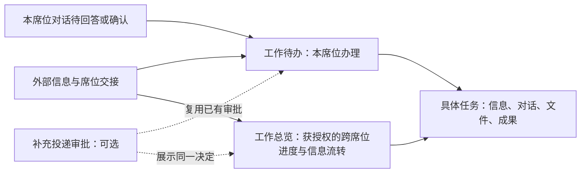

# 统一席位待办与工作总览：审阅入口

日期：2026-10-09。状态：**方案已整理，待用户审阅；未批准产品实施。**

本方案在独立 worktree 编写，分支为 `codex/work-inbox-overview-design`，基线为 main 的 `4fd9565`。main 正在实施的席位职责与补充投递审批仅作为只读参考；没有复制未提交实现，也没有修改主工作区。

## 1. 目标与范围

当前四个入口收敛为两个：**工作待办**帮助当前席位找到下一件需要办理的事；**工作总览**帮助获授权人员掌握跨席位工作及信息处理进度。任务继续承载相关信息、对话、文件和成果。

| 当前入口 | 调整后 |
| --- | --- |
| 工作待办、收到的信息 | 合并为“工作待办”，区分工作交接和信息阅处 |
| 信息处理中心 | 扩展为“工作总览”，保留信息流转、后台处理与配置能力 |
| 全部动态 | 取消独立入口；待回答／确认进入待办中的对话提醒，运行状态和新回复留在对话列表 |

## 2. 席位分工

沿用 main 正在确立的四类职责：总体席负责协调、分派、验收及获授权的管理；情报席负责信息核实；筹划席负责方案；态势席负责状态与变化。各席位都使用“工作待办”，总体席也有自己的待办。

职责描述来自统一席位目录，不在页面再维护一份。页面入口与操作依据实际能力授权；“总体席”这个名称不直接放开权限。工作区继续按任务 × 席位隔离。

## 3. 建议审阅的关键选择

1. **信息采用“阅处”语义。**新送达的信息进入“待阅处”；人员可提问、分析、关联任务，或知悉后直接“标记已阅处”，也可重新列为待阅处。无需强制编写成果；阅读、AI 完成、投递完成均不自动结清。
2. **历史收件单独识别。**升级前已送达的信息显示“历史未登记”，在“全部”中可查，默认不倒灌成新待办，也不伪造为已阅处；人员可主动列入待阅处。
3. **工作交接保留原有责任。**承办人签收／提交，发起人验收。已提交的工作对承办人显示等待验收，对发起人进入待办。对话成功不代替交付验收。
4. **总体查看流程，办理仍按原权限。**新增显式、默认关闭的跨席位工作总览只读权限；授予后可查看公共任务下工作标题、分派双方、进度和交付版本摘要。非参与者不因此获得原始交接文件、私有对话、验收或代办权限。
5. **待办与总览复用同一业务记录。**不同入口不产生第二份工作、第二次投递或第二项审批；对话提醒按“个对话”单独计数，不与“项工作”相加。

这些是本版待审建议，尚未被视为已获实施批准。具体可观察行为见 [验收清单](acceptance.md)。

## 4. 补充投递审批不是前置依赖

基础方案可在仅有固定投递时实施和验收。补充投递审批已落地且当前席位获准时，才把其待批准记录接入工作待办，并在总览查看同一决定；未启用时不出现审批栏目，不阻塞任何已有流程。

本方案不建设审批服务，也不借审批人配置识别全局管理员。接口落点参考当前 main，实施前核对最终提交即可。缺少审批模块是正常能力差异；审批模块已启用但读取失败必须显式报错，不能伪装成零项。

## 5. 本期不做

不建立新的 Agent 循环、通用流程引擎、组织管理平台、自动任务分派或自动阅处；不统一所有业务状态为一种“完成”；不开放所有席位文件；不增加独立动态页面；不改变信息归口、现有交接和原生对话历史的权威来源。

## 6. 交付与实施顺序

建议按权限与阅处记录 → 待办聚合 → 页面与导航 → 总览 → 兼容及回归的顺序实施。补充投递审批接入为可选末段，基础交付可独立验收。

| 文档 | 内容 |
| --- | --- |
| [需求](prd.md) | 用户目标、需求边界、验收编号 |
| [详细设计](design.md) | 页面、业务状态、权限、数据与接口、迁移兼容 |
| [实施步骤](implement.md) | 分步修改范围、质量门槛、回滚与 main 对齐 |
| [验收清单](acceptance.md) | 多席位、状态、权限、旧数据及导航用例 |
| [现状依据](research/current-state.md) | 基线代码位置、main 在途改动、实际能力缺口 |

主要风险是新旧收件语义、只读总览的数据边界，以及 main 同时修改身份、数据库和信息页面。实施前在本 worktree 对齐 main 已提交版本并复核这些交点；仅对接口变动做必要适配，产品边界若改变则再次审阅。
