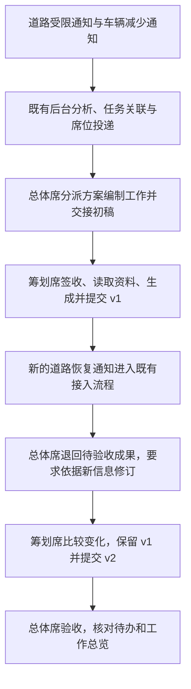

# 审阅入口

日期：2026-10-10。状态：**实施完成，人工端到端验收待执行。**

## 本阶段做什么

先用合并后的工作待办、工作总览和对话界面，完成一轮“多条信息 → 编制方案 → 提交 → 情况变化 → 修订 → 验收”的实际验证。已有能力直接使用，发现具体问题后再做必要修复。

图中是测试操作顺序，不是新增系统工作流；每个正式交接仍由人员确认。v1 在新信息到来前保持待验收，避免把已验收工作重新打开。

## 请重点审阅

1. **阶段定位**：先验证已有能力，不预设新功能；发现需要新增机制时另行审阅。
2. **测试场景**：使用合成补给方案，重点是多源依据、文件修订和席位交接；不验证实际运输调度。
3. **实际建设量**：补充“道路恢复”模拟数据、测试准备／检查脚本及验收记录；产品代码仅按实测问题修复。
4. **验收方式**：先隔离数据自动核验，再让用户从新 UI 操作总体席和筹划席；保留每次失败和人工纠正。

阅读顺序：

- [需求与通过标准](prd.md)：本期做到什么程度。
- [验证设计](design.md)：材料、流程、文件和权限如何使用。
- [实施步骤](implement.md)：先做什么、哪些情况需要再次审阅、怎样验证。

已完成模拟恢复事件、验证驱动和测试材料，并按用户追加授权更新 4315。E1/E2 已真实分析成功，当前停在总体席待审批。没有改动产品代码或代替用户审批。

- [测试指南](test-guide.md)
- [实际验证记录与未覆盖项](research/validation.md)
