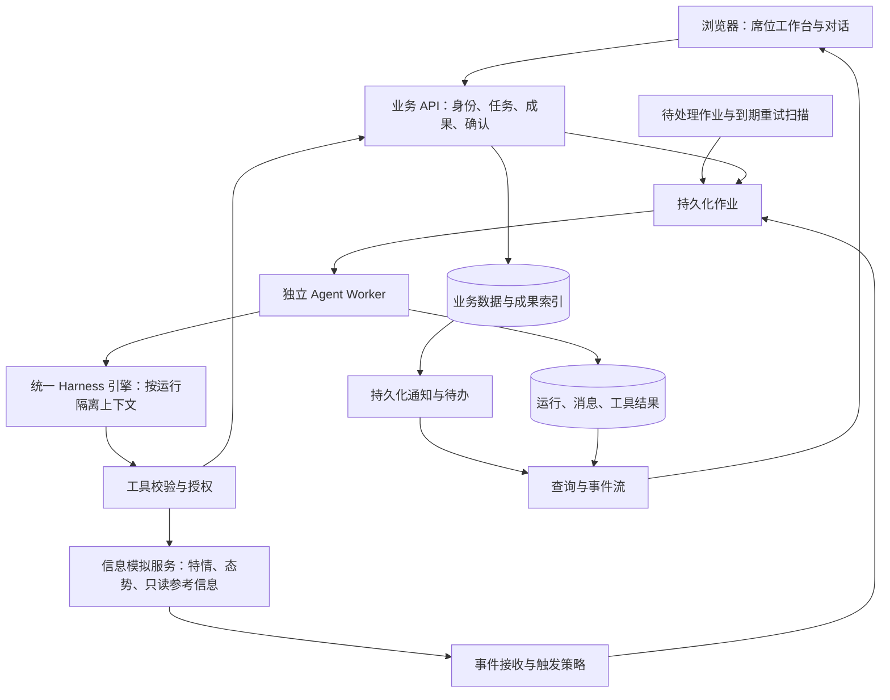

# MVP 设计边界

版本：v0.3；状态：设计草案。实现顺序为通用 Harness 与作业框架先行，样板业务和信息模拟服务后接入；最终 MVP 聚焦多源研判与方案审核，调度实现后延。未锁定框架、数据库或 API 字段。需求来源为 [PRD](prd.md)，技术决策见 [decisions.md](decisions.md)。

## 1. 单机部署下的逻辑分工

下图为完成业务接入后的目标结构；信息模拟服务和特情／态势输入属于 M2／M3，不是 M0／M1 的启动依赖。前期使用固定测试资料与合成事件直接验证通用工具和作业入口。



图中存储与模块可以共用一个数据库，不要求分别成为微服务。建议部署单元为 Web、业务 API、Agent Worker、模拟服务、数据库和本地持久化文件目录。作业、事件和通知可以先使用数据库表，不强制引入消息中间件。

| 边界 | 负责 | 不应承担 |
| --- | --- | --- |
| 业务 API | 身份与静态授权、任务与工作项、成果版本、确认和审计、标准操作 | 将聊天文本作为唯一业务状态 |
| Worker／Harness | 领取作业、构建上下文、模型与工具循环、预算与取消、运行记录 | 绕过业务服务改状态或由模型批准操作 |
| 信息模拟服务 | 特情消息、态势快照及参考信息，统一标识／时间／版本，场景注入与重置 | 实现调度动作、改变资源占用，或在无来源标记时随机给出冲突数据 |
| 工作区 | 资料、草稿、成果文件与业务编号关联 | 以全员共享可写目录代替任务隔离 |
| 浏览器 | 业务操作、对话、工具进度、成果与地图预览 | 持有服务凭证或决定后台作业生命周期 |

信息模拟服务维护样板场景的输入和版本。不同报告可以存在显式设计的矛盾，但必须保留各自来源和时间；同一对象的版本与地图展示应可对照。若样板包含资源位置、类型或可用性，作为只读快照提供给方案分析；Agent 的建议不会修改这些快照或占用资源。

### 通用框架与业务接入的边界

| 能力 | M0／M1 先实现 | M2／M3 后接入 |
| --- | --- | --- |
| Harness | 模型适配、工具循环、配置／Skill 加载、上下文引用、Run 控制与事件流 | 特情／态势读取、知识检索和专业 Skill |
| 作业与后台 | 任务、工作项、会话、持久化队列、服务身份、触发／重跑、并发与恢复 | 特情接收、事件关联、业务输入版本和席位路由 |
| 成果与确认 | 可校验的结构化成果、来源引用、版本、固定提交／退回／确认流程 | 简报／方案字段、审核职责、过期输入的业务规则 |
| 子 Agent | 单层委派、父子 Run、独立上下文、权限子集和结果回传 | 态势摘要、方案检查配置 |
| 身份与界面 | 固定测试身份、静态策略、最小任务与作业台 | 业务三席位和地图面板 |
| 验证输入 | 少量文本／JSON、固定工具与合成事件，可注入超时等故障 | 多源模拟服务、业务场景脚本、领域真值与质量评估 |

通用协议通过对象引用、带版本的输入、工具注册和成果类型校验承接领域数据，不把特情字段写入运行内核。测试工具只服务于框架验证，不预先建设业务模拟服务。通用性限定在当前 MVP 所需接口，不扩展为动态插件市场、审批设计器或多 Harness 平台。

## 2. 最小对象与关联

以下为最终 MVP 概念清单，不直接等同于最终数据表。M1 先实现身份、任务／会话、运行、作业、成果与确认；RawMessage／Event、SituationSnapshot 和地图对象在业务接入时补齐。前期输入使用通用来源引用及版本，后台合成事件不要求存在特情对象。

| 对象 | 必须保留的信息或关系 |
| --- | --- |
| Identity／Seat／Role | 当前主体、席位与角色绑定；后台为独立服务主体；静态策略版本 |
| RawMessage／Event | 来源消息标识、事件关联、原始内容、发生及接收时间、事件输入版本；模拟时间单独记录 |
| SituationSnapshot／SourceReference | 态势要素、来源、发生／观测时间、接收时间、版本、相关对象；可选资源／环境参考信息使用同类来源引用 |
| TaskSpace／WorkItem | 任务范围；工作项目标、责任席位、输入引用、预期成果和状态 |
| Session／Message | 任务与固定席位角色、原始消息、历史摘要、关联成果；摘要不替代原始记录 |
| AgentDefinition／Skill | 职责、版本、工具范围、输入／输出要求、触发和结果去向 |
| Job／Run | 作业触发来源、输入快照、执行尝试、状态、错误、预算、父子 Run、重试或续接关联 |
| ToolCall／Operation | 工具名称、经校验参数、结果、操作编号、幂等键、身份、业务目标与输入版本 |
| Artifact／ArtifactVersion | 简报与筹划方案两类成果、结构化内容、文件位置、输入来源及版本、生成 Run、不可混淆的成果版本编号 |
| Submission／Confirmation | 提交方、接收方、目标成果版本、动作、参数范围、意见和处理时间 |
| Notification | 关联业务结果、接收席位、投递尝试、阅读状态；工作项签收另记 |
| MapSelection／Layer | 选中对象或区域、坐标基准、业务编号、输入版本、候选／共享状态 |

有任务归属的对象必须携带并校验任务范围。尚未建立任务的后台特情作业使用受限事件范围，建立任务后显式关联；不能为了满足字段而伪造任务或使用全局会话。

简报组织来源事实、态势摘要、变化、冲突和待核实项；方案组织目标、依据、态势判断、约束、建议安排与待核实事项。方案保存引用的消息、态势快照、知识片段及版本；新增输入不会重写已归档依据，修订形成新版本。

## 3. 状态与关键转换

| 对象 | 建议状态语义 | 关键约束 |
| --- | --- | --- |
| 工作项 | 待签收 → 处理中 → 待审核 → 已完成；退回到处理中 | 方案类工作以指定成果版本通过审核为完成条件；与 Run 状态分开 |
| 成果版本 | 草稿 → 已提交 → 已确认或已退回 | 修改生成新版本；旧审核保留但不批准新版本 |
| Session 交互显示 | 本轮处理中／等待用户输入 | 会话贯穿多轮；这些是界面交互语义，不将整段对话当成一个长期执行中的 Run |
| Run | 排队 → 执行中 → 成功／失败／已取消／中断；受控操作可进入待确认 | 待确认时保存上下文及具体动作，释放本次执行槽位；确认后关联续接 |
| 通知 | 已保存，投递中／成功／失败，未读／已读 | 投递和阅读是独立维度；通知重试不重跑分析 |

多轮对话中，每次用户输入通常启动新 Run；一次 Run 内可包含多次模型和工具调用。本轮生成草稿或询问补充信息后，Run 可以成功结束，Session 等待用户输入，工作项仍为“处理中”。只有成果正式提交、审核等需要批准的具体动作才使用“待确认”，不能把普通等待回复都记为待确认。

同会话待确认时，不得同时放行另一条相冲突的活动 Run；具体恢复为原 Run 还是关联后续 Run，可在 W01 验证后决定，但必须保留确认与原操作的关联。

固定按钮确认已经是用户的明确业务动作，不必为每次点击再叠加无意义的弹窗；Agent 发起正式提交、审核或共享态势发布等受控动作时，按策略形成待确认请求。两条入口都由服务端验证身份、当前状态、具体版本和参数。普通只读查询和授权范围内的草稿保存不统一要求人工确认。

## 4. 统一 Harness 引擎与独立运行控制

“统一”指前台各席位和后台作业复用同一套引擎代码、工具接口及运行机制。每次执行单独装配身份、权限和上下文，分别管理状态；不使用一个包含所有会话历史的全局 Agent 执行对象。

| 隔离层次 | 设计要求 |
| --- | --- |
| 任务与身份 | 每次读取资料、调用工具和写入成果均校验主体及任务范围 |
| Session | 消息和摘要按会话保存；同一会话可在后续 Run 中继续使用自身历史；其他会话的聊天不默认注入，即使属于同一任务 |
| Run | 输入快照、工具结果、预算、取消与确认状态按运行管理，并关联所属会话及任务；控制一个 Run 不影响无关 Run |
| 后台作业 | 使用固定服务身份及独立作业上下文；没有人工会话时仍按作业、运行和数据范围隔离，不借用用户会话 |
| 可共享业务资料 | 任务事实和已提交成果通过授权接口显式读取；共享业务资料不自动扩大聊天记录的可见范围 |

隔离由服务端数据访问校验和执行上下文保证，不要求每个会话独占一个进程。Worker 可以复用执行资源，但不得在不同会话或 Run 之间串用可变状态；同会话最多一个活动 Run，不同会话可以并行。

| 维度 | 前台对话 | 后台特情 |
| --- | --- | --- |
| 主体 | 登录人员及席位 | 固定服务身份 |
| 触发 | 新消息或人工操作 | 新特情／补充消息、人工重跑；扫描仅补偿待处理和到期重试 |
| 上下文 | 任务目标、特情与态势快照、已确认事实、相关成果、当前会话、知识与地图选择 | 指定事件、关联态势快照和获准业务资料 |
| 产物 | 会话回复、任务成果与操作请求 | 候选分析、事件关联记录、指定席位待办 |
| 人工介入 | 展示待确认动作 | 保存待人工处理事项，人员处理后续接 |

每次运行按需读取业务事实、近期消息、历史摘要和相关成果，不无限拼接全部历史。其他席位聊天、无关任务和全系统长期记忆不进入默认上下文。外部消息、附件、态势报告是待分析数据，其中的指令式文字不能修改身份、工具范围或系统职责。

工具循环最少完成：选择工具 → 校验输入／身份／范围／必要确认 → 调用 → 持久化结果 → 模型继续处理 → 校验和登记成果。主 Agent 对 SubAgent 的委派有独立上下文、父运行关联、预算与并发上限；子 Agent 只能查询和返回候选分析，不能再委派、审批或分派工作项。

多源研判按“读取来源及版本 → 关联事件／对象 → 区分已确认事实、变化、冲突和缺失 → 结合知识依据形成建议 → 保存成果及引用”组织。至少同时使用特情与态势两类输入；其他参考信息按样板接入。源信息更新后提示已有分析所依据的版本，由人员发起补充分析或修订，不将较新的接收时间直接等同于更可信，也不静默覆盖已确认结论。

## 5. 后台处理的可靠性

1. 接收消息时先持久化原文和可追踪的待处理记录，避免原文已接收但作业丢失。可使用同事务或事务内事件记录后可靠转为作业。
2. 消息去重键与事件标识分开。同一消息重送只处理一次，同一事件的新消息仍需处理。
3. 同事件处理采用串行或合并尚未启动更新的简单策略；不同事件可并行。输出保存所基于的输入版本，旧分析不能覆盖更新的当前结果。
4. 分析和通知分别记录。先保存分析及待投递记录，再推送；通知失败只重试投递。
5. 触发规则区分原始业务输入和分析完成事件，记录来源及关联 Run，避免自身产物触发无限分析。
6. 领取作业需持久化归属及可识别的失联状态；Worker 重启后把失联执行标记为中断。具体领取锁、租约或扫描机制在实现设计时选定。
7. 重试有上限；人工重跑保留原输入和原执行关联。结果不明的写操作先查状态；停止不撤销已完成动作。
8. 停用新触发与取消已有运行分开。停用期间消息仍有记录，不静默丢弃；恢复触发后的补处理策略在 W09 明确。

只承诺保存已有结果、识别中断并从已保存上下文接续，不承诺任意执行点自动续跑。进程健康检查不调用模型，也不等同于业务已恢复。

## 6. 工具、工作区与集成契约

下表包含最终领域工具。M1 先验证工具参数、权限、调用结果、确认和成果读写协议，使用固定资料读取及测试成果工具；知识检索、特情／态势查询和地图工具在 M2／M3 实现。

| 工具组 | 最小能力 | 接口设计关注点 |
| --- | --- | --- |
| 知识与任务读取 | 检索、定位原文、读取任务资料／事件／工作项 | 来源、版本、访问范围；场景当前信息通过业务服务查询 |
| 成果与文件 | 读取草稿、保存候选、新建版本、登记文件 | 任务／Run 隔离、结构校验、版本冲突；禁止任意路径 |
| 协同与确认 | 准备分派、提交指定版本、产生确认请求、查询处理结果 | 当前主体、接收席位、具体版本及动作；幂等 |
| 态势与参考信息 | 查态势快照、变化及样板纳入的资源／环境概况 | 只读、来源和时间口径、输入版本；过期与缺失标识 |
| 地图 | 读选中对象／区域、生成候选标绘、确认共享 | 对象标识、坐标与时间基准、几何校验、候选和共享分离 |

任务工作区可采用本地持久化目录加数据库索引。运行临时文件通过格式和业务校验后登记为成果；不能因清理临时区域或重启而丢失正式成果。路径和范围在服务端强制校验，模型不获得任意 Shell、宿主机接口或全库凭证。

地图仅做一个组件或既有框架的薄适配；先确认坐标基准、图层格式、事件与态势对象标识。场景模拟保留种子、版本、输入序列和异常配置；测试真值不注入 Agent。历史过程查看与重新调用模型分析分开，后者不保证逐字复现。

## 7. 最小界面建议

| 页面／面板 | 核心内容 |
| --- | --- |
| 演示入口 | 预置席位进入；当前身份和模拟环境标识 |
| 任务与待办 | 任务列表、工作项状态、到期／阻塞提示、未读／待处理事项 |
| 任务工作台 | 特情与态势摘要、来源和版本、会话列表、多轮对话、运行与工具状态、成果和资料、地图 |
| 成果与审核 | 指定版本预览、来源、退回意见、提交和确认、历史记录 |
| 后台作业 | 关联事件、输入版本、状态、产物、失败原因、取消／重试、触发启停 |
| 场景控制 | 固定场景启动、重置、随机种子、事件和异常注入；可为简单开发控制入口 |

这些是信息组织建议，可合并为更少的页面，不以页面数量作为交付指标。

## 8. 技术选择与运行记录

TypeScript／Node.js 作为优先验证候选；W01 用非业务测试工具比较“嵌入式 Agent 核心＋自有 Harness”与“包装已有运行时”，MVP 只实现一种内核适配。模型访问、数据库和主要框架在 W01／W02 明确；领域检索、地图、专业模板在后续 W00／W06／W11 明确，不能反向阻塞前期运行框架。

运行记录至少关联模型标识与可获得的版本、提示词／角色配置／Skill 版本、输入快照、工具参数与结果、成果版本、耗时和可获得的用量；关联业务操作及人工确认。不要依赖模型自述判断工具调用成功，也不将其自述当作可靠审计证据。

## 9. 后续调度系统接入：仅设计预留

用户已明确延后全部调度相关实现。以下记录未来操作模拟或真实调度系统的接入边界，不要求 MVP 创建调度表、实现适配器、提供占位 API、注册调度工具或展示调度按钮；调度专用系统调研与测试也在后续阶段开展。

### 责任和数据边界

- 方案通过独立编号、版本、来源和审核记录成为未来接入的输入。方案内容继续独立存在，批准方案不会自动下发指令。
- 后续增加领域工具适配器，经业务 API 的身份、任务范围、专门操作确认和幂等校验后调用调度系统。MVP 的工具注册与授权边界应允许以后增加这类受控操作。
- 未来由调度系统维护资源占用和执行状态；本系统保存请求关联和回执投影。读取资源概况与执行调度使用不同权限及工具。
- 外部请求建议关联任务、方案版本、拟执行参数、发起身份、操作确认、幂等键；外部系统返回操作编号，供后续查询与结果对账。具体协议留待接入时确定。
- 届时增加 Dispatch／Receipt 等对象及调度成果；当前的两类成果和工作项完成条件不依赖这些对象。

### 后续业务状态示意

```text
请求中
├─ 拒绝（请求结束）
├─ 接受 → 执行中 → 完成／异常
└─ 结果待查询 → 按操作编号或幂等键查询后确定状态
```

这是调度系统的业务状态，与 Agent Run 独立。请求被接受后，提交该请求的 Run 可以结束，后续回执更新调度状态；未知结果先查询再决定是否重试。该状态机、资源争用处理、回执接收及其验收均在后续接入阶段实现，不属于当前 MVP 状态模型。
