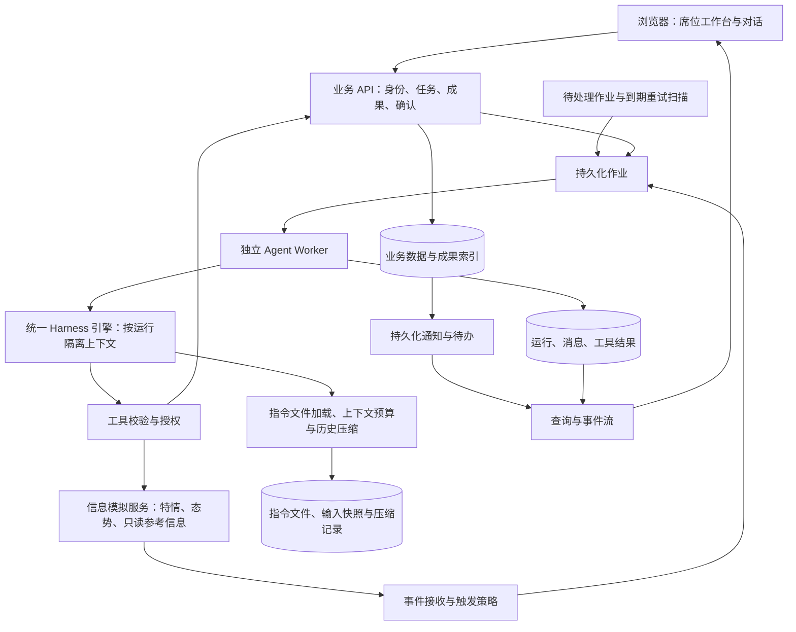

# MVP 设计边界

版本：v0.7；状态：设计边界草案，开发未启动。产品为面向垂直场景的 Agent 作业与协同平台，以多轮对话为主要交互，Tool、Memory、Skill、Subagent 和上下文管理／压缩为基础能力。框架先行、样板业务与模拟服务后接入，MVP 跑通多源研判与方案审核；调度实现后延。首步按 Pi 路线设计，M1 长期内核、数据库和正式 API 字段仍待验证。需求来源为 [PRD](prd.md)，技术决策见 [decisions.md](decisions.md)。

W01 首步收敛为 Pi 多轮对话与最小工具，见 [首增量设计](../../.trellis/tasks/09-16-w01-harness-validation/design.md)。完整 Run、确认、平台数据库／快照与导出设计移至 [后续设计](../../.trellis/tasks/09-16-w01-harness-validation/design-later.md)，在 W01 S3／S4 验证；下文是完整 MVP 的边界，不能全部视为首步前置。W01-1 已实现并验证；W01-2（S2a）已完成 A01～A12 组合验收。

## 1. 单机部署下的逻辑分工

下图为完成业务接入后的目标结构；信息模拟服务和特情／态势输入属于 M2／M3，不是 M0／M1 的启动依赖。前期使用固定测试资料与合成事件直接验证通用工具和作业入口。



指令文件保存在受控工作区，其余业务与运行记录可共用一个数据库，不要求分别成为微服务。建议部署单元为 Web、业务 API、Agent Worker、模拟服务、数据库和本地持久化文件目录。作业、事件和通知可以先使用数据库表，不强制引入消息中间件。

| 边界 | 负责 | 不应承担 |
| --- | --- | --- |
| 业务 API | 身份与静态授权、任务与工作项、成果版本、确认和审计、标准操作 | 将聊天文本作为唯一业务状态 |
| Worker／Harness | 领取作业、按目标组织步骤、加载授权指令文件、装配与压缩上下文、模型／工具循环、子运行、预算与取消 | 绕过业务服务改状态或由模型批准操作 |
| 指令文件与上下文管理 | 持久保存和加载工作区约定，受控编辑；按预算组织输入并保存压缩记录 | 自动建立结构化事实记忆库，或用文件／摘要替代业务状态与授权 |
| 信息模拟服务 | 特情消息、态势快照及参考信息，统一标识／时间／版本，场景注入与重置 | 实现调度动作、改变资源占用，或在无来源标记时随机给出冲突数据 |
| 工作区 | 资料、草稿、成果文件与业务编号关联 | 以全员共享可写目录代替任务隔离 |
| 浏览器 | 业务操作、对话、工具进度、成果与地图预览 | 持有服务凭证或决定后台作业生命周期 |

信息模拟服务维护样板场景的输入和版本。不同报告可以存在显式设计的矛盾，但必须保留各自来源和时间；同一对象的版本与地图展示应可对照。若样板包含资源位置、类型或可用性，作为只读快照提供给方案分析；Agent 的建议不会修改这些快照或占用资源。

### 通用框架与业务接入的边界

| 能力 | M0／M1 先实现 | M2／M3 后接入 |
| --- | --- | --- |
| Harness | 模型适配、按目标组合工具、配置／Skill 加载、Memory、上下文预算与压缩、Run 控制与事件流 | 特情／态势读取、知识检索、专业 Skill 与领域指令文件 |
| 作业与后台 | 任务、工作项、会话、持久化队列、服务身份、触发／重跑、并发与恢复 | 特情接收、事件关联、业务输入版本和席位路由 |
| 成果与确认 | 可校验的结构化成果、来源引用、版本、固定提交／退回／确认流程 | 简报／方案字段、审核职责、过期输入的业务规则 |
| 子 Agent | 单层委派、父子 Run、独立上下文、权限子集和结果回传 | 态势摘要、方案检查配置 |
| 身份与界面 | 固定测试身份、静态策略、以多轮对话为主的作业台，配合任务／工具／子运行／成果视图 | 业务三席位和地图面板 |
| 验证输入 | 少量文本／JSON、固定工具与合成事件，可注入超时等故障 | 多源模拟服务、业务场景脚本、领域真值与质量评估 |

通用协议通过对象引用、带版本的输入、工具注册、指令文件范围和成果类型校验承接领域数据，不把特情字段写入内核。成熟 Harness 的处理机制服务于垂直场景，不单独扩大成面向所有行业的产品。测试工具只用于框架验证；不建设动态插件市场、审批设计器或多 Harness 平台。

平台中的三种分工分别管理：WorkItem 分派负责席位／人员责任与成果交接；Subagent 委派负责一次作业内的计算分工；外部调度负责外部系统动作及回执。前两者进入 MVP，第三者按第 9 节后延。业务状态机约束操作权限和有效转换，Agent 的查询、分析及工具组合可随目标和结果调整。

## 2. 最小对象与关联

以下为最终 MVP 概念清单，不直接等同于最终数据表。M1 先实现身份、任务／会话、运行、作业、指令文件与压缩记录、成果及确认；RawMessage／Event、SituationSnapshot 和地图对象在业务接入时补齐。前期输入使用通用来源引用及版本，后台合成事件不要求存在特情对象。

| 对象 | 必须保留的信息或关系 |
| --- | --- |
| Identity／Seat／Role | 当前主体、席位与角色绑定；后台为独立服务主体；静态策略版本 |
| RawMessage／Event | 来源消息标识、事件关联、原始内容、发生及接收时间、事件输入版本；模拟时间单独记录 |
| SituationSnapshot／SourceReference | 态势要素、来源、发生／观测时间、接收时间、版本、相关对象；可选资源／环境参考信息使用同类来源引用 |
| TaskSpace／WorkItem | 任务范围；工作项目标、责任席位、输入引用、预期成果和状态 |
| Session／Message | 任务与固定席位角色、内核绑定、原始内容块、工具调用／结果关联、历史摘要、关联成果；采用平台标识，历史与摘要分别保留 |
| InstructionFile | AGENTS.md／CLAUDE.md 式指令文件、所属工作区、可读写范围及内容摘要；文件编辑复用受控工作区能力，不设记忆条目库 |
| ContextSnapshot／CompactionRecord | 所用模型与预算、选入的消息／指令文件内容与摘要／成果版本、压缩前覆盖范围、摘要版本、保留引用、结果和失败原因 |
| AgentDefinition／Skill | 职责、版本、工具范围、输入／输出要求、触发和结果去向 |
| Job／Run | 作业触发来源、输入快照、内核标识／版本、协议版本、执行尝试、状态、错误、预算、父子 Run、重试或续接关联 |
| NativeCheckpoint | 内核标识／版本、快照格式版本、对应 Run／提交边界和不透明原生内容；平台通用代码不解析内核私有结构 |
| ToolCall／Operation | 工具名称、经校验参数、结果、操作编号、幂等键、身份、业务目标与输入版本 |
| Artifact／ArtifactVersion | 简报与筹划方案两类成果、结构化内容、文件位置、输入来源及版本、生成 Run、不可混淆的成果版本编号 |
| Submission／Confirmation | 提交方、接收方、目标成果版本、动作、参数范围、意见和处理时间 |
| Notification | 关联业务结果、接收席位、投递尝试、阅读状态；工作项签收另记 |
| MapSelection／Layer | 选中对象或区域、坐标基准、业务编号、输入版本、候选／共享状态 |

有任务归属的对象必须携带并校验任务范围。尚未建立任务的后台特情作业使用受限事件范围，建立任务后显式关联；不能为了满足字段而伪造任务或使用全局会话。

简报组织来源事实、态势摘要、变化、冲突和待核实项；方案组织目标、依据、态势判断、约束、建议安排与待核实事项。方案保存引用的消息、态势快照、知识片段及版本；新增输入不会重写已归档依据，修订形成新版本。

## 3. 状态与关键转换

| 对象 | 建议状态语义 | 关键约束 |
| --- | --- | --- |
| 工作项 | 待签收 → 处理中 → 待审核 → 已完成；退回到处理中 | 方案类工作以指定成果版本通过审核为完成条件；与 Run 状态分开 |
| 成果版本 | 草稿 → 已提交 → 已确认或已退回 | 修改生成新版本；旧审核保留但不批准新版本 |
| Session 交互显示 | 本轮处理中／等待用户输入 | 会话贯穿多轮；这些是界面交互语义，不将整段对话当成一个长期执行中的 Run |
| Run | 排队 → 执行中 → 成功／失败／已取消／中断；受控操作可进入待确认 | 待确认时保存上下文及具体动作，释放本次执行槽位；确认后关联续接 |
| 通知 | 已保存，投递中／成功／失败，未读／已读 | 投递和阅读是独立维度；通知重试不重跑分析 |

多轮对话中，每次用户输入通常启动新 Run；一次 Run 内可包含多次模型和工具调用。本轮生成草稿或询问补充信息后，Run 可以成功结束，Session 等待用户输入，工作项仍为“处理中”。只有成果正式提交、审核等需要批准的具体动作才使用“待确认”，不能把普通等待回复都记为待确认。

同会话待确认时，不得同时放行另一条相冲突的活动 Run。W01 S3 的后续设计选择在确认后恢复原 Run 的新执行段、沿用操作标识与总预算；普通下一轮及终态后续作创建新 Run。该接法需通过暂停与恢复探针后固化，必须保留确认与原操作的关联。首增量仅有消息 requestId 和进程内活动标记，不实现本节完整状态机。

固定按钮确认已经是用户的明确业务动作，不必为每次点击再叠加无意义的弹窗；Agent 发起正式提交、审核或共享态势发布等受控动作时，按策略形成待确认请求。两条入口都由服务端验证身份、当前状态、具体版本和参数。普通只读查询和授权范围内的草稿保存不统一要求人工确认。

## 4. 统一 Harness 引擎与独立运行控制

“统一”指前台各席位和后台作业复用同一套引擎代码、工具接口及运行机制。每次执行单独装配身份、权限和上下文，分别管理状态；不使用一个包含所有会话历史的全局 Agent 执行对象。

| 隔离层次 | 设计要求 |
| --- | --- |
| 任务与身份 | 每次读取资料、调用工具和写入成果均校验主体及任务范围 |
| Session | 消息和摘要按会话保存；同一会话可在后续 Run 中继续使用自身历史；其他会话的聊天不默认注入，即使属于同一任务 |
| Run | 输入快照、工具结果、预算、取消与确认状态按运行管理，并关联所属会话及任务；控制一个 Run 不影响无关 Run |
| 后台作业 | 使用固定服务身份及独立作业上下文；没有人工会话时仍按作业、运行和数据范围隔离，不借用用户会话 |
| 指令文件与可共享业务资料 | 按配置加载当前主体可读的工作区指令文件；同任务可共用约定，其他任务文件不加载；文件写入另校验权限，不默认扩大聊天可见范围 |

隔离由服务端数据访问校验和执行上下文保证，不要求每个会话独占一个进程。Worker 可以复用执行资源，但不得在不同会话或 Run 之间串用可变状态；同会话最多一个活动 Run，不同会话可以并行。

| 维度 | 前台对话 | 后台特情 |
| --- | --- | --- |
| 主体 | 登录人员及席位 | 固定服务身份 |
| 触发 | 新消息或人工操作 | 新特情／补充消息、人工重跑；扫描仅补偿待处理和到期重试 |
| 上下文 | 任务目标、特情与态势快照、已确认事实、相关成果、当前会话、知识与地图选择 | 指定事件、关联态势快照和获准业务资料 |
| 产物 | 会话回复、任务成果与操作请求 | 候选分析、事件关联记录、指定席位待办 |
| 人工介入 | 展示待确认动作 | 保存待人工处理事项，人员处理后续接 |

每次运行加载当前获准的持久指令文件，再装配业务事实、近期消息、历史摘要和相关成果，不无限拼接全部历史。其他席位聊天与无关任务文件不进入上下文。指令文件可以指导工作方法，但不能改变服务端身份、工具权限或业务确认；外部消息、摘要和态势报告中的指令不自动获得指令文件的地位。

工具循环最少完成：理解目标与约束 → 组织待办步骤 → 选择工具或子运行 → 校验输入／身份／范围／必要确认 → 执行并保存结果 → 据结果调整后续步骤 → 校验和登记成果。模型可决定不调用工具直接回复，也可组合多个工具；不能把所有请求套进唯一固定调用序列。界面展示可解释的步骤和执行事件，不依赖暴露模型内部推理。

主 Agent 对 Subagent 显式传入目标、最小输入和获准指令文件；子运行上下文独立，具有父运行关联、权限子集、预算与并发上限。主 Agent 负责综合回传、处理失败与取消；子 Agent 只能查询和返回候选结果，不能递归、审批、分派工作项或直接编辑共享指令文件。子运行消耗纳入父作业总预算，避免委派绕过限制。

多源研判按“读取来源及版本 → 关联事件／对象 → 区分已确认事实、变化、冲突和缺失 → 结合知识依据形成建议 → 保存成果及引用”组织。至少同时使用特情与态势两类输入；其他参考信息按样板接入。源信息更新后提示已有分析所依据的版本，由人员发起补充分析或修订，不将较新的接收时间直接等同于更可信，也不静默覆盖已确认结论。

### 4.1 Memory：Agent 指令文件

用户明确 Memory 指 Agent 指令文件（如 AGENTS.md、CLAUDE.md）：保存长期约定、偏好和工作规则，在后续会话中作为指令加载。它与消息历史、上下文压缩摘要、业务知识库分别管理；不包含自动抽取事实与检索召回的记忆服务。

- 按配置加载通用及当前任务／工作区获准的指令文件。首版以 AGENTS.md 为统一名称；CLAUDE.md 表达相同概念，可由适配器按明确配置兼容，不将两个名称视为两套系统。
- 同任务获准会话可加载同一份约定文件，其他任务和开发机的全局文件不自动混入；会话聊天仍独立。后台与子 Agent 只加载各自获准范围。
- 用户可编辑，或在明确要求／已配置写权限下让 Agent 修改文件；保存复用受控文件写入与冲突检查，不额外引入候选记忆采纳流程。子 Agent 首版只读。
- 下一 Run 从文件重新加载当前内容；已有 Run 使用已固定的输入快照。记录文件标识、内容摘要与本次加载文本，供回查；修改／删除旧规则不静默改写历史运行。
- 指令文件计入上下文预算，不能在压缩旧对话时一并丢掉当前约定。文件缺失可按无附加约定运行，读取失败／超限明确提示，不悄悄使用旧缓存。
- 文件是工作指令，不是权限凭证或实时业务事实。调整指令不能批准业务动作，外部资料也不能借文件编辑提升权限。

若采用 Pi，可复用其 Context Files／ResourceLoader 机制，宿主只限定可加载文件与工作区编辑边界。具体映射在 W01 实测；不要求开发 MemoryEntry／MemoryRevision 数据库、语义检索、事实失效或自动学习系统。

### 4.2 上下文预算与压缩

1. 按所用模型配置上下文窗口、输出预留和安全余量，估算或计量输入；工具结果、记忆及子运行回传都计入预算。
2. 先选择必要的当前目标、身份约束、近期消息、当前指令文件和相关资料／成果，再考虑压缩旧历史。超长工具结果可保留结构化摘录与原始结果引用，不能将截断当完整结果。
3. 达到配置阈值时，在安全的模型调用边界执行压缩。保留目标、最新约束与纠正、关键事实及来源版本、未完成步骤、成果引用、已完成工具效果和待确认动作的权威记录引用；保留工具调用与结果的关联，不能造成未闭合调用。
4. 保存压缩覆盖的消息范围、摘要版本、模型／配置及必要引用，原始消息和工具结果可回查。摘要不成为新的系统指令，也不替代原操作的参数、版本及确认记录。
5. 后续轮按当前指令文件、摘要、近期内容和授权资料重建上下文，并能回读原始依据。压缩后仍须理解用户新增条件、纠正与未完成工作；不能重复执行已完成写操作。
6. 压缩失败、摘要缺少必需字段或关键输入仍超预算时，记录失败并使用有界重试、进一步读取必要片段或明确停止／请求缩小任务；不静默丢弃关键内容或无限重试。压缩调用计入总耗时与用量。

W01 核验候选的原生能力及宿主需补齐的部分，W05 落地。测试使用较小的可配置上下文预算主动触发压缩，验证压缩前后任务连续性、纠正有效性、引用与权限，并注入压缩失败。

## 5. 后台处理的可靠性

1. 接收消息时先持久化原文和可追踪的待处理记录，避免原文已接收但作业丢失。可使用同事务或事务内事件记录后可靠转为作业。
2. 消息去重键与事件标识分开。同一消息重送只处理一次，同一事件的新消息仍需处理。
3. 同事件处理采用串行或合并尚未启动更新的简单策略；不同事件可并行。输出保存所基于的输入版本，旧分析不能覆盖更新的当前结果。
4. 分析和通知分别记录。先保存分析及待投递记录，再推送；通知失败只重试投递。
5. 触发规则区分原始业务输入和分析完成事件，记录来源及关联 Run，避免自身产物触发无限分析。
6. 领取作业需持久化归属及可识别的失联状态；Worker 重启后把失联执行标记为中断。具体领取锁、租约或扫描机制在实现设计时选定。
7. 重试有上限；人工重跑保留原输入和原执行关联。结果不明的写操作先查状态；停止不撤销已完成动作。
8. 停用新触发与取消已有运行分开。停用期间消息仍有记录，不静默丢弃；恢复触发后的补处理策略在 W09 明确。

只承诺保存已有结果、识别中断并从已保存上下文接续，不承诺任意执行点自动续跑。进程健康检查不调用模型，也不等同于业务已恢复。

### W01-2 的最小工作区前置设计

S2a 先明确 Workspace 是指令／资料范围，Session 固定归属该范围；业务 Task／WorkItem 后续关联，不将 workspaceId 与 taskId 混用。同区共享指令不共享聊天。下一阶段仅增加创建／切换、会话归属及文件式指令／Skill，具体见 [W01-2 实施方案](../../.trellis/tasks/09-16-w01-2-workspace-memory/review.md)。本节其余正式任务与持久化语义仍按 S3／M1 推进。

## 6. 工具、工作区与集成契约

下表包含最终领域工具。M1 先验证工具参数、权限、调用结果、确认和成果读写协议，使用固定资料读取及测试成果工具；知识检索、特情／态势查询和地图工具在 M2／M3 实现。

外部系统通过受控工具和服务适配接入，适配层将鉴权、对象标识、查询／操作结果与错误转换为统一工具契约；Harness 不依赖某个业务系统内部结构。MVP 使用模拟信息服务验证，后续可替换为真实接入。内部任务分派等写操作已经属于本期；外部调度写操作按第 9 节后延，不将当前只读信息接入解释为平台永久只能查询。

| 工具组 | 最小能力 | 接口设计关注点 |
| --- | --- | --- |
| 指令文件读写 | 加载、查看并受控编辑 AGENTS.md 式文件；修改后续轮使用新内容 | 明确文件清单、工作区与写权限、内容摘要／冲突检测；子运行只读 |
| 知识与任务读取 | 检索、定位原文、读取任务资料／事件／工作项 | 来源、版本、访问范围；场景当前信息通过业务服务查询 |
| 成果与文件 | 读取草稿、保存候选、新建版本、登记文件 | 任务／Run 隔离、结构校验、版本冲突；禁止任意路径 |
| 协同与确认 | 准备分派、提交指定版本、产生确认请求、查询处理结果 | 当前主体、接收席位、具体版本及动作；幂等 |
| 态势与参考信息 | 查态势快照、变化及样板纳入的资源／环境概况 | 只读、来源和时间口径、输入版本；过期与缺失标识 |
| 地图 | 读选中对象／区域、生成候选标绘、确认共享 | 对象标识、坐标与时间基准、几何校验、候选和共享分离 |

任务工作区可采用本地持久化目录加数据库索引。运行临时文件通过格式和业务校验后登记为成果；不能因清理临时区域或重启而丢失正式成果。路径和范围在服务端强制校验，模型不获得任意 Shell、宿主机接口或全库凭证。

地图仅做一个组件或既有框架的薄适配；先确认坐标基准、图层格式、事件与态势对象标识。场景模拟保留种子、版本、输入序列和异常配置；测试真值不注入 Agent。历史过程查看与重新调用模型分析分开，后者不保证逐字复现。

## 7. 最小界面建议

多轮对话为主要工作入口，用户可提出目标、引用资料／成果、追加条件、纠正并继续。运行时展示公开处理步骤、工具调用与结果、子运行、压缩提示、产物、确认和异常；用户无需理解 Worker 或内核实现细节。已有“先停止再以新输入继续”的 MVP 控制边界保持不变，不要求复杂运行中改向。

| 页面／面板 | 核心内容 |
| --- | --- |
| 演示入口 | 预置席位进入；当前身份和模拟环境标识 |
| 任务与待办 | 任务列表、工作项状态、到期／阻塞提示、未读／待处理事项 |
| 对话作业台 | 会话列表、多轮输入与回复、资料／成果引用、处理步骤、工具与子运行状态、停止／继续、待确认与异常；业务接入后增加态势和地图 |
| 指令文件与上下文辅助视图 | 查看本次加载的文件及内容、进入受控编辑；展示压缩状态与历史依据回查 |
| 成果与审核 | 指定版本预览、来源、退回意见、提交和确认、历史记录 |
| 后台作业 | 关联事件、输入版本、状态、产物、失败原因、取消／重试、触发启停 |
| 场景控制 | 固定场景启动、重置、随机种子、事件和异常注入；可为简单开发控制入口 |

这些是信息组织建议，可合并为更少的页面，不以页面数量作为交付指标。分派、提交、签收和审核仍提供结构化入口，对话与按钮调用同一业务服务并受同样规则约束。

## 8. 技术选择与运行记录

W01 首步按 TypeScript／Node.js + Pi 嵌入设计，先实现多轮对话和一个只读工具；模型、会话与基本取消真实通过后，再扩展其他能力。Pi 包与原生格式限于独立模块，首步复用原生历史，不要求平台数据库或完整 HarnessAdapter。完整 W01 再评估 Tool、Skill、Memory、压缩、Subagent、事件、确认及可替换边界，形成长期选型；替代运行时仍可作为失败后的比较路线。数据库在 S3／M1 前收敛，领域检索、地图和模板后接入。

### 8.1 成熟内核与未来全部自研

当前路线须兼容后续完全自研 Agent／Harness 并移除 Pi 等内核依赖。语言和 Web 框架可以继续使用；基础模型仍可调用已有 API。使用成熟内核不等于承诺永久绑定，也不意味着 W01 仅做一次性演示；通过验证的实现可持续使用，是否以及何时自研另行决定。

| 边界 | 项目拥有的契约与数据 | 可由当前内核提供的实现 |
| --- | --- | --- |
| 运行 | Session／Run 标识、状态、预算、取消和确认语义、平台事件 | 执行循环、停止机制、事件与快照转换 |
| 工具与业务 | 工具名称／版本／参数规则、授权、幂等、业务接入与实际结果 | 工具暴露给模型的格式、调用与结果回传机制 |
| 指令与上下文 | AGENTS.md 文件、Skill 内容和版本、加载权限、历史与来源记录 | 指令／Skill 装配、上下文组织与压缩策略的执行 |
| 保存与恢复 | 平台工作记录、成果、操作账本、导出格式与版本 | 内核专属恢复快照及同内核恢复 |

首步以独立 Pi 模块和实际需要的消息／事件接口保留代码边界；S3／S4 再收敛开始／继续／停止执行、宿主工具与保存恢复的完整内核契约。Pi 专属类型、hook 和原生字段转换集中在适配模块，业务规则和页面不直接调用 SDK。MVP 只实现一个内核适配，后期通过测试替身检查契约，不建设通用插件市场或多内核选择页面。

### 8.2 数据保留与迁移边界

以下独立平台工作记录与版本化快照在 W01 S3／S4 验证、M1 工程化。W01-1／S2 暂以 Pi 原生会话文件为历史保存来源，平台独立存储尚未成立；过渡时备份并转换或只读保留旧历史，不让两套来源长期同时写入。

工作记录须保留平台定义的完整消息内容、工具调用及结果关联、实际操作结果、来源／成果引用、指令和 Skill 版本。展示文本不能成为唯一记录。压缩覆盖范围使用平台消息标识；模型专属协议字段另行保留，便于同提供方续接，但不能据此承诺所有模型／内核可互相恢复。

内核原生快照使用带 `engineId`、`engineVersion`、`checkpointSchemaVersion` 的外层结构保存，内部内容仅由对应适配器解释。平台读取历史、成果和导出工作记录不依赖解析该快照；导出仍校验原有身份和任务权限，不导出凭证或额外开放内部推理内容。

每个 Run 固定内核绑定，确认接续使用同一内核和兼容版本。现有 Session 默认继续原内核；版本不兼容须明确迁移或拒绝恢复，不能偷偷丢弃快照后当作成功续接。跨内核续作是未来单独的转换流程，在已结束运行的边界重建上下文，保留来源和已完成操作，不能重放写效果。

### 8.3 后续自研的实施路径

1. **当前 W01／M1：** 首步仅隔离 Pi 依赖、复用原生历史；完成多轮对话后，S3／S4 补齐平台记录、契约、版本化快照和 R15 检查，M1 再工程化。首增量不以完整 R15 为退出门槛。
2. **未来自研：** 依据实际缺口选择先接管执行循环、模型访问、上下文／压缩或其他能力；项目已实现的权限、工具、文件、任务和成果模块继续复用。可分阶段移除依赖，最终完全去掉 Pi；所需开发、兼容和维护成本届时评估。
3. **验证与切换：** 自研实现通过同一套能力验收及迁移专项验证后，先承接新会话；旧会话继续原内核或经明确转换后接续。运行中及待确认任务不直接切换；尚未确认结果的操作先核对账本。模型输出不要求逐字一致。
4. **退出与回退：** 迁移保留原始数据、版本映射与验证记录。新内核失败时，只将尚未启动的新会话路由退回旧内核；已由新内核产生的状态按其绑定处理，不把回退代码当成反向数据迁移。旧任务完成或迁移通过后，才移除原内核依赖。

FG11／AC24 只验证当前可替换边界和数据可读／可导出性，不宣称未来完整迁移已经成功。实际自研与迁移不进入本次 MVP 工作包。

### 8.4 接入与运行证据

用户已有 DeepSeek、Kimi 等 API 和 Ubuntu 服务器。设计保留模型提供方适配与独立配置，具体采用模型及兼容性由 W01 核验，不要求第一版建设自动模型路由或同时接通所有提供方。用户建设后写入本地配置，模型和服务器凭证不进入 Git；资源规格、访问方式与运行预算届时补齐。W01-1 已完成真实 DeepSeek API 验证；本期继续使用已有配置，尚未部署 Ubuntu。

运行记录至少关联模型标识与可获得的版本、提示词／角色／Skill 版本、输入快照、加载的指令文件内容摘要、压缩记录、工具参数与结果、父子运行、成果版本、耗时及可获得用量；关联业务操作与确认。模型自述不能代替实际工具、指令文件加载、压缩和子运行证据。

## 9. 后续调度系统接入：仅设计预留

用户已明确延后全部调度相关实现。以下记录未来操作模拟或真实调度系统的接入边界，不要求 MVP 创建调度表、实现适配器、提供占位 API、注册调度工具或展示调度按钮；调度专用系统调研与测试也在后续阶段开展。

### 责任和数据边界

- 方案通过独立编号、版本、来源和审核记录成为未来接入的输入。方案内容继续独立存在，批准方案不会自动下发指令。
- 后续增加领域工具适配器，经业务 API 的身份、任务范围、专门操作确认和幂等校验后调用调度系统。MVP 的工具注册与授权边界应允许以后增加这类受控操作。
- 未来由调度系统维护资源占用和执行状态；本系统保存请求关联和回执投影。读取资源概况与执行调度使用不同权限及工具。
- 外部请求建议关联任务、方案版本、拟执行参数、发起身份、操作确认、幂等键；外部系统返回操作编号，供后续查询与结果对账。具体协议留待接入时确定。
- 届时增加 Dispatch／Receipt 等对象及调度成果；当前的两类成果和工作项完成条件不依赖这些对象。

### 后续业务状态示意

```text
请求中
├─ 拒绝（请求结束）
├─ 接受 → 执行中 → 完成／异常
└─ 结果待查询 → 按操作编号或幂等键查询后确定状态
```

这是调度系统的业务状态，与 Agent Run 独立。请求被接受后，提交该请求的 Run 可以结束，后续回执更新调度状态；未知结果先查询再决定是否重试。该状态机、资源争用处理、回执接收及其验收均在后续接入阶段实现，不属于当前 MVP 状态模型。
